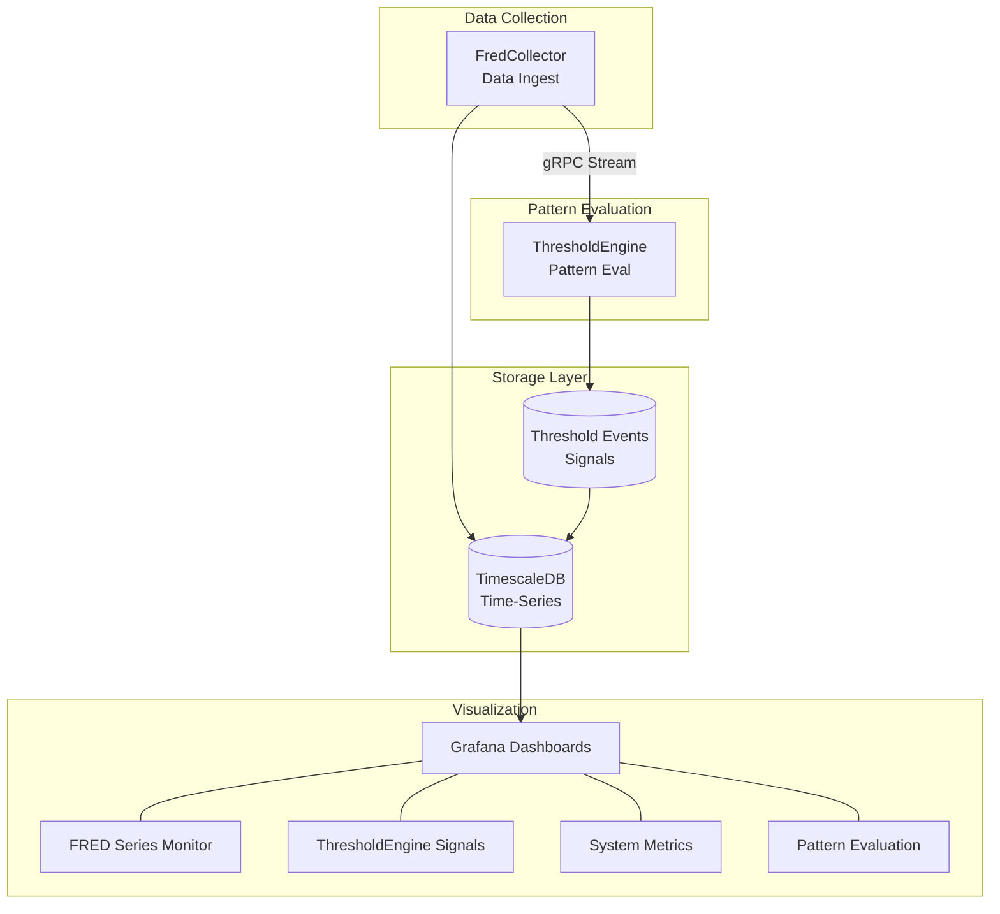

# ATLAS Platform - Executive Summary

**Date:** 2025-11-21
**Status:** Production-Ready Core, Active Development

## System Overview

ATLAS is a real-time macroeconomic monitoring platform that ingests Federal Reserve Economic Data (FRED), evaluates pattern-based signals, and provides actionable insights for portfolio allocation decisions.

## Current Architecture

## What's Working

### Data Collection (FredCollector)
- **12 FRED series** actively collected (expandable via API)
- REST API for series management and observation queries
- gRPC streaming for real-time event propagation
- Scheduled collection with configurable intervals
- Full observability (Prometheus metrics, structured logging)

### Pattern Engine (ThresholdEngine)
- **18 patterns** loaded and enabled across 4 categories:
  - **Growth** (5): Retail sales surge, industrial production expansion, etc.
  - **Recession** (4): Yield curve inversion, freight decline, industrial contraction
  - **NBFI** (6): Shadow banking stress, repo stress, HY spread blowout
  - **Volatility** (3): VIX spikes, term structure inversion
- Hot-reload capability (edit JSON, patterns reload automatically)
- Dynamic enable/disable via REST API
- Expression-based evaluation with C# scripting

### Infrastructure
- Containerized deployment (nerdctl/Docker compatible)
- Ansible-automated provisioning
- OpenTelemetry integration (traces, metrics, logs)
- Grafana dashboards for visualization

## Recent Accomplishments (This Session)

1. **Fixed port conflicts** - Separated HTTP/1.1 (REST) and HTTP/2 (gRPC) services
2. **Enabled dynamic series management** - Can add new FRED series via API
3. **Fixed pattern hot-reload bug** - Patterns now properly reload on file changes
4. **Added 4 new series**: RSAFS, WLRRAL, DCPN3M, TSIFRGHT
5. **Enabled 6 previously disabled patterns** requiring the new series
6. **Converted ISM patterns** to use INDPRO (Industrial Production) as proxy
7. **Created Pattern Signals dashboard** in Grafana

## Pattern Coverage

| Category | Patterns | Key Indicators |
|----------|----------|----------------|
| Growth | 5 | Retail sales, industrial production, employment |
| Recession | 4 | Yield curve, freight, industrial contraction |
| NBFI | 6 | HY spreads, repo stress, commercial paper |
| Volatility | 3 | VIX levels, term structure |

## Key Endpoints

| Service | Port | Protocol | Purpose |
|---------|------|----------|---------|
| FredCollector REST | 5001 | HTTP/1.1 | Series/observation queries |
| FredCollector gRPC | 5002 | HTTP/2 | Event streaming |
| ThresholdEngine REST | 5003 | HTTP/1.1 | Pattern management |
| FredCollector Admin | 5004 | HTTP/1.1 | Series management |
| Grafana | 3000 | HTTP/1.1 | Dashboards |
| Prometheus | 9090 | HTTP/1.1 | Metrics |

## Current Limitations

1. **No alerting** - Threshold events stored but no notification system
2. **Manual series addition** - Must know FRED series IDs to add
3. **Pattern validation errors** - 2 NBFI patterns need series definitions
4. **No backtesting** - Patterns evaluated on live data only

## Suggested Next Steps

### High Priority
1. **Alert Integration** - Connect threshold events to notification system (email/Slack/webhook)
2. **Fix remaining patterns** - Add requiredSeries to kre-underperformance, bankruptcy-clusters
3. **Backfill historical data** - Load 2+ years of data for YoY calculations

### Medium Priority
4. **Backtesting framework** - Evaluate patterns against historical data
5. **Macro Score dashboard** - Visualize aggregate score over time
6. **Pattern performance tracking** - Measure signal accuracy

### Lower Priority
7. **Auto-discovery of required series** - Parse expressions for series IDs
8. **Pattern templates** - Simplify creating new patterns
9. **Multi-region support** - Add non-US economic indicators

## Test Coverage

- FredCollector: Unit + Integration tests passing
- ThresholdEngine: Unit tests passing
- Pattern evaluation: Verified working (7 events processed)

## Access Points

- **Grafana**: http://mercury:3000
  - FRED Series Monitor dashboard
  - ThresholdEngine Pattern Signals dashboard
- **APIs**: See endpoints table above
- **Logs**: Loki via Grafana Explore

---

*Generated 2025-11-21 | ATLAS Platform v1.0*
