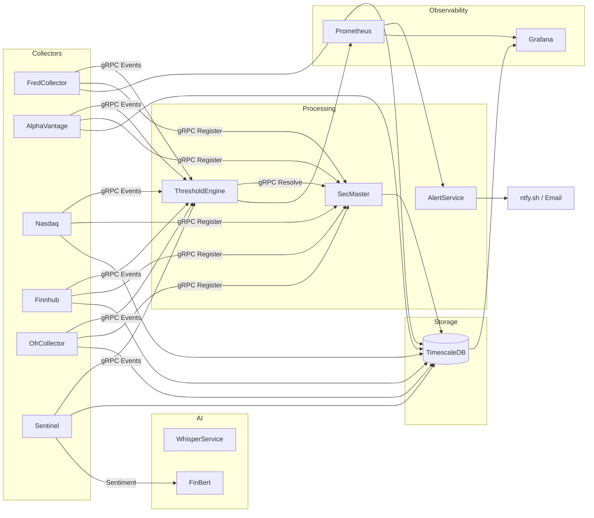

# ATLAS Platform - Executive Summary

**Status:** Production Ready
**Updated:** 2026-01-01

## Overview

ATLAS is a real-time macroeconomic monitoring platform that ingests data from multiple sources (FRED, Alpha Vantage, Finnhub, OFR, Nasdaq), evaluates 62 pattern-based signals, detects regime transitions, and delivers actionable alerts for portfolio allocation decisions.

## Architecture



## Services

| Service | Status | Description |
|---------|--------|-------------|
| FredCollector | :white_check_mark: | 47 FRED economic series |
| AlphaVantageCollector | :white_check_mark: | Commodities (WTI, Brent, Natural Gas) |
| NasdaqCollector | :warning: | LBMA gold prices (disabled - IP whitelist pending) |
| FinnhubCollector | :white_check_mark: | Stock quotes, sentiment, analyst ratings |
| OfrCollector | :white_check_mark: | OFR Financial Stress Index, STFM, HFM data |
| SentinelCollector | :white_check_mark: | News aggregation, sentiment analysis |
| CalendarService | :white_check_mark: | Market status, trading day validation |
| SecMaster | :white_check_mark: | Instrument metadata, source resolution, fuzzy search |
| ThresholdEngine | :white_check_mark: | 62 patterns, regime detection |
| AlertService | :white_check_mark: | ntfy.sh + email notification channels |
| WhisperService | :white_check_mark: | YouTube transcription via Whisper |
| FinBertSidecar | :white_check_mark: | Financial sentiment analysis |

**Total:** 35+ containers

## Pattern Library

| Category | Count | Examples |
|----------|-------|----------|
| Recession | 13 | Sahm Rule, yield curve inversion, initial claims |
| Growth | 8 | GDP acceleration, industrial production, ISM |
| Liquidity | 8 | VIX L1/L2, credit spreads, Fed liquidity |
| NBFI Stress | 8 | HY spreads, repo facility, Chicago NFCI |
| Inflation | 8 | CPI, breakevens, commodity prices |
| OFR | 7 | FSI components, STFM repo, HFM leverage |
| Valuation | 6 | CAPE, Buffett indicator |
| Currency | 3 | DXY, EM FX, carry trades |
| Commodity | 1 | Copper/Gold ratio |

**Total:** 62 patterns across 9 categories

## Regime Detection

Six-state machine with hysteresis:

| Regime | Macro Score | Equity | Defensive |
|--------|-------------|--------|-----------|
| Growth | > 10 | 80-90% | 10-20% |
| Recovery | 0 to 10 | 70-80% | 20-30% |
| Neutral | -10 to 0 | 60-70% | 30-40% |
| Late Cycle | -10 to 0 | 55-70% | 30-45% |
| Recession | -20 to -10 | 70-80% | 20-30% |
| Crisis | < -20 | 80-90% | 10-20% |

## Key Endpoints

All services use internal ports (8080 REST, 5001 gRPC). Only services requiring external access have host port mappings.

| Service | Port (Host) | Purpose |
|---------|-------------|---------|
| grafana | 3000 | Dashboards |
| timescaledb | 5432 | Database |
| whisper-service | 8090 | YouTube transcription |
| ollama-gpu | 11434 | LLM inference (GPU) |
| ollama-cpu | 11435 | LLM inference (CPU) |

## MCP Servers (Claude Desktop)

| Server | Port | Purpose |
|--------|------|---------|
| ollama-mcp | 3100 | Local LLM inference (GPU/CPU) |
| markitdown-mcp | 3102 | Document conversion |
| fredcollector-mcp | 3103 | FRED data access |
| thresholdengine-mcp | 3104 | Pattern evaluation |
| finnhub-mcp | 3105 | Market data, calendars |
| ofr-mcp | 3106 | OFR financial stress data |
| secmaster-mcp | 3107 | Instrument metadata search |
| whisper-mcp | 3108 | YouTube transcription |

## Infrastructure

- **Runtime:** nerdctl + containerd
- **Database:** TimescaleDB (PostgreSQL + hypertables)
- **Observability:** OpenTelemetry -> Prometheus, Loki, Tempo, Grafana
- **Deployment:** Ansible playbooks, systemd auto-start
- **Hardware:** AMD Threadripper 9960X, RTX 5090 (32GB), 128GB RAM

## Deployment

```bash
cd ~/ATLAS/deployment/ansible
ansible-playbook playbooks/site.yml
```

## See Also

- [STATE.md](../STATE.md) - Current system status
- [Architecture](ARCHITECTURE.md) - Design decisions
- [gRPC Architecture](GRPC-ARCHITECTURE.md) - Event streaming
- [Infrastructure](../infrastructure/README.md) - Compose and configs
