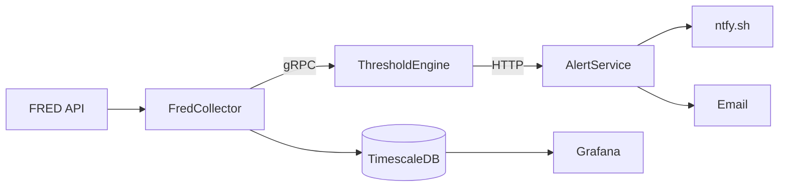

# ATLAS Platform - Executive Summary

**Status:** Production Ready
**Last Updated:** 2025-11-27

## Overview

ATLAS is a real-time macroeconomic monitoring platform that ingests Federal Reserve Economic Data (FRED), evaluates pattern-based signals, and delivers actionable alerts for portfolio allocation decisions.

## Architecture

## Services

| Service | Status | Key Metrics |
|---------|--------|-------------|
| FredCollector | ✅ Production | 39 series, 378 tests |
| ThresholdEngine | ✅ Production | 31 patterns, 153 tests |
| AlertService | ✅ Production | ntfy + email channels |
| Observability | ✅ Production | 8 Grafana dashboards |

## Data Coverage

**39 FRED Series** across categories:
- **Recession**: ICSA, CCSA, UNRATE, UMCSENT, T10Y2Y
- **Liquidity**: VIXCLS, BAMLH0A0HYM2, DTWEXBGS, WALCL
- **Growth**: GDP, INDPRO, RSAFS, HOUST, PAYEMS
- **NBFI**: NFCI, STLFSI4, RRPONTSYD, RPONTSYD

## Pattern Categories

| Category | Patterns | Examples |
|----------|----------|----------|
| Recession | 8 | Sahm Rule, yield curve inversion, initial claims spike |
| Liquidity | 5 | VIX deployment L1/L2, credit spread widening |
| Growth | 5 | GDP acceleration, industrial production expansion |
| NBFI | 8 | Chicago NFCI, St. Louis stress, repo facility usage |
| Valuation | 5 | Buffett indicator, equal weight index |

## Endpoints

| Service | Port | Purpose |
|---------|------|---------|
| FredCollector REST | 5001 | Series queries, observations |
| FredCollector gRPC | 5002 | Event streaming to ThresholdEngine |
| ThresholdEngine | 5003 | Pattern management API |
| AlertService | 8081 | Alert sink (POST /alerts) |
| Grafana | 3000 | Dashboards |
| Prometheus | 9090 | Metrics |

## Key Features

- **Hot Reload**: Pattern JSON changes apply without restart
- **Roslyn Expressions**: Full C# in pattern definitions
- **Context API**: GetLatest, GetYoY, GetMA, GetSpread, IsSustained
- **Regime Detection**: Six regimes from Crisis to Growth
- **Signal Scoring**: -2 to +2 scale with context-dependent logic

## Infrastructure

Deployed via Ansible to Linux server running nerdctl compose:
- 19 containerized services
- TimescaleDB for time-series storage
- Full OpenTelemetry observability (Prometheus, Loki, Tempo)
- Automated via systemd (atlas.service)

## Access

- **Grafana**: http://yourserver:3000
- **Logs**: Loki via Grafana Explore
- **Traces**: Tempo via Grafana Explore

## See Also

- [Architecture](ARCHITECTURE.md) - Design decisions
- [gRPC Architecture](GRPC-ARCHITECTURE.md) - Event streaming
- [FredCollector](../FredCollector/) - Data collection
- [ThresholdEngine](../ThresholdEngine/) - Pattern evaluation
- [AlertService](../AlertService/) - Notifications
