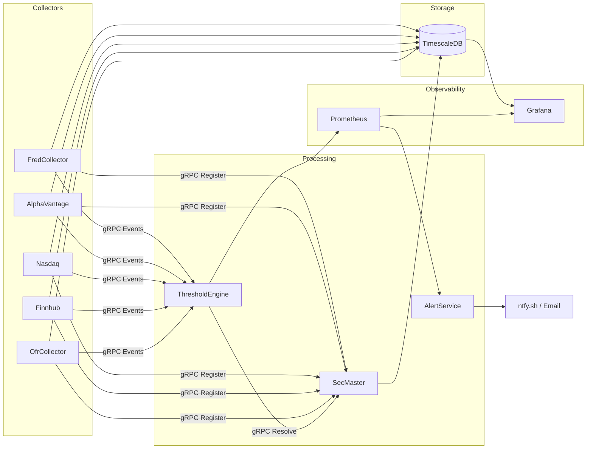

# ATLAS Platform - Executive Summary

**Status:** Production Ready
**Updated:** 2025-12-14

## Overview

ATLAS is a real-time macroeconomic monitoring platform that ingests data from multiple sources (FRED, Alpha Vantage, Finnhub, OFR, Nasdaq), evaluates 50+ pattern-based signals, detects regime transitions, and delivers actionable alerts for portfolio allocation decisions.

## Architecture



## Services

| Service | Status | Description |
|---------|--------|-------------|
| FredCollector | ✅ | 47 FRED economic series, 378 tests |
| AlphaVantageCollector | ✅ | Commodities (WTI, Brent, Natural Gas) |
| NasdaqCollector | ✅ | LBMA gold prices (AM/PM fixings) |
| FinnhubCollector | ✅ | Stock quotes, sentiment, analyst ratings |
| OfrCollector | ✅ | OFR Financial Stress Index, STFM, HFM data |
| CalendarService | ✅ | Market status, trading day validation |
| SecMaster | ✅ | Instrument metadata, source resolution, fuzzy search |
| ThresholdEngine | ✅ | 50+ patterns, regime detection, 226 tests |
| AlertService | ✅ | ntfy.sh + email notification channels |

**Total:** 30+ containers, 645+ tests passing

## Pattern Library

| Category | Count | Examples |
|----------|-------|----------|
| Recession | 12 | Sahm Rule, yield curve inversion, initial claims |
| Liquidity | 9 | VIX L1/L2, credit spreads, Fed liquidity |
| NBFI Stress | 14 | HY spreads, repo facility, Chicago NFCI, OFR FSI |
| Growth | 5 | GDP acceleration, industrial production |
| Valuation | 2 | CAPE, Buffett indicator |
| Inflation | 8 | CPI, breakevens, commodity prices |
| Commodity | 1 | Copper/Gold ratio |
| Currency | 3 | DXY, EM FX, risk sentiment |

**Total:** 50+ patterns across 8 categories

## Regime Detection

Six-state machine with hysteresis:

| Regime | Macro Score | Equity | Defensive |
|--------|-------------|--------|-----------|
| Growth | > 10 | 80-90% | 10-20% |
| Recovery | 0 to 10 | 70-80% | 20-30% |
| Neutral | -10 to 0 | 60-70% | 30-40% |
| Late Cycle | -10 to 0 | 55-70% | 30-45% |
| Recession | -20 to -10 | 70-80% | 20-30% |
| Crisis | < -20 | 80-90% | 10-20% |

## Key Endpoints

| Service | Port (Host) | Purpose |
|---------|-------------|---------|
| fred-collector | 5001/5002 | REST API / gRPC streaming |
| alphavantage-collector | 5010/5011 | REST API / gRPC streaming |
| finnhub-collector | 5012/5013 | REST API / gRPC streaming |
| ofr-collector | 5016 | REST API |
| threshold-engine | 5003 | Pattern management API |
| alert-service | 8081 | Alertmanager webhook sink |
| secmaster | 5017 | Instrument metadata API / gRPC |
| grafana | 3000 | Dashboards |
| prometheus | 9090 | Metrics |

**Note:** All collectors use internal port 5001 for gRPC event streaming

## MCP Servers (Claude Desktop)

| Server | Port | Purpose |
|--------|------|---------|
| ollama-mcp | 3100 | Local LLM inference (GPU/CPU) |
| markitdown-mcp | 3102 | Document conversion |
| fredcollector-mcp | 3103 | FRED data access |
| thresholdengine-mcp | 3104 | Pattern evaluation |
| finnhub-mcp | 3105 | Market data, calendars |
| ofrcollector-mcp | 3106 | OFR financial stress data |
| secmaster-mcp | (internal) | Instrument metadata search |

## Infrastructure

- **Runtime:** nerdctl + containerd
- **Database:** TimescaleDB (PostgreSQL + hypertables)
- **Observability:** OpenTelemetry → Prometheus, Loki, Tempo, Grafana
- **Deployment:** Ansible playbooks, systemd auto-start
- **Hardware:** AMD Threadripper 9960X, RTX 5090 (32GB), 128GB RAM

## Deployment

```bash
cd ~/ATLAS/deployment/ansible
ansible-playbook playbooks/site.yml
```

## See Also

- [STATE.md](../STATE.md) - Current system status
- [Architecture](ARCHITECTURE.md) - Design decisions
- [gRPC Architecture](GRPC-ARCHITECTURE.md) - Event streaming
- [Infrastructure](../infrastructure/README.md) - Compose and configs
