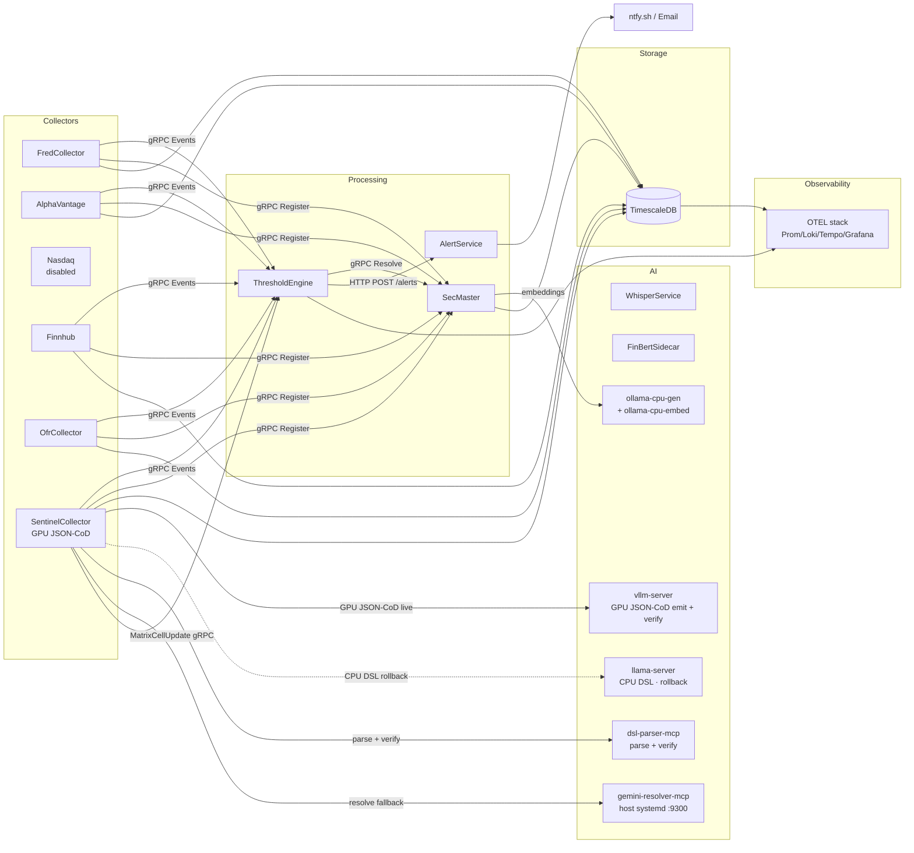

# ATLAS Platform - Executive Summary

**Status:** Active development (Phase 5 matrix-cell integration + Sentinel GPU-CoD role-flip DONE — extraction on GPU vLLM JSON-CoD; see `STATE.md`)
**Updated:** 2026-06-11

## Overview

ATLAS is a real-time macroeconomic monitoring platform that ingests data from multiple sources (FRED, Alpha Vantage, Finnhub, OFR, SentinelCollector news / GPU vLLM JSON-CoD extraction), evaluates 72 pattern-based signals across nine categories, projects each signal onto an 11-sector ATLAS grid, classifies per-sector regimes, and delivers actionable alerts for portfolio allocation decisions.

## Architecture


```mermaid
flowchart LR
    subgraph Collectors
        FC[FredCollector]
        AV[AlphaVantage]
        NC[Nasdaq<br/>disabled]
        FH[Finnhub]
        OFR[OfrCollector]
        SC[SentinelCollector<br/>GPU JSON-CoD]
    end

    subgraph Processing
        SM[SecMaster]
        TE[ThresholdEngine]
        AS[AlertService]
    end

    subgraph AI
        WS[WhisperService]
        FB[FinBertSidecar]
        VLLM[vllm-server<br/>GPU JSON-CoD emit + verify]
        LS[llama-server<br/>CPU DSL · rollback]
        DSL[dsl-parser-mcp<br/>parse + verify]
        OL[ollama-cpu-gen<br/>+ ollama-cpu-embed]
        GR[gemini-resolver-mcp<br/>host systemd :9300]
    end

    subgraph Storage
        DB[(TimescaleDB)]
    end

    subgraph Observability
        OTEL[OTEL stack<br/>Prom/Loki/Tempo/Grafana]
    end

    FC & AV & FH & OFR & SC -->|gRPC Events| TE
    FC & AV & FH & OFR & SC -->|gRPC Register| SM
    FC & AV & FH & OFR & SC --> DB
    SC -->|GPU JSON-CoD live| VLLM
    SC -.->|CPU DSL rollback| LS
    SC -->|parse + verify| DSL
    SC -->|resolve fallback| GR
    TE -->|gRPC Resolve| SM
    SM -->|embeddings| OL
    TE -->|HTTP POST /alerts| AS
    AS --> N[ntfy.sh / Email]
    SC -->|MatrixCellUpdate gRPC| TE
    DB & TE --> OTEL
    SM --> DB
```

## Services

| Service | Status | Description |
|---------|--------|-------------|
| FredCollector | :white_check_mark: | Federal Reserve economic series (~76 active in production DB) |
| AlphaVantageCollector | :white_check_mark: | Commodities, equities, forex, crypto (25/day quota) |
| NasdaqCollector | :warning: | Disabled in `/opt/ai-inference/compose.yaml` — Nasdaq Data Link WAF blocks datacenter IPs (pending whitelist) |
| FinnhubCollector | :white_check_mark: | Stock quotes, candles, sentiment, analyst ratings, calendars |
| OfrCollector | :white_check_mark: | OFR Financial Stress Index, STFM, HFM data |
| SentinelCollector | :white_check_mark: | News aggregation (SearXNG/RSS/edge) + GPU vLLM JSON-CoD extraction (CPU DSL = rollback) |
| CalendarService | :white_check_mark: | NYSE trading days/holidays + FRED economic-release calendar |
| SecMaster | :white_check_mark: | Instrument metadata, source resolution, hybrid SQL/fuzzy/vector/RAG search |
| ThresholdEngine | :white_check_mark: | 72 patterns, 11-sector projection, per-sector regime classification, matrix-cell persistence |
| AlertService | :white_check_mark: | Webhook sink for Alertmanager — severity routing → ntfy / email / AutoFix (re-enabled + verified end-to-end 2026-06-10, PR #656) |
| WhisperService | :white_check_mark: | YouTube transcription via faster-whisper |
| FinBertSidecar | :white_check_mark: | FinBERT 768-d embeddings (no production consumer wired today) |

**Total:** 30 service containers in `/opt/ai-inference/compose.yaml` (excludes the separately-managed OTEL stack: Prometheus, Loki, Tempo, Grafana, otel-collector).

## Pattern Library

Pattern definitions live under `ThresholdEngine/config/patterns/<category>/*.json` and are hot-reloaded by the `PatternConfigurationWatcher`.

| Category | Count | Examples |
|----------|-------|----------|
| Recession | 22 | Sahm Rule, yield-curve inversion/steepening, initial/continuing claims, JOLTS, Beveridge, Challenger layoffs |
| Growth | 11 | GDP acceleration, industrial production, retail sales, durable goods, residential investment, housing starts, global PMI |
| Liquidity | 9 | VIX level, credit spread widening, DXY risk-off, Fed liquidity, fed funds rate, real rates (incl. TIPS), M2 growth |
| NBFI | 8 | standing/reverse repo stress, CCC/BB divergence, Chicago NFCI, St. Louis stress index, commercial-paper stress, financial-insider breadth |
| OFR | 7 | FSI composite + sub-indices (credit, funding, volatility, EM), STFM repo stress, HFM leverage |
| Inflation | 6 | CPI YoY level, PCE level + acceleration, inflation expectations, Truflation vs CPI, core CPI stickiness |
| Currency | 5 | DXY, EUR-USD, EM-FX weakness, JPY carry unwind, ECB policy rate |
| Commodity | 3 | Copper/Gold ratio, oil price, natgas price |
| Valuation | 1 | Buffett indicator |

**Total: 72 patterns (71 enabled, 1 disabled) across 9 categories.**

## Regime Detection

ThresholdEngine classifies each of the 11 ATLAS sectors **independently** per evaluation cycle using a configurable `SectorRegimeTaxonomy`. The default taxonomy is a five-band partition of the cell-value clamp range `[-3, +3]` (`ThresholdEngine/src/Services/SectorRegimeClassifier.cs`):

| Regime | Score band | Meaning |
|--------|-----------|---------|
| `severe_contraction` | `[-3, -1.5)` | Saturated downside |
| `contraction` | `[-1.5, -0.5)` | Meaningful negative tilt |
| `neutral` | `[-0.5, +0.5)` | Within noise |
| `expansion` | `[+0.5, +1.5)` | Meaningful positive tilt |
| `overheating` | `[+1.5, +3]` | Saturated upside |

Per-sector regime transitions are persisted by `SectorRegimePersistenceWorker` and published over the `ObservationEventStream` gRPC for downstream subscribers. Boundary values (`±0.5`, `±1.5`) align with the `SectorThresholdCrossingDetector` convention so crossings and regime transitions share boundary semantics.

## Key Endpoints

All services use internal ports (8080 REST, 5001 gRPC). Only services requiring external access have host port mappings.

| Service | Port (Host) | Purpose |
|---------|-------------|---------|
| grafana | 3000 | Dashboards (separate OTEL compose stack) |
| sentinel-collector | 5091 | Review UI browser access |
| timescaledb | 5432 | Database |
| whisper-service | 8090 | YouTube transcription |
| vllm-server | 8000 | GPU LLM inference (Qwen2.5-32B-AWQ) — live JSON-CoD extraction + verification + report summaries |
| ollama-cpu-gen | 11435 | CPU LLM inference (qwen3:30b-a3b, generation) |
| ollama-cpu-embed | 11436 | CPU embeddings (bge-m3) |
| llama-server | 11437 | llama.cpp CPU server (GBNF-constrained DSL CoD — rollback path) |

## MCP Servers (Claude Desktop / Claude Code)

MCP servers are consolidated into their parent service directories where applicable (e.g., `FredCollector/mcp/`, `SecMaster/mcp/`). Sidecars and host-resident bridges are listed below.

| Server | Port | Transport | Purpose |
|--------|------|-----------|---------|
| markitdown-mcp | 3102 | SSE | Document conversion (HTML/PDF → markdown) |
| trafilatura | 3109 | HTTP | Trafilatura pre-wash sidecar for Sentinel normalization |
| fredcollector-mcp | 3103 | HTTP MCP | FRED data query + admin |
| thresholdengine-mcp | 3104 | HTTP MCP | Pattern evaluation, regime status |
| finnhub-mcp | 3105 | HTTP MCP | Market data, calendars, live quotes |
| ofr-mcp | 3106 | HTTP MCP | FSI, funding markets, hedge fund data |
| secmaster-mcp | 3107 | HTTP MCP | Instrument search, metadata query, semantic search |
| whisper-service-mcp | 3108 | Streamable HTTP | YouTube transcription proxy |
| dsl-parser-mcp | 3120 | HTTP | DSL + JSON parser (`/parse` + `/parse_json`) + v2.3.1 grounding verifier sidecar for Sentinel CoD extraction |
| gemini-resolver-mcp | 9300 (host systemd) | HTTP JSON | Gemini grounded-search fallback resolver for Sentinel (not containerized) |
| ntfy-mcp | n/a (stdio) | MCP/stdio | ntfy publish/poll bridge for the supervisor (`atlas-claude-ask` / `atlas-claude-reply`) |

## Infrastructure

- **Runtime:** nerdctl + containerd
- **Database:** TimescaleDB (PostgreSQL + hypertables)
- **Observability:** OpenTelemetry → Prometheus, Loki, Tempo, Grafana (separate compose stack managed by `otel.service`)
- **Deployment:** Ansible playbooks, systemd auto-start (`atlas.service`)
- **Hardware:** AMD Threadripper 9960X, RTX 5090 (32GB), 128GB RAM

## Deployment

```bash
cd ~/ATLAS/deployment/ansible
ansible-playbook -i inventory/hosts.yml playbooks/deploy.yml --tags <service>
```

Never edit `/opt/ai-inference/compose.yaml` directly — it is ansible-managed.

## See Also

- [STATE.md](../STATE.md) - Current system status and active phase
- [Architecture](ARCHITECTURE.md) - Design decisions
- [gRPC Architecture](GRPC-ARCHITECTURE.md) - Event streaming
- [Deployment](../deployment/README.md) - Compose, ansible roles, inventory
