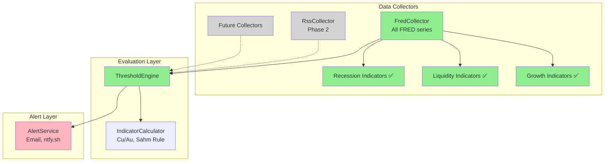
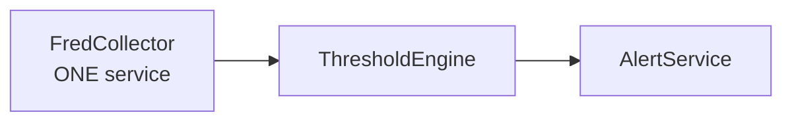

# FRED Data Availability Research
**Date**: 2025-11-14
**Last Updated**: 2025-11-21
**Purpose**: Determine which ATLAS indicators are available in FRED vs require separate collectors
**Status**: ✅ Research Complete, Implementation Complete

---

## Executive Summary

**✅ CONFIRMED**: Almost ALL liquidity and growth indicators needed for ATLAS are available in FRED!

**Implementation Status**: E6 (Liquidity Indicators) and E7 (Growth & Valuation Indicators) are **fully implemented** in FredCollector. All 30 series are configured and actively collecting data.

---

## E6: Liquidity Indicators - FRED Availability

### ✅ Available in FRED (Stay in FredCollector)

| Indicator | FRED Series | Frequency | Data Range | Status |
|-----------|-------------|-----------|------------|--------|
| **VIX** | VIXCLS | Daily | 1990-01-02 to present | ✅ CONFIRMED |
| **Dollar Index** | DTWEXBGS | Daily | 2006-01-02 to present | ✅ CONFIRMED |
| **High-Yield Spread** | BAMLH0A0HYM2 | Daily | Historical to present | ✅ CONFIRMED |
| **Investment-Grade Spread** | BAMLC0A0CM | Daily | Historical to present | ✅ CONFIRMED |
| **Fed Balance Sheet** | WALCL | Weekly | Historical to present | ✅ CONFIRMED |
| **M2 Money Supply** | M2SL | Monthly/Weekly | Historical to present | ✅ CONFIRMED |
| **SOFR** | SOFR | Daily | 2018 to present | ✅ Already in E3 |
| **Treasury Yields** | DGS2, DGS10, DGS30 | Daily | Historical to present | ✅ Already in E3 |
| **Copper Price** | PCOPPUSDM | Monthly | 1947 to present | ✅ CONFIRMED |
| **Gold Price** | GOLDAMGBD228NLBM | Daily | Historical to present | ✅ CONFIRMED |

**Additional VIX Variants Available**:
- VXVCLS (3-Month VIX)
- VXDCLS (DJIA VIX)
- VXGOGCLS (Equity VIX on Google)

**Dollar Index Variants**:
- DTWEXBGS (Broad goods & services - RECOMMENDED)
- DTWEXEMEGS (Emerging markets)
- Various historical discontinued series

**Credit Spread Variants**:
- Full rating breakdown: AAA, AA, A, BBB, BB, B, CCC
- BAMLC0A4CBBB (BBB spreads specifically)
- BAMLH0A3HYC (CCC & lower)

### ⚠️ NOT in FRED (Would Need Separate Collectors)

| Indicator | Alternative Source | Priority | Notes |
|-----------|-------------------|----------|-------|
| Real-time DXY (ICE index) | ICE Data | LOW | FRED's DTWEXBGS is Fed's official equivalent |
| Intraday VIX | CBOE Direct | LOW | FRED has daily close, sufficient for ATLAS |
| Real-time credit spreads | Bloomberg/Reuters | LOW | FRED has daily updates, sufficient |

### Recommendation for E6

**Keep E6 in FredCollector** with following series:

**Priority 1 (Add immediately)**:
- VIXCLS (VIX Daily)
- DTWEXBGS (Broad Dollar Index)  
- BAMLH0A0HYM2 (High-Yield OAS)
- BAMLC0A0CM (Investment-Grade OAS)
- WALCL (Fed Balance Sheet)

**Priority 2 (After Priority 1 working)**:
- M2SL (M2 Money Supply)
- PCOPPUSDM (Copper prices)
- GOLDAMGBD228NLBM (Gold prices)

---

## E7: Growth & Valuation Indicators - FRED Availability

### ✅ Available in FRED (Stay in FredCollector)

| Indicator | FRED Series | Frequency | Status |
|-----------|-------------|-----------|--------|
| **GDP** | GDP | Quarterly | ✅ CONFIRMED |
| **Real GDP** | GDPC1 | Quarterly | ✅ CONFIRMED |
| **Industrial Production** | INDPRO | Monthly | ✅ CONFIRMED |
| **Capacity Utilization** | TCU | Monthly | ✅ CONFIRMED |
| **Retail Sales** | RSXFS | Monthly | ✅ CONFIRMED |
| **Personal Income** | PI | Monthly | ✅ CONFIRMED |
| **Personal Consumption** | PCE | Monthly | ✅ CONFIRMED |
| **Unemployment Rate** | UNRATE | Monthly | ✅ Already in E3 |
| **Labor Force Participation** | CIVPART | Monthly | ✅ CONFIRMED |
| **Durable Goods Orders** | DGORDER | Monthly | ✅ CONFIRMED |
| **Housing Starts** | HOUST | Monthly | ✅ CONFIRMED |
| **Building Permits** | PERMIT | Monthly | ✅ CONFIRMED |
| **CPI** | CPIAUCSL | Monthly | ✅ CONFIRMED |

### ⚠️ Valuation Metrics - Partially Available

| Metric | FRED Availability | Alternative |
|--------|-------------------|-------------|
| **Shiller CAPE** | ❌ Not in FRED | Calculated from S&P data + CPI |
| **Buffett Indicator** | Partial (Wilshire 5000 + GDP) | Calculate: WILL5000PRFC / GDP |
| **Forward P/E** | ❌ Not in FRED | Would need earnings data |
| **Equity Risk Premium** | ❌ Not in FRED | Calculate from yields + earnings |

### Recommendation for E7

**Keep E7 in FredCollector** with following approach:

**Group A - Core Growth Indicators** (Add first):
- GDP, GDPC1 (Real GDP)
- INDPRO (Industrial Production)
- TCU (Capacity Utilization)
- RSXFS (Retail Sales)

**Group B - Consumption & Income**:
- PCE (Personal Consumption)
- PI (Personal Income)
- PSAVERT (Personal Saving Rate)

**Group C - Housing**:
- HOUST (Housing Starts)
- PERMIT (Building Permits)
- HSN1F (New Home Sales)

**Group D - Business Activity**:
- DGORDER (Durable Goods)
- NEWORDER (Manufacturers New Orders)
- UMTMVS (Manufacturers Sales)

**Valuation Metrics**: Defer to Phase 2, require calculation from multiple sources

---

## Epic Implementation Status

### E6: Liquidity Indicators ✅ COMPLETE
**Status**: Implemented in FredCollector
**Completion**: 100%
**Tests**: Passing

**Implemented Series** (6 total):
| Series | Description | Status |
|--------|-------------|--------|
| VIXCLS | VIX Volatility Index | ✅ Active |
| DTWEXBGS | Broad Dollar Index | ✅ Active |
| BAMLH0A0HYM2 | High-Yield Credit Spread | ✅ Active |
| BAMLC0A0CM | Investment-Grade Credit Spread | ✅ Active |
| WALCL | Fed Total Assets | ✅ Active |
| M2SL | M2 Money Supply | ✅ Active |

### E7: Growth & Valuation Indicators ✅ COMPLETE
**Status**: Implemented in FredCollector
**Completion**: 100%
**Tests**: Passing

**Implemented Series** (17 total):

*Output & Production*:
- GDP, GDPC1 ✅
- INDPRO, TCU ✅
- IPMAN ✅

*Consumption*:
- RSXFS, PCE, PI ✅
- PSAVERT ✅

*Housing*:
- HOUST, PERMIT ✅

*Business*:
- DGORDER ✅

*Labor*:
- CIVPART ✅

**Note**: Commodity series (PCOPPUSDM, GOLDAMGBD228NLBM) deferred to future phase for Cu/Au ratio

---

## What Does NOT Need Separate Collectors

### ❌ NO Need for VixCollector
FRED has VIX data (VIXCLS) with daily updates. While CBOE has intraday data, ATLAS framework operates on daily/weekly schedules, so FRED's daily close is sufficient.

### ❌ NO Need for ForexCollector  
FRED has comprehensive currency data via Fed's trade-weighted indexes (DTWEXBGS and variants). While not identical to ICE's DXY, Fed's official index serves the same purpose for macro regime classification.

### ❌ NO Need for CommodityCollector
FRED has copper, gold, oil, and other major commodities. Data is sufficient for calculating ratios like Cu/Au for recession signals.

---

## What MIGHT Need Separate Collectors (Future)

### RSS/News Collector (Sentiment Analysis)
**Priority**: Phase 2  
**Rationale**: Not available in FRED, provides forward-looking sentiment signals  
**Use Cases**:
- Financial news sentiment analysis
- Fed communications parsing
- Earnings call transcripts

### Alternative Economic Data Collector (Phase 2)
**Priority**: Phase 2-3  
**Rationale**: Validate against government data manipulation  
**Sources**:
- Truflation (real-time inflation)
- Indeed (job postings)
- Mastercard SpendingPulse (consumer spending)
- OpenTable (restaurant traffic)

### Real-Time Market Data Collector (Phase 3)
**Priority**: Phase 3 (nice to have)  
**Rationale**: FRED data has lag, real-time useful for tactical decisions  
**Use Cases**:
- Intraday VIX spikes for deployment timing
- Real-time credit spread widening
- Flash crash detection

---

## Cu/Au Ratio Calculation

**Both available in FRED**, can be calculated automatically:

```csharp
// Collection
await CollectSeries("PCOPPUSDM");  // Copper
await CollectSeries("GOLDAMGBD228NLBM");  // Gold

// Calculation (in ThresholdEngine or IndicatorCalculator)
decimal cuAuRatio = copperPrice / goldPrice;

// Threshold Evaluation
if (cuAuRatio < 0.15m)
    → Bear Market Signal
else if (cuAuRatio > 0.22m)
    → Bull Market Signal
```

**Note**: Different from real-time spot prices, but sufficient for daily/weekly ATLAS framework monitoring.

---

## Implementation Status

### Phase 1: FredCollector Core ✅ COMPLETE
| Epic | Description | Status |
|------|-------------|--------|
| E1 | Foundation | ✅ Complete |
| E2 | FRED API Integration | ✅ Complete |
| E3 | Recession Indicators | ✅ Complete |
| E5 | Historical Backfill | ✅ Complete |
| E8 | REST API | ✅ Complete |

### Phase 2: FredCollector Coverage ✅ COMPLETE
| Epic | Description | Status |
|------|-------------|--------|
| E6 | Liquidity Indicators (6 series) | ✅ Complete |
| E7 | Growth & Valuation (17 series) | ✅ Complete |
| E9 | Container Deployment | ✅ Complete |
| E10 | OpenTelemetry | ✅ Complete |
| E11 | gRPC Event Streaming | ✅ Complete |

### Phase 3: ThresholdEngine ✅ COMPLETE
| Epic | Description | Status |
|------|-------------|--------|
| TE1-TE9 | Pattern evaluation, regime detection | ✅ Complete |

**Total**: 30 series configured, 24 patterns, 319 tests passing

### Phase 4: Future Work
| Component | Description | Status |
|-----------|-------------|--------|
| AlertService | Email and push notifications | ◯ Planned |
| RssCollector | Financial news and sentiment | ◯ Planned |
| Commodity series | Cu/Au ratio calculation | ◯ Planned |

---

## Updated ARCHITECTURE.md Implications

**Key Change**: E6 and E7 should NOT be listed as separate collector services. They remain part of FredCollector.

**Correct Architecture**:



**NOT Needed**:
- ❌ VixCollector (VIX is in FRED)
- ❌ ForexCollector (Dollar index is in FRED)
- ❌ CommodityCollector (Copper, gold in FRED)

---

## Verification Commands

To verify any FRED series exists:
```bash
curl "https://api.stlouisfed.org/fred/series?series_id=VIXCLS&api_key=YOUR_KEY&file_type=json"
curl "https://api.stlouisfed.org/fred/series?series_id=DTWEXBGS&api_key=YOUR_KEY&file_type=json"
```

---

## Summary & Recommendations

### ✅ Keep in FredCollector
- E6: Liquidity Indicators (VIX, DXY, credit spreads, Fed balance sheet, commodities)
- E7: Growth & Valuation Indicators (GDP, industrial production, consumption, housing)

### ❌ Do NOT Create Separate Collectors (Not Needed)
- VixCollector - VIX is in FRED (VIXCLS)
- ForexCollector - Dollar index in FRED (DTWEXBGS)
- CommodityCollector - Copper/gold in FRED

### 🔮 Future Collectors (Phase 2+)
- RssCollector - News and sentiment (not in FRED)
- AlternativeDataCollector - Truflation, Indeed, etc. (validation against government data)

### 📊 ATLAS Architecture Remains Clean



**No need for complexity of multiple commodity/market data collectors in MVP.**

---

**Status**: ✅ Research Complete, Implementation Complete
**FredCollector**: 30 series configured and collecting
**ThresholdEngine**: 24 patterns evaluating data
**Next Phase**: AlertService implementation
