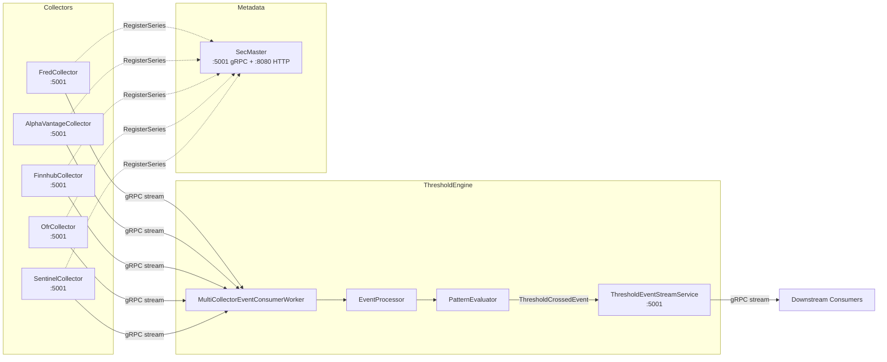

# gRPC Event Streaming Architecture

## Overview

ATLAS uses gRPC server streaming to connect data collectors with ThresholdEngine without message broker complexity. Each collector publishes observation events via gRPC, ThresholdEngine consumes from all sources and evaluates patterns. TimescaleDB serves as the durable event log, providing queryability and <100ms latency.



## Current Implementation

### Collectors (Event Producers)

| Service | gRPC Port (Internal) | HTTP Port (Internal) | Event Types |
|---------|---------------------|---------------------|-------------|
| FredCollector | 5001 | 8080 | SeriesCollectedEvent, CollectionFailedEvent |
| AlphaVantageCollector | 5001 | 8080 | SeriesCollectedEvent, OhlcvCollectedEvent, CollectionFailedEvent |
| FinnhubCollector | 5001 | 8080 | SeriesCollectedEvent, CollectionFailedEvent |
| OfrCollector | 5001 | 8080 | SeriesCollectedEvent, CollectionFailedEvent |
| SentinelCollector | 5001 | 8080 | SeriesCollectedEvent, CollectionFailedEvent |
| NasdaqCollector | 5001 | 8080 | (currently disabled - WAF blocking) |

All collectors implement the `ObservationEventStream` gRPC service contract from the shared `Events` library. All use internal port 5001 for gRPC and 8080 for HTTP/REST.

### ThresholdEngine (Event Consumer + Producer)

**As Consumer:**
- **MultiCollectorEventConsumerWorker**: Maintains parallel gRPC connections to all collectors
- **ICollectorEventClient**: Per-collector client interface with health checks and streaming
- **EventProcessor**: Routes events to pattern evaluation
- **ProcessedEvent tracking**: Idempotency via event ID deduplication in TimescaleDB

**As Producer:**
- **ThresholdEventStreamService**: Exposes gRPC streaming for downstream consumers
- Streams `ThresholdCrossedEvent` when patterns trigger
- Used by SentinelCollector to react to regime changes

### SecMaster (Metadata Service)

SecMaster provides gRPC services for instrument metadata management:

| gRPC Service | Port | Purpose |
|--------------|------|---------|
| SecMasterRegistry | 5001 | Instrument registration (fire-and-forget from collectors) |
| SecMasterResolver | 5001 | Symbol resolution for ThresholdEngine routing |

HTTP API is available on port 8080 for REST access and health checks.

Collectors register instruments via gRPC on startup and during collection. SecMaster stores metadata in PostgreSQL for fast lookup and cross-source search.

## Key Design Decisions

### 1. gRPC Over Message Broker

**Decision**: Use gRPC server streaming instead of Kafka/RabbitMQ.

**Rationale**:
- Events already persisted in TimescaleDB (no redundant storage)
- No broker cluster to manage
- <100ms latency vs broker round-trips
- Native "events since X" queries
- Type-safe protobuf contracts

**Trade-offs**:
- Simple for 6+ tightly coupled services
- HTTP/2 multiplexing handles concurrent streams
- Schema changes require coordinated deployments (shared Events library mitigates this)
- No built-in consumer group management (single consumer pattern works for current scale)

### 2. TimescaleDB as Event Log

Each collector stores events in its own `events` table:

```sql
CREATE TABLE events (
    id BIGSERIAL PRIMARY KEY,
    event_type TEXT NOT NULL,
    series_id TEXT NOT NULL,
    occurred_at TIMESTAMPTZ NOT NULL,
    payload JSONB NOT NULL
);

SELECT create_hypertable('events', 'occurred_at');
```

Benefits:
- ACID durability
- SQL queryability for backtesting
- Time-based retention policies
- Single source of truth

### 3. Event Deduplication and Checkpointing

ThresholdEngine uses a unified checkpoint based on the last processed event time:

```csharp
// Global checkpoint across all collectors (events are naturally ordered by time)
var lastProcessed = await _processedEventRepository.GetLastProcessedTimeAsync(ct)
    ?? DateTime.UtcNow.AddMonths(-1);

// Phase 1: Historical catch-up
await foreach (var evt in client.GetEventsSinceAsync(lastProcessed, eventTypes, ct))
{
    await eventProcessor.ProcessEventAsync(evt, ct);
}

// Phase 2: Real-time streaming
await foreach (var evt in client.SubscribeToEventsAsync(lastProcessed, eventTypes, ct))
{
    await eventProcessor.ProcessEventAsync(evt, ct);
}
```

**Idempotency**: Each event has a unique ULID. The `ProcessedEvent` table tracks processed event IDs to prevent duplicate processing.

Benefits:
- Stateless collectors (don't track consumers)
- Automatic recovery on restart via checkpoint
- Event-level idempotency prevents duplicates during catch-up

## Protobuf Contracts

**Location**: `Events/src/Events/Protos/` (shared library)

### ObservationEventStream (Collectors + ThresholdEngine)

```protobuf
syntax = "proto3";
package atlas.events;

service ObservationEventStream {
  rpc SubscribeToEvents(SubscriptionRequest) returns (stream Event);
  rpc GetEventsSince(TimeRangeRequest) returns (stream Event);
  rpc GetEventsBetween(TimeRangeRequest) returns (stream Event);
  rpc GetLatestEventTime(google.protobuf.Empty) returns (google.protobuf.Timestamp);
  rpc GetHealth(google.protobuf.Empty) returns (HealthResponse);
}

message Event {
  string event_id = 1;                          // Unique ULID
  google.protobuf.Timestamp occurred_at = 2;
  string source_service = 3;                    // e.g., "FredCollector"

  oneof payload {
    SeriesCollectedEvent series_collected = 10;
    OhlcvCollectedEvent ohlcv_collected = 12;
    CollectionFailedEvent collection_failed = 11;
    ThresholdCrossedEvent threshold_crossed = 13;
  }
}

message SeriesCollectedEvent {
  string series_id = 1;
  repeated DataPoint data_points = 2;
  google.protobuf.Timestamp collected_at = 3;
}

message ThresholdCrossedEvent {
  string pattern_id = 1;
  string pattern_name = 2;
  string category = 3;
  double signal = 4;
  double current_value = 5;
  map<string, string> metadata = 6;
  google.protobuf.Timestamp evaluated_at = 7;
}

message SubscriptionRequest {
  google.protobuf.Timestamp start_from = 1;
  repeated string event_types = 2;              // Filter by type
  repeated string series_ids = 3;               // Filter by series
}
```

### SecMaster Services

```protobuf
syntax = "proto3";
package atlas.secmaster;

service SecMasterRegistry {
  rpc RegisterSeries(SeriesRegistration) returns (RegistrationResponse);
  rpc RegisterSeriesBatch(stream SeriesRegistration) returns (BatchRegistrationResponse);
}

service SecMasterResolver {
  rpc ResolveSymbol(ResolveRequest) returns (ResolveResponse);
  rpc ResolveBatch(BatchResolveRequest) returns (stream ResolveResponse);
  rpc LookupSource(SourceLookupRequest) returns (ResolveResponse);
}
```

## Implementation

### Collector Side (EventStreamService)

Each collector implements `ObservationEventStream.ObservationEventStreamBase`:

```csharp
public class EventStreamService : ObservationEventStream.ObservationEventStreamBase
{
    public override async Task SubscribeToEvents(
        SubscriptionRequest request,
        IServerStreamWriter<Event> responseStream,
        ServerCallContext context)
    {
        var startFrom = request.StartFrom?.ToDateTimeOffset() ?? DateTimeOffset.UtcNow;

        // Phase 1: Historical catch-up
        await foreach (var evt in _repository.StreamEventsSinceAsync(startFrom, ct))
        {
            await responseStream.WriteAsync(MapToProto(evt), ct);
            lastTime = evt.OccurredAt;
        }

        // Phase 2: Real-time polling
        while (!context.CancellationToken.IsCancellationRequested)
        {
            await Task.Delay(500, context.CancellationToken);
            await foreach (var evt in _repository.StreamEventsSinceAsync(lastTime, ct))
            {
                await responseStream.WriteAsync(MapToProto(evt), ct);
                lastTime = evt.OccurredAt;
            }
        }
    }
}
```

### Consumer Side (MultiCollectorEventConsumerWorker)

ThresholdEngine runs parallel tasks for each collector with independent retry logic:

```csharp
public class MultiCollectorEventConsumerWorker : BackgroundService
{
    protected override async Task ExecuteAsync(CancellationToken stoppingToken)
    {
        // Start a consumer task for each collector
        var tasks = _eventClients.Select(client =>
            ConsumeFromCollectorAsync(client, stoppingToken));
        await Task.WhenAll(tasks);
    }

    private async Task ConsumeFromCollectorAsync(
        ICollectorEventClient client,
        CancellationToken ct)
    {
        var retryDelay = TimeSpan.FromSeconds(5);

        // Wait for collector to be healthy
        while (!ct.IsCancellationRequested && !await client.IsHealthyAsync(ct))
        {
            await Task.Delay(retryDelay, ct);
            retryDelay = TimeSpan.FromSeconds(Math.Min(retryDelay.TotalSeconds * 2, 300));
        }

        while (!ct.IsCancellationRequested)
        {
            try
            {
                await ConsumeEventsAsync(client, ct);
            }
            catch (RpcException ex) when (ex.StatusCode == StatusCode.Unavailable)
            {
                _logger.LogInformation("{Collector} unavailable, retrying...", client.CollectorName);
                await Task.Delay(retryDelay, ct);
                retryDelay = TimeSpan.FromSeconds(Math.Min(retryDelay.TotalSeconds * 2, 300));
            }
        }
    }
}
```

## Observability

### Metrics (Prometheus)

**Collectors**:
- `grpc_server_handled_total{service="ObservationEventStream"}` - Requests handled
- `events_published_total{collector="FredCollector"}` - Events published
- `grpc_server_msg_sent_total` - Messages streamed

**ThresholdEngine**:
- `events_received_total{source="FredCollector"}` - Events received per collector
- `checkpoint_lag_seconds{collector="FredCollector"}` - How far behind real-time
- `pattern_evaluations_total` - Patterns evaluated

### Tracing (Tempo)

Each event carries trace context:
```csharp
using var activity = ActivitySource.StartActivity("ProcessObservationEvent");
activity?.SetTag("event.id", evt.EventId);
activity?.SetTag("event.source", evt.Source);
activity?.SetTag("series.id", evt.SeriesId);
```

### Health Checks

Each collector exposes gRPC health on internal port 5001:
```bash
# From inside the container (via nerdctl exec)
grpcurl -plaintext localhost:5001 atlas.events.ObservationEventStream/GetHealth
```

## Operational Procedures

### Verify Connectivity

```bash
# Check each collector's gRPC endpoint (all on internal port 5001)
sudo nerdctl exec fred-collector grpcurl -plaintext localhost:5001 atlas.events.ObservationEventStream/GetLatestEventTime
sudo nerdctl exec alphavantage-collector grpcurl -plaintext localhost:5001 atlas.events.ObservationEventStream/GetLatestEventTime
sudo nerdctl exec finnhub-collector grpcurl -plaintext localhost:5001 atlas.events.ObservationEventStream/GetLatestEventTime
sudo nerdctl exec ofr-collector grpcurl -plaintext localhost:5001 atlas.events.ObservationEventStream/GetLatestEventTime
sudo nerdctl exec sentinel-collector grpcurl -plaintext localhost:5001 atlas.events.ObservationEventStream/GetLatestEventTime

# Check ThresholdEngine gRPC endpoint
sudo nerdctl exec threshold-engine grpcurl -plaintext localhost:5001 atlas.events.ObservationEventStream/GetHealth

# Check SecMaster gRPC services
sudo nerdctl exec secmaster grpcurl -plaintext localhost:5001 list
```

### Check Processed Events (Checkpoint)

```sql
-- View latest processed event time (global checkpoint)
SELECT MAX(event_occurred_at) as last_checkpoint
FROM processed_events;

-- View recent processed events
SELECT event_id, event_type, processed_at, event_occurred_at
FROM processed_events
ORDER BY processed_at DESC
LIMIT 10;
```

### Reset Checkpoint (Recovery)

```sql
-- Delete processed events to force reprocessing from a specific date
-- WARNING: This will cause duplicate processing if patterns are not idempotent
DELETE FROM processed_events
WHERE event_occurred_at > '2025-01-01 00:00:00+00';
```

### Force Historical Replay

```bash
# Restart ThresholdEngine - it automatically backfills from last checkpoint
sudo nerdctl compose -f /opt/ai-inference/compose.yaml restart threshold-engine
```

## Performance Characteristics

| Metric | Target | Actual |
|--------|--------|--------|
| Event publishing latency (p99) | <100ms | ~50ms |
| End-to-end latency | <500ms | ~200ms |
| Throughput | >100 events/sec | ~500 events/sec |
| Checkpoint lag (normal) | <10s | <5s |
| Concurrent connections | 100+ | Tested to 50 |

## Adding a New Collector

1. **Add reference to Events library** - Contains shared protobuf contracts
2. **Implement EventStreamService** - Extend `ObservationEventStream.ObservationEventStreamBase`
3. **Register gRPC service** in Program.cs:
   ```csharp
   app.MapGrpcService<EventStreamService>();
   app.MapGrpcReflectionService();
   ```
4. **Configure Kestrel** for dual ports (8080 HTTP, 5001 gRPC)
5. **Add collector config** to ThresholdEngine's compose.yaml:
   ```yaml
   - Collectors__Items__N__Name=NewCollector
   - Collectors__Items__N__ServiceUrl=http://new-collector:5001
   - Collectors__Items__N__Enabled=true
   ```
6. **Register with SecMaster** (optional) - Call `SecMasterRegistry.RegisterSeries` on startup

No changes needed to:
- Event contracts (shared Events library)
- ThresholdEngine code (auto-discovers from config)
- Pattern definitions
- AlertService

## See Also

- [ARCHITECTURE.md](ARCHITECTURE.md) - System overview
- [ThresholdEngine](../ThresholdEngine/README.md) - Pattern evaluation
- [FredCollector](../FredCollector/README.md) - Reference collector implementation
- [Events](../Events/README.md) - Shared protobuf contracts
