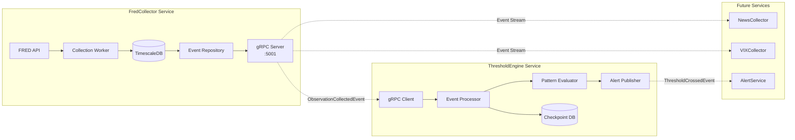

# gRPC Event Streaming Architecture

## Executive Summary

ATLAS uses gRPC server streaming to connect microservices without introducing message broker complexity. FredCollector publishes observation events via gRPC, ThresholdEngine consumes and evaluates patterns, and future services can subscribe independently. This architecture leverages TimescaleDB as the event log, providing durability, queryability, and <100ms latency without operational overhead of Kafka/RabbitMQ.

## Architecture Overview



## Key Design Decisions

### 1. Why gRPC Instead of Message Broker?

**Context**: ATLAS needs event distribution between 2-3 tightly coupled services, not 50+ loosely coupled microservices.

**Decision**: Use gRPC server streaming instead of RabbitMQ/Kafka.

**Rationale**:
- **Eliminates Redundant Persistence**: Events already stored in TimescaleDB (source of truth)
- **Operational Simplicity**: No broker cluster to manage, monitor, or scale
- **Performance**: <100ms latency vs 10-50ms broker round-trips
- **Queryability**: Native support for "events since X" and "events between Y-Z"
- **Type Safety**: Protobuf contracts prevent serialization errors
- **Debugging**: Direct RPC calls easier to trace than broker hops

**Trade-offs**:
- ✅ Perfect for small service count with coordinated deployments
- ✅ Supports 100+ concurrent clients per server (HTTP/2 multiplexing)
- ✅ Idempotent events mean connections *could* scale further
- ❌ Operational complexity at scale: no unified consumer group dashboard, no built-in lag monitoring across all streams, service discovery becomes manual
- ❌ Schema changes require coordinated deployments (tight coupling)
- ❌ No built-in partitioning for parallel consumption (not needed at our throughput)

### 2. Events as Queryable Stream

**Context**: Time-series observations are naturally ordered and need historical access.

**Decision**: Store events in TimescaleDB, stream from database.

**Rationale**:
- **Durability**: Database provides ACID guarantees
- **Ordering**: Single writer + ORDER BY = deterministic sequence
- **Retention**: TimescaleDB policies handle cleanup (2 years default)
- **Recovery**: Clients can query from any point in time
- **Analytics**: SQL queries over event history for backtesting

**Implementation**:
```sql
CREATE TABLE events (
    id BIGSERIAL PRIMARY KEY,
    event_id TEXT UNIQUE NOT NULL,        -- ULID for idempotency
    occurred_at TIMESTAMPTZ NOT NULL,     -- Event timestamp
    source_service TEXT NOT NULL,         -- "FredCollector"
    event_type TEXT NOT NULL,             -- "SeriesCollectedEvent"
    payload JSONB NOT NULL,               -- Full event data
    INDEX idx_events_occurred_at (occurred_at DESC)
);

-- Convert to hypertable for time-series optimization
SELECT create_hypertable('events', 'occurred_at');
```

### 3. Client-Owned Checkpoints

**Context**: Consumers need to track their progress independently.

**Decision**: Each client maintains its own checkpoint (last_processed_event_time).

**Rationale**:
- **Stateless Server**: FredCollector doesn't track consumer state
- **Independent Progress**: Services can catch up at different rates
- **Outage Recovery**: Automatic catch-up from checkpoint on restart
- **No Coordination**: Services don't block each other

**Implementation**:
```csharp
// ThresholdEngine tracks its own progress
var checkpoint = await _repo.GetLastProcessedTimeAsync();
await foreach (var evt in _client.GetEventsSince(checkpoint))
{
    await ProcessEventAsync(evt);
    await _repo.UpdateCheckpointAsync(evt.OccurredAt);
}
```

## Protobuf Contract

**Location**: `src/ATLAS.Events/protos/events.proto`

```protobuf
syntax = "proto3";
package atlas.events;

service EventStream {
  // Real-time streaming from checkpoint
  rpc SubscribeToEvents(SubscriptionRequest) returns (stream Event);
  
  // Historical queries
  rpc GetEventsSince(TimeRangeRequest) returns (stream Event);
  rpc GetEventsBetween(TimeRangeRequest) returns (stream Event);
  
  // Metadata
  rpc GetLatestEventTime(Empty) returns (Timestamp);
}

message Event {
  string event_id = 1;                    // ULID for idempotency
  google.protobuf.Timestamp occurred_at = 2;
  string source_service = 3;
  
  oneof payload {
    SeriesCollectedEvent series_collected = 10;
    CollectionFailedEvent collection_failed = 11;
    ThresholdCrossedEvent threshold_crossed = 20;
    RegimeTransitionEvent regime_transition = 21;
  }
}

message SeriesCollectedEvent {
  string series_id = 1;                   // "ICSA", "UMCSENT"
  repeated DataPoint data_points = 2;
  google.protobuf.Timestamp collected_at = 3;
}

message SubscriptionRequest {
  google.protobuf.Timestamp start_from = 1;
  repeated string event_types = 2;        // Filter by type
  repeated string series_ids = 3;         // Filter by series
}
```

## Implementation Guide

### FredCollector (Event Producer)

1. **Publish Events During Collection**:
```csharp
// In DataCollectionService.cs
var evt = new Event
{
    EventId = Ulid.NewUlid().ToString(),
    OccurredAt = Timestamp.FromDateTime(DateTime.UtcNow),
    SourceService = "FredCollector",
    SeriesCollected = new SeriesCollectedEvent
    {
        SeriesId = seriesId,
        DataPoints = { /* observations */ }
    }
};

await _eventPublisher.PublishAsync(evt);
```

2. **Implement gRPC Server**:
```csharp
// In EventStreamService.cs
public override async Task SubscribeToEvents(
    SubscriptionRequest request,
    IServerStreamWriter<Event> responseStream,
    ServerCallContext context)
{
    // Historical catch-up
    await foreach (var evt in _repo.GetEventsSince(request.StartFrom))
    {
        await responseStream.WriteAsync(evt);
    }
    
    // Real-time streaming (poll or use LISTEN/NOTIFY)
    while (!context.CancellationToken.IsCancellationRequested)
    {
        await Task.Delay(100); // Poll interval
        
        await foreach (var evt in _repo.GetNewEventsSince(lastEventTime))
        {
            await responseStream.WriteAsync(evt);
            lastEventTime = evt.OccurredAt;
        }
    }
}
```

3. **Configure Service**:
```csharp
// In Program.cs
builder.Services.AddGrpc();
app.MapGrpcService<EventStreamService>();
```

### ThresholdEngine (Event Consumer)

1. **Implement gRPC Client**:
```csharp
// In FredCollectorEventClient.cs
public async IAsyncEnumerable<Event> SubscribeToEventsAsync(
    DateTime startFrom,
    CancellationToken cancellationToken)
{
    var request = new SubscriptionRequest
    {
        StartFrom = Timestamp.FromDateTime(startFrom)
    };
    
    using var call = _client.SubscribeToEvents(request);
    
    await foreach (var evt in call.ResponseStream.ReadAllAsync())
    {
        yield return evt;
    }
}
```

2. **Process Events with Checkpointing**:
```csharp
// In EventConsumerWorker.cs
protected override async Task ExecuteAsync(CancellationToken stoppingToken)
{
    while (!stoppingToken.IsCancellationRequested)
    {
        try
        {
            // Get checkpoint
            var checkpoint = await _repo.GetLastProcessedTimeAsync()
                ?? DateTime.UtcNow.AddMonths(-1);
            
            // Historical catch-up
            await foreach (var evt in _client.GetEventsSince(checkpoint))
            {
                await ProcessEventAsync(evt);
            }
            
            // Real-time streaming
            await foreach (var evt in _client.SubscribeToEvents(checkpoint))
            {
                await ProcessEventAsync(evt);
            }
        }
        catch (RpcException ex) when (ex.StatusCode == StatusCode.Unavailable)
        {
            await Task.Delay(5000); // Retry with backoff
        }
    }
}
```

3. **Ensure Idempotent Processing**:
```csharp
// In EventProcessor.cs
public async Task ProcessEventAsync(Event evt)
{
    // Check if already processed (idempotency)
    if (await _repo.HasProcessedAsync(evt.EventId))
        return;
    
    // Process event
    await HandleEventAsync(evt);
    
    // Mark as processed with checkpoint
    await _repo.MarkProcessedAsync(evt.EventId, evt.OccurredAt);
}
```

### Container Configuration

**docker-compose.yaml**:
```yaml
services:
  fred-collector:
    image: atlas/fred-collector:latest
    ports:
      - "5000:5000"  # REST API
      - "5001:5001"  # gRPC
    environment:
      - GRPC__PORT=5001
      - ConnectionStrings__Atlas=Host=timescaledb;Database=atlas
    
  threshold-engine:
    image: atlas/threshold-engine:latest
    depends_on:
      - fred-collector
    environment:
      - FredCollector__GrpcUrl=http://fred-collector:5001
      - ConnectionStrings__Atlas=Host=timescaledb;Database=atlas
    
  timescaledb:
    image: timescale/timescaledb:latest-pg16
    volumes:
      - timescale_data:/var/lib/postgresql/data
```

## Testing Strategy

### Unit Tests

**Event Publishing**:
```csharp
[Fact]
public async Task PublishEvent_StoresInDatabase()
{
    // Arrange
    var evt = CreateTestEvent();
    
    // Act
    await _publisher.PublishAsync(evt);
    
    // Assert
    var stored = await _context.Events.FirstAsync();
    Assert.Equal(evt.EventId, stored.EventId);
}
```

**Event Processing**:
```csharp
[Fact]
public async Task ProcessEvent_IdempotentProcessing()
{
    // Process same event twice
    await _processor.ProcessEventAsync(evt);
    await _processor.ProcessEventAsync(evt);
    
    // Should only process once
    _mockEvaluator.Verify(e => e.EvaluateAsync(It.IsAny<string>()), Times.Once);
}
```

### Integration Tests

**End-to-End Flow**:
```csharp
[Fact]
public async Task EndToEnd_CollectionTriggersPatternEvaluation()
{
    // Arrange: Start both services
    // Act: Trigger collection in FredCollector
    // Assert: ThresholdEngine evaluates patterns
}
```

**Outage Recovery**:
```csharp
[Fact]
public async Task Recovery_CatchesUpMissedEvents()
{
    // Arrange: ThresholdEngine offline, events published
    // Act: Restart ThresholdEngine
    // Assert: All events processed via catch-up
}
```

### Performance Tests

```csharp
[Fact]
public async Task Performance_100ConcurrentClients()
{
    // Connect 100 clients
    // Measure: latency, throughput, resource usage
    // Target: <100ms p99, >10K events/sec
}
```

## Monitoring & Observability

### Key Metrics

**FredCollector (Producer)**:
- `fredcollector.events.published` - Events published per minute
- `fredcollector.grpc.subscriptions` - Active client connections
- `fredcollector.grpc.streaming_latency_ms` - Stream latency histogram

**ThresholdEngine (Consumer)**:
- `thresholdengine.events.received` - Events received per minute
- `thresholdengine.events.processed` - Events successfully processed
- `thresholdengine.checkpoint_lag_seconds` - How far behind real-time

### Grafana Dashboard Panels

1. **Event Flow Overview**:
   - Events published vs consumed (time series)
   - Checkpoint lag (gauge)
   - Active gRPC connections (current value)

2. **Performance Metrics**:
   - Event processing latency (p50, p95, p99)
   - Pattern evaluation rate
   - Database query performance

3. **Error Tracking**:
   - Failed event processing
   - gRPC connection errors
   - Retry attempts

### Distributed Tracing

```csharp
using var activity = ActivitySource.StartActivity("ProcessEvent");
activity?.SetTag("event.id", evt.EventId);
activity?.SetTag("event.type", evt.PayloadCase);
```

## Operational Procedures

### Deployment Sequence

1. Deploy FredCollector with gRPC server enabled
2. Verify gRPC endpoint health: `grpcurl fred-collector:5001 list`
3. Deploy ThresholdEngine with EventConsumerWorker
4. Monitor checkpoint progress in Grafana
5. Validate event flow end-to-end

### Troubleshooting

**Issue: ThresholdEngine not receiving events**
- Check gRPC connectivity: `grpcurl fred-collector:5001 atlas.events.EventStream/GetLatestEventTime`
- Verify checkpoint: Query `processed_events` table for last checkpoint
- Check logs for retry attempts

**Issue: High checkpoint lag**
- Verify pattern evaluation performance
- Check database query latency
- Consider batch size tuning

**Issue: Duplicate processing**
- Verify idempotency check (`event_id` uniqueness)
- Check for transaction rollbacks
- Review error handling logic

### Recovery Procedures

**Manual Checkpoint Reset**:
```sql
-- Reset to specific time
UPDATE checkpoint SET last_processed = '2025-01-01 00:00:00'::timestamptz
WHERE service = 'ThresholdEngine';
```

**Force Historical Replay**:
```bash
# Set environment variable to override checkpoint
EVENTCONSUMER__BACKFILLMONTHS=3 ./threshold-engine
```

## Future Enhancements

### Phase 2 (Q2 2026)
- **Postgres LISTEN/NOTIFY**: Replace polling with push notifications
- **Event Compaction**: Batch multiple observations into single event
- **gRPC-Web**: Browser-based dashboard subscriptions
- **Multi-tenant**: Service-specific event filtering

### Phase 3 (Q3 2026)
- **Event Replay API**: Debug/backtest with historical events
- **Schema Evolution**: Versioned protobuf contracts
- **Dead Letter Queue**: Failed event investigation
- **Horizontal Scaling**: Multiple gRPC server instances

## Success Criteria

### Functional Requirements
- ✅ Events flow from FredCollector to ThresholdEngine
- ✅ Historical catch-up works on restart
- ✅ Idempotent processing prevents duplicates
- ✅ Checkpoint recovery within 1 minute
- ✅ 100+ concurrent clients supported

### Performance Requirements
- ✅ <100ms event publishing latency (p99)
- ✅ <500ms end-to-end latency (publish to process)
- ✅ >100 events/sec throughput
- ✅ <10 second checkpoint lag normal operation
- ✅ <20ms database query latency (p95)

### Quality Requirements
- ✅ 80%+ test coverage on gRPC logic
- ✅ Zero event loss over 30-day evaluation
- ✅ 99.9% uptime over 90 days
- ✅ Comprehensive observability operational
- ✅ Documentation complete and accurate

## Summary

The gRPC event streaming architecture provides ATLAS with a simple, performant, and reliable event distribution system without the operational complexity of traditional message brokers. By leveraging TimescaleDB as the event log and gRPC for streaming, we achieve <100ms latency, historical queryability, and automatic recovery - all critical for real-time financial decision-making.

**Key Innovation**: Events-as-queryable-stream model perfectly fits time-series financial data, providing both real-time updates and historical analysis capabilities in a single, elegant architecture.

---

*Last Updated: 2025-11-17*  
*Status: Architecture Approved, Implementation Planned for Q1 2026*  
*Owner: James (Head Architect)*
