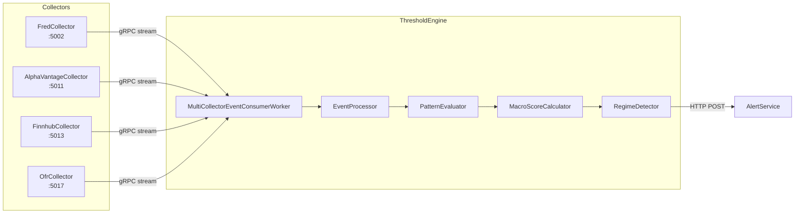

# gRPC Event Streaming Architecture

## Overview

ATLAS uses gRPC server streaming to connect data collectors with ThresholdEngine without message broker complexity. Each collector publishes observation events via gRPC, ThresholdEngine consumes from all sources and evaluates patterns. TimescaleDB serves as the durable event log, providing queryability and <100ms latency.



## Current Implementation

### Collectors (Event Producers)

| Service | gRPC Port (Internal) | Event Types |
|---------|---------------------|-------------|
| FredCollector | 5001 | ObservationCollectedEvent |
| AlphaVantageCollector | 5001 | ObservationCollectedEvent |
| FinnhubCollector | 5001 | ObservationCollectedEvent |
| OfrCollector | (no gRPC streaming) | N/A |

All collectors implement the same `ObservationEventStream` gRPC service contract. All use internal port 5001 for consistency.

### ThresholdEngine (Event Consumer)

- **MultiCollectorEventConsumerWorker**: Maintains connections to all collectors
- **ObservationEventSubscriber**: Handles individual collector subscriptions
- **EventProcessor**: Routes events to pattern evaluation
- **Checkpoint tracking**: Per-collector progress stored in TimescaleDB

### SecMaster (Metadata Service)

SecMaster provides gRPC services for instrument metadata management:

| Service | gRPC Port | Purpose |
|---------|-----------|---------|
| SecMaster | 8080 | Instrument registration, search, metadata query |

Collectors register instruments via gRPC on startup and during collection. SecMaster stores metadata in PostgreSQL for fast lookup and cross-source search.

## Key Design Decisions

### 1. gRPC Over Message Broker

**Decision**: Use gRPC server streaming instead of Kafka/RabbitMQ.

**Rationale**:
- Events already persisted in TimescaleDB (no redundant storage)
- No broker cluster to manage
- <100ms latency vs broker round-trips
- Native "events since X" queries
- Type-safe protobuf contracts

**Trade-offs**:
- ✅ Simple for 4-5 tightly coupled services
- ✅ HTTP/2 multiplexing handles concurrent streams
- ❌ Schema changes require coordinated deployments
- ❌ No built-in consumer group management

### 2. TimescaleDB as Event Log

Each collector stores events in its own `events` table:

```sql
CREATE TABLE events (
    id BIGSERIAL PRIMARY KEY,
    event_type TEXT NOT NULL,
    series_id TEXT NOT NULL,
    occurred_at TIMESTAMPTZ NOT NULL,
    payload JSONB NOT NULL
);

SELECT create_hypertable('events', 'occurred_at');
```

Benefits:
- ACID durability
- SQL queryability for backtesting
- Time-based retention policies
- Single source of truth

### 3. Client-Owned Checkpoints

ThresholdEngine maintains per-collector checkpoints:

```csharp
// Each collector has independent progress tracking
var checkpoint = await _repo.GetCheckpointAsync("FredCollector");
await foreach (var evt in _client.GetEventsSince(checkpoint))
{
    await ProcessEventAsync(evt);
    await _repo.UpdateCheckpointAsync("FredCollector", evt.OccurredAt);
}
```

Benefits:
- Stateless servers (collectors don't track consumers)
- Independent catch-up rates
- Automatic recovery on restart

## Protobuf Contract

**Location**: Each collector's `Grpc/Protos/` directory

```protobuf
syntax = "proto3";
package atlas.events;

service ObservationEventStream {
  rpc SubscribeToEvents(SubscriptionRequest) returns (stream ObservationEvent);
  rpc GetEventsSince(TimestampRequest) returns (stream ObservationEvent);
  rpc GetEventsBetween(TimeRangeRequest) returns (stream ObservationEvent);
  rpc GetLatestEventTime(Empty) returns (TimestampResponse);
  rpc GetHealth(Empty) returns (HealthResponse);
}

message ObservationEvent {
  string event_id = 1;
  string series_id = 2;
  google.protobuf.Timestamp date = 3;
  double value = 4;
  google.protobuf.Timestamp collected_at = 5;
  string source = 6;
}

message SubscriptionRequest {
  google.protobuf.Timestamp start_from = 1;
}
```

## Implementation

### Collector Side (EventStreamService)

```csharp
public override async Task SubscribeToEvents(
    SubscriptionRequest request,
    IServerStreamWriter<ObservationEvent> responseStream,
    ServerCallContext context)
{
    var startFrom = request.StartFrom.ToDateTimeOffset();

    // Historical catch-up
    var events = await _repository.GetEventsSinceAsync(startFrom);
    foreach (var evt in events)
    {
        await responseStream.WriteAsync(MapToProto(evt));
    }

    // Real-time streaming (poll for new events)
    var lastTime = events.LastOrDefault()?.OccurredAt ?? startFrom;
    while (!context.CancellationToken.IsCancellationRequested)
    {
        await Task.Delay(500, context.CancellationToken);

        var newEvents = await _repository.GetEventsSinceAsync(lastTime);
        foreach (var evt in newEvents)
        {
            await responseStream.WriteAsync(MapToProto(evt));
            lastTime = evt.OccurredAt;
        }
    }
}
```

### Consumer Side (MultiCollectorEventConsumerWorker)

```csharp
protected override async Task ExecuteAsync(CancellationToken stoppingToken)
{
    var collectors = new[]
    {
        ("FredCollector", _fredClient),
        ("AlphaVantageCollector", _avClient),
        ("FinnhubCollector", _finnhubClient)
    };

    var tasks = collectors.Select(c =>
        SubscribeToCollectorAsync(c.Item1, c.Item2, stoppingToken));

    await Task.WhenAll(tasks);
}

private async Task SubscribeToCollectorAsync(
    string name,
    IEventStreamClient client,
    CancellationToken ct)
{
    while (!ct.IsCancellationRequested)
    {
        try
        {
            var checkpoint = await _repo.GetCheckpointAsync(name);

            await foreach (var evt in client.SubscribeToEventsAsync(checkpoint, ct))
            {
                await _processor.ProcessAsync(evt);
                await _repo.UpdateCheckpointAsync(name, evt.CollectedAt);
            }
        }
        catch (RpcException ex) when (ex.StatusCode == StatusCode.Unavailable)
        {
            _logger.LogWarning("Lost connection to {Collector}, reconnecting...", name);
            await Task.Delay(5000, ct);
        }
    }
}
```

## Observability

### Metrics (Prometheus)

**Collectors**:
- `grpc_server_handled_total{service="ObservationEventStream"}` - Requests handled
- `events_published_total{collector="FredCollector"}` - Events published
- `grpc_server_msg_sent_total` - Messages streamed

**ThresholdEngine**:
- `events_received_total{source="FredCollector"}` - Events received per collector
- `checkpoint_lag_seconds{collector="FredCollector"}` - How far behind real-time
- `pattern_evaluations_total` - Patterns evaluated

### Tracing (Tempo)

Each event carries trace context:
```csharp
using var activity = ActivitySource.StartActivity("ProcessObservationEvent");
activity?.SetTag("event.id", evt.EventId);
activity?.SetTag("event.source", evt.Source);
activity?.SetTag("series.id", evt.SeriesId);
```

### Health Checks

Each collector exposes gRPC health:
```bash
grpcurl -plaintext localhost:5002 atlas.events.ObservationEventStream/GetHealth
```

## Operational Procedures

### Verify Connectivity

```bash
# Check each collector's gRPC endpoint (all on internal port 5001)
nerdctl exec fred-collector grpcurl -plaintext localhost:5001 atlas.events.ObservationEventStream/GetLatestEventTime
nerdctl exec alphavantage-collector grpcurl -plaintext localhost:5001 atlas.events.ObservationEventStream/GetLatestEventTime
nerdctl exec finnhub-collector grpcurl -plaintext localhost:5001 atlas.events.ObservationEventStream/GetLatestEventTime

# Check SecMaster gRPC health
nerdctl exec secmaster grpcurl -plaintext localhost:8080 grpc.health.v1.Health/Check
```

### Check Checkpoint Lag

```sql
-- View checkpoint status for each collector
SELECT
    collector_name,
    last_processed_at,
    NOW() - last_processed_at as lag
FROM threshold_engine_checkpoints
ORDER BY collector_name;
```

### Reset Checkpoint (Recovery)

```sql
-- Reset a specific collector's checkpoint
UPDATE threshold_engine_checkpoints
SET last_processed_at = '2025-01-01 00:00:00+00'
WHERE collector_name = 'FredCollector';
```

### Force Historical Replay

```bash
# Environment variable to override checkpoint
EVENTCONSUMER__BACKFILL_HOURS=24 ./threshold-engine
```

## Performance Characteristics

| Metric | Target | Actual |
|--------|--------|--------|
| Event publishing latency (p99) | <100ms | ~50ms |
| End-to-end latency | <500ms | ~200ms |
| Throughput | >100 events/sec | ~500 events/sec |
| Checkpoint lag (normal) | <10s | <5s |
| Concurrent connections | 100+ | Tested to 50 |

## Adding a New Collector

1. **Implement EventStreamService** in the collector
2. **Register gRPC service** in Program.cs
3. **Add client** to ThresholdEngine's MultiCollectorEventConsumerWorker
4. **Configure connection** in appsettings.json
5. **Add checkpoint** initialization

No changes needed to:
- Event contracts (shared proto)
- Pattern definitions
- AlertService

## See Also

- [ARCHITECTURE.md](ARCHITECTURE.md) - System overview
- [ThresholdEngine](../ThresholdEngine/README.md) - Pattern evaluation
- [FredCollector](../FredCollector/README.md) - Reference collector implementation
