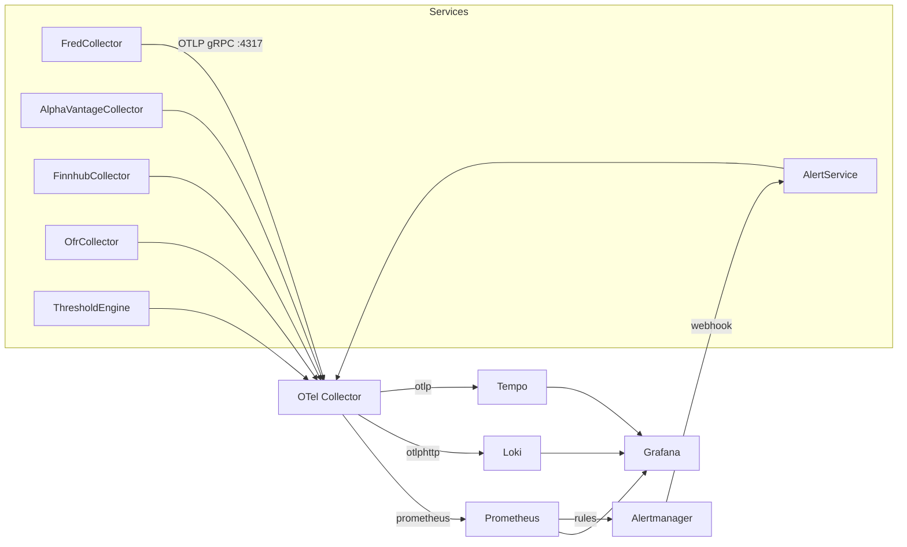

# ATLAS Observability

OpenTelemetry-based observability with traces, metrics, and logs across all services.

## Architecture



## Stack

| Component | Port | Purpose |
|-----------|------|---------|
| OTel Collector | 4317 (gRPC), 4318 (HTTP) | OTLP receiver, routing |
| Prometheus | 9090 | Metrics storage, alerting rules |
| Loki | 3101 | Log aggregation |
| Tempo | 3200 | Distributed tracing |
| Alertmanager | 9093 | Alert routing |
| Grafana | 3000 | Dashboards, exploration |

## Service Configuration

All services use the same OpenTelemetry configuration pattern:

```csharp
// Program.cs
builder.Services.AddOpenTelemetry()
    .ConfigureResource(r => r.AddService(serviceName))
    .WithTracing(t => t
        .AddAspNetCoreInstrumentation()
        .AddHttpClientInstrumentation()
        .AddGrpcClientInstrumentation()
        .AddSource(ServiceActivitySource.Name)
        .AddOtlpExporter())
    .WithMetrics(m => m
        .AddAspNetCoreInstrumentation()
        .AddHttpClientInstrumentation()
        .AddMeter(ServiceMeter.Name)
        .AddOtlpExporter());
```

**Environment Variables**:
```yaml
OTEL_EXPORTER_OTLP_ENDPOINT: http://otel-collector:4317
OTEL_SERVICE_NAME: fred-collector
OTEL_RESOURCE_ATTRIBUTES: deployment.environment=production
```

## Metrics

### Naming Convention

```
{service}.{component}.{metric}
```

Examples:
- `fredcollector.api.requests_total`
- `thresholdengine.patterns.evaluated_total`
- `ofrcollector.fsi.collection_duration_seconds`

### Common Metrics (All Services)

| Metric | Type | Tags | Description |
|--------|------|------|-------------|
| `*.api.requests_total` | Counter | endpoint, method, status | HTTP requests |
| `*.api.request_duration_seconds` | Histogram | endpoint, method | Request latency |
| `*.grpc.requests_total` | Counter | method, status | gRPC calls |
| `*.database.query_duration_seconds` | Histogram | operation | DB query time |

### Collector Metrics

| Metric | Type | Description |
|--------|------|-------------|
| `*.observations.collected_total` | Counter | Observations ingested |
| `*.collection.duration_seconds` | Histogram | Collection job duration |
| `*.api.errors_total` | Counter | External API errors |
| `*.events.published_total` | Counter | gRPC events streamed |

### ThresholdEngine Metrics

| Metric | Type | Description |
|--------|------|-------------|
| `thresholdengine.patterns.evaluated_total` | Counter | Pattern evaluations |
| `thresholdengine.patterns.triggered_total` | Counter | Patterns that fired |
| `thresholdengine.macro_score` | Gauge | Current macro score |
| `thresholdengine.regime` | Gauge | Current regime (0-3) |
| `thresholdengine.events.received_total` | Counter | Events from collectors |

## Tracing

### ActivitySource Pattern

Each service defines its own ActivitySource:

```csharp
public static class ServiceActivitySource
{
    public const string Name = "FredCollector";
    public static readonly ActivitySource Source = new(Name, "1.0.0");
}
```

### Span Creation

```csharp
using var activity = ServiceActivitySource.Source.StartActivity("CollectSeries");
activity?.SetTag("series.id", seriesId);
activity?.SetTag("source", "FRED");

try
{
    // ... operation
    activity?.SetStatus(ActivityStatusCode.Ok);
}
catch (Exception ex)
{
    activity?.SetStatus(ActivityStatusCode.Error, ex.Message);
    activity?.AddException(ex);
    throw;
}
```

### Recording Exceptions

Always record exceptions in catch blocks. This ensures exceptions appear in traces for debugging:

```csharp
catch (Exception ex)
{
    activity?.SetStatus(ActivityStatusCode.Error, ex.Message);  // Marks span as error
    activity?.AddException(ex);  // Adds exception event with stack trace
    _logger.LogError(ex, "Operation failed for {SeriesId}", seriesId);
    throw;
}
```

`AddException` adds an event to the span containing:
- Exception type (`exception.type`)
- Message (`exception.message`)
- Stack trace (`exception.stacktrace`)

### Required Tags

| Tag | Description | Example |
|-----|-------------|---------|
| `series.id` | Data series identifier | "UNRATE" |
| `source` | Data source | "FRED", "OFR", "Finnhub" |
| `operation` | Operation type | "collect", "backfill" |
| `success` | Outcome | "true", "false" |

## Logging

### Serilog Configuration

All services use Serilog with OTLP export and trace correlation:

```csharp
builder.Host.UseSerilog((context, config) => config
    .ReadFrom.Configuration(context.Configuration)
    .Enrich.FromLogContext()
    .Enrich.WithSpan()  // Adds trace_id, span_id
    .WriteTo.OpenTelemetry(opts =>
    {
        opts.Endpoint = otlpEndpoint;
        opts.Protocol = OtlpProtocol.Grpc;
    }));
```

### Log Levels

Production default is `Warning`. Use levels correctly:

| Level | Use For | Example |
|-------|---------|---------|
| Information | Routine ops, expected retries | "Collected 5 observations for UNRATE" |
| Warning | Unexpected but recoverable | "Rate limited, backing off" |
| Error | Failures, exceptions | "Failed to connect to FRED API" |

### Structured Logging

```csharp
// Good - structured with context
_logger.LogWarning("Collection failed for {SeriesId} after {Attempts} attempts",
    seriesId, attempts);

// Bad - string interpolation loses structure
_logger.LogWarning($"Collection failed for {seriesId} after {attempts} attempts");
```

## Alerting

### Alert Rules

Located in `deployment/artifacts/monitoring/alerts/`:

| File | Scope | Key Alerts |
|------|-------|------------|
| `service-health.yml` | All services | Container restarts, memory, CPU |
| `fredcollector.yml` | FredCollector | API errors, collection failures |
| `thresholdengine.yml` | ThresholdEngine | Pattern load failures, event processing |

### Alert Routing

```yaml
# alertmanager.yml
routes:
  - match:
      severity: critical
    receiver: critical
    group_wait: 10s
    repeat_interval: 1h
  - match:
      severity: warning
    receiver: warning
    group_wait: 30s
    repeat_interval: 2h
```

### Notification Flow

```
Prometheus → Alertmanager → AlertService → ntfy.sh / Email
```

AlertService receives webhooks and routes by severity:
- **critical**: ntfy + email
- **warning**: ntfy only
- **info**: email only

## Dashboards

### Available Dashboards

| Dashboard | Purpose |
|-----------|---------|
| ATLAS Overview | System health, all services |
| FredCollector | FRED API, collection metrics |
| ThresholdEngine | Pattern evaluation, regime status |
| OfrCollector | FSI trends, STFM/HFM collection |
| FinnhubCollector | Quote collection, calendar sync |

### Dashboard Location

Provisioned dashboards: `deployment/artifacts/monitoring/dashboards/`

## Best Practices

### 1. Metrics at Service Boundary

Record metrics at the service boundary, not internal layers:

```csharp
// ✓ Correct - gRPC service boundary
public override async Task SubscribeToEvents(...)
{
    await foreach (var evt in _repo.GetEventsAsync())
    {
        await responseStream.WriteAsync(evt);
        _eventsStreamed.Add(1);  // Count here
    }
}

// ✗ Wrong - internal repository
public async IAsyncEnumerable<Event> GetEventsAsync()
{
    yield return evt;
    _meter.Add(1);  // Double-counting with service layer
}
```

### 2. Bounded Tag Cardinality

Tags must have finite possible values:

```csharp
// ✓ Good - bounded
activity?.SetTag("status", success ? "ok" : "error");
activity?.SetTag("method", "GET");

// ✗ Bad - unbounded
activity?.SetTag("user_id", userId);      // Unique per user
activity?.SetTag("event_id", eventId);    // Unique per event
activity?.SetTag("series_id", seriesId);  // Grows with data
```

### 3. Error Status in Catch Blocks

Always record errors in traces:

```csharp
catch (Exception ex)
{
    activity?.SetStatus(ActivityStatusCode.Error, ex.Message);
    _logger.LogError(ex, "Operation failed");
    throw;
}
```

### 4. Streaming Metrics

For long-running streams, emit per-event metrics:

```csharp
// ✓ Visible during streaming
await foreach (var evt in stream)
{
    await Process(evt);
    _counter.Add(1);  // Immediate visibility
}

// ✗ Only visible after stream ends
var count = await stream.CountAsync();
_counter.Add(count);  // Hours of no data
```

## Troubleshooting

### No Metrics in Prometheus

1. Check OTLP endpoint: `curl http://otel-collector:4317`
2. Verify service config: `OTEL_EXPORTER_OTLP_ENDPOINT`
3. Check OTel Collector logs: `nerdctl logs otel-collector`

### Missing Traces

1. Verify ActivitySource is registered in `.AddSource()`
2. Check trace sampling (default 100%)
3. Confirm Tempo is receiving: Grafana → Explore → Tempo

### Logs Not Correlated

1. Ensure `.Enrich.WithSpan()` in Serilog config
2. Check logs include `trace_id` field
3. Verify Loki label extraction in OTel Collector config

## Access

| Service | URL |
|---------|-----|
| Grafana | http://mercury:3000 |
| Prometheus | http://mercury:9090 |
| Alertmanager | http://mercury:9093 |
| Tempo | http://mercury:3200 |
| Loki | http://mercury:3101 |

## See Also

- [ARCHITECTURE.md](ARCHITECTURE.md) - System overview
- [Deployment](../deployment/README.md) - Infrastructure setup
- [AlertService](../AlertService/README.md) - Notification routing
