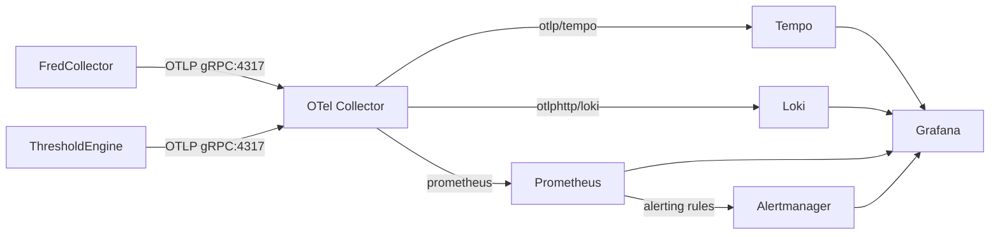

# Observability

OpenTelemetry (OTLP) for traces, metrics, and logs with correlation.

## Architecture

**Backends**:
- Tempo: Distributed tracing (traces via OTLP gRPC)
- Loki: Log aggregation (logs via OTLP HTTP)
- Prometheus: Metrics storage + alert evaluation
- Alertmanager: Alert routing and notifications
- Grafana: Unified dashboards

## Pipeline Status

| Component | Status | Notes |
|-----------|--------|-------|
| Metrics → Prometheus | ✅ Working | Via OTel prometheus exporter |
| Logs → Loki | ✅ Working | Via otlphttp/loki exporter |
| Traces → Tempo | ✅ Working | Via otlp/tempo exporter |
| Alert rules | ✅ Defined | 3 rule files in monitoring/alerts/ |
| Alert routing | ✅ Configured | Severity-based (critical/warning/info) |
| Notifications | ✅ AlertService | ntfy.sh + email via AlertService sink |

## Instrumentation

**Automatic**: ASP.NET Core, HttpClient, EF Core  
**Custom**: Business metrics (observations, rate limiter, API duration, workers, repositories)

### Instrumentation Coverage

**Phase 1 (Complete)**: Core framework (ActivitySource, Meter, OTel config)  
**Phase 2 (Complete)**: API endpoints (traces, metrics, tags)  
**Phase 3 (Complete)**: Workers (DataCollectionScheduler, ThresholdAlertWorker, InitialDataBackfillWorker)  
**Phase 4 (Complete)**: Repositories (ObservationRepository, SeriesConfigRepository, ThresholdAlertRepository)  
**Phase 5 (Complete)**: Grafana dashboards

## Configuration

**Endpoint**: `OpenTelemetry__OtlpEndpoint=http://otel-collector:4317`  
**Service Name**: `OpenTelemetry__ServiceName=fred-collector-service` (or `fred-collector-api`)  
**Logging**: Serilog → OTLP (structured, trace-correlated)

## Metrics

### FRED API Metrics
- `fredcollector.fred_api.requests.total` - Counter (series_id, success, status_code)
- `fredcollector.fred_api.request.duration` - Histogram (ms, series_id, success)
- `fredcollector.fred_api.errors.total` - Counter (series_id, error_type, status_code)

### Data Collection Metrics
- `fredcollector.observations.collected.total` - Counter (series_id, frequency)
- `fredcollector.data_collection.duration` - Histogram (ms, series_id, operation, success)
- `fredcollector.backfill.duration` - Histogram (ms, series_id, success)
- `fredcollector.backfill.observations.processed` - Counter (series_id)

### Worker Metrics
- `fredcollector.worker.series.scheduled.total` - Counter (worker)
- `fredcollector.worker.threshold.observations.processed.total` - Counter (series_id, threshold_crossed)
- `fredcollector.worker.threshold.alerts.generated.total` - Counter (series_id, category)
- `fredcollector.worker.backfill.initial.series.processed.total` - Counter (success)

### Repository Metrics
- `fredcollector.repository.operation.duration` - Histogram (ms, repository, operation, success)
- `fredcollector.repository.observations.upserted.total` - Counter (series_id, operation)
- `fredcollector.repository.observations.revised.total` - Counter (series_id)
- `fredcollector.repository.bulk_insert.batches.total` - Counter (batch_size)
- `fredcollector.repository.queries.total` - Counter (repository, operation)

### API Metrics
- `fredcollector.api.requests.total` - Counter (endpoint, http_method, status_code, success)
- `fredcollector.api.cache.hits.total` - Counter (endpoint)
- `fredcollector.api.cache.misses.total` - Counter (endpoint)

### Seeding Metrics
- `fredcollector.seeding.series.seeded.total` - Counter (series_id, category)

## Traces

Custom spans created using `FredCollectorActivitySource`:
- `ScheduleAllActiveSeries` - Scheduling all series for collection
- `ScheduleSeriesJob` - Scheduling individual series
- `ProcessObservation` - Processing observation for threshold checking
- `InitialDataBackfill` - Initial backfill worker execution
- `BackfillSeries` - Backfilling individual series
- `UpsertObservation` - Upserting observation to database
- `BulkInsertObservations` - Bulk inserting observations
- `GetObservations` - Querying observations
- `GetLatestObservation` - Getting latest observation
- `GetActiveSeries` - Getting active series configurations
- `AddThresholdAlert` - Adding threshold alert

All spans include relevant tags (series_id, operation type, success/failure, etc.)

## Grafana Dashboards

**Location**: `infrastructure/monitoring/fredcollector-dashboard.json`

**Panels**:
- FRED API Request Rate
- FRED API Request Duration (p95)
- FRED API Errors
- Observations Collected
- Data Collection Duration (p95)
- Series Scheduled
- Threshold Observations Processed
- Threshold Alerts Generated
- Initial Backfill Series Processed
- Backfill Duration (p95)
- Repository Operation Duration (p95)
- Observations Upserted
- Observations Revised
- Bulk Insert Batches
- Repository Queries
- API Requests (by endpoint)

## Access

- Grafana: http://localhost:3000
- Prometheus: http://localhost:9090
- Tempo: http://localhost:3200
- Loki: http://localhost:3101

## Trace-Log Correlation

Click trace ID in Grafana → see all logs for that request. Logs include `trace_id` and `span_id` automatically via Serilog.Enrichers.Span.

## Alerting

### Alert Rules

Three rule files in `infrastructure/monitoring/alerts/`:

**service-health.yml**:
- Container restarts > 3 in 15m
- Service down > 1m
- Memory usage > 90%
- CPU usage > 90%

**fredcollector.yml**:
- API errors > 5% for 5m
- API latency p95 > 5s
- Rate limiting active
- Collection failures
- Database latency > 1s
- No events streamed (dead man's switch)

**thresholdengine.yml**:
- Warmup failures
- Empty cache (no compiled expressions)
- Patterns not loaded
- gRPC connection retries
- Event processing failures
- High latency (p95)

### Alert Routing (alertmanager.yml)

| Severity | Group Wait | Repeat | Receiver |
|----------|------------|--------|----------|
| critical | 10s | 1h | `critical` |
| warning | 30s | 2h | `warning` |
| info | 5m | 12h | `default` |

### Notifications (AlertService)

All Alertmanager receivers POST to AlertService (`http://alert-service:8080/alerts`).

**AlertService** (port 8081):
- Async notification sink with pluggable channels
- Receives webhooks from Alertmanager (ops alerts)
- Can receive direct POSTs from ThresholdEngine (business alerts)

**Notification Channels**:
- `NtfyChannel`: Push notifications via ntfy.sh
- `EmailChannel`: SMTP email via MailKit

**Routing** (by severity):
| Severity | Channels |
|----------|----------|
| critical | ntfy + email |
| warning | ntfy |
| info | email |

**Configuration**: Environment variables in compose.yaml:
- `Channels__Ntfy__Topic`: ntfy.sh topic name
- `Channels__Email__Enabled`: Enable/disable email
- `Channels__Email__SmtpHost`: SMTP server
