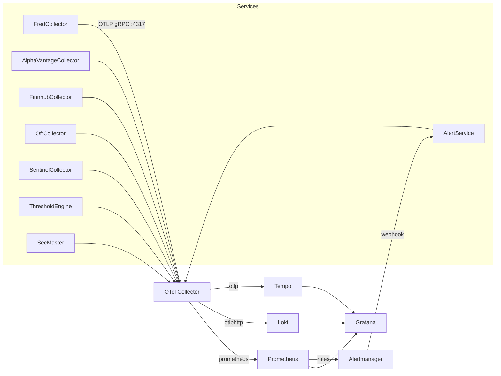
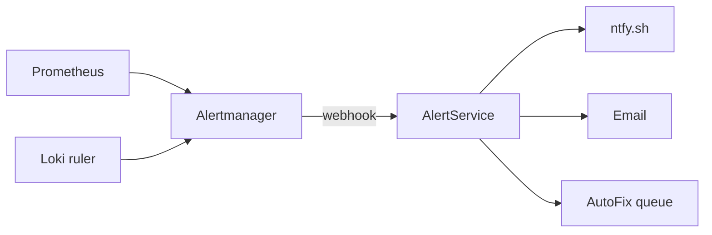

# ATLAS Observability

OpenTelemetry-based observability with traces, metrics, and logs across all services.

## Architecture


```mermaid
flowchart LR
    subgraph Services
        FC[FredCollector]
        AV[AlphaVantageCollector]
        FH[FinnhubCollector]
        OFR[OfrCollector]
        SC[SentinelCollector]
        TE[ThresholdEngine]
        AS[AlertService]
        SM[SecMaster]
    end

    FC -->|OTLP gRPC :4317| OC[OTel Collector]
    AV --> OC
    FH --> OC
    OFR --> OC
    SC --> OC
    TE --> OC
    AS --> OC
    SM --> OC

    OC -->|otlp| T[Tempo]
    OC -->|otlphttp| L[Loki]
    OC -->|prometheus| P[Prometheus]
    P -->|rules| AM[Alertmanager]
    AM -->|webhook| AS

    T --> G[Grafana]
    L --> G
    P --> G
```

## Stack

| Component | Port (internal) | Purpose |
|-----------|------|---------|
| OTel Collector | 4317 (gRPC), 4318 (HTTP) | OTLP receiver, routing |
| Prometheus | 9090 | Metrics storage (120d retention), alerting rules |
| Loki | 3100 | Log aggregation (30d retention) |
| Tempo | 3200 | Distributed tracing (7d retention) |
| Alertmanager | 9093 | Alert routing |
| Grafana | 3000 | Dashboards, exploration |

Only **Grafana** is mapped to a host port (`mercury:3000`); Prometheus/Loki/Tempo/Alertmanager are
internal-only and reached through Grafana's datasource proxy. Prometheus scrapes every 15s; jobs:
`node-exporter`, `nvidia-gpu` (gpu-exporter), `otel-collector`, `containerd`, `gemini-resolver`
(there is no `ups` job — UPS monitoring is dead since 2026-06-11).

## Service Configuration

All services use the same OpenTelemetry configuration pattern:

```csharp
// Program.cs
builder.Services.AddOpenTelemetry()
    .ConfigureResource(r => r.AddService(serviceName))
    .WithTracing(t => t
        .AddAspNetCoreInstrumentation()
        .AddHttpClientInstrumentation()
        .AddGrpcClientInstrumentation()
        .AddSource(ServiceActivitySource.Name)
        .AddOtlpExporter())
    .WithMetrics(m => m
        .AddAspNetCoreInstrumentation()
        .AddHttpClientInstrumentation()
        .AddRuntimeInstrumentation()        // CLR: GC, heap, threadpool, cpu.count, exceptions
        .AddMeter(ServiceMeter.Name)
        .AddOtlpExporter());
```

> **Runtime instrumentation is mandatory** on every .NET service (package
> `OpenTelemetry.Instrumentation.Runtime`). See [.NET Runtime Metrics](#net-runtime-metrics-all-net-services).

**Environment Variables** (configured in compose.yaml):
```yaml
OpenTelemetry__OtlpEndpoint: http://otel-collector:4317
OpenTelemetry__ServiceName: fred-collector
OpenTelemetry__ServiceVersion: 1.0.0
```

## Metrics

### Naming Convention

```
{service}.{component}.{metric}
```

Examples:
- `fredcollector.fred_api.requests.total`
- `thresholdengine.events.received`
- `ofrcollector.collection.duration`

### FredCollector Metrics

| Metric | Type | Description |
|--------|------|-------------|
| `fredcollector.fred_api.request.duration` | Histogram | FRED API request duration (ms) |
| `fredcollector.fred_api.requests.total` | Counter | Total FRED API requests |
| `fredcollector.fred_api.errors.total` | Counter | FRED API errors |
| `fredcollector.observations.collected.total` | Counter | Observations collected |
| `fredcollector.data_collection.duration` | Histogram | Collection operation duration |
| `fredcollector.backfill.duration` | Histogram | Backfill operation duration |
| `fredcollector.api.requests.total` | Counter | REST API requests |
| `fredcollector.repository.operation.duration` | Histogram | Repository operation duration |

### ThresholdEngine Metrics

| Metric | Type | Description |
|--------|------|-------------|
| `thresholdengine.events.received` | Counter | Events received from collectors |
| `thresholdengine.events.processed` | Counter | Events successfully processed |
| `thresholdengine.patterns.triggered` | Counter | Patterns that fired |
| `thresholdengine.streaming.events_processed` | Counter | Real-time streaming events |
| `thresholdengine.grpc.call_duration_seconds` | Histogram | gRPC call duration |
| `thresholdengine.warmup.duration_ms` | Histogram | Cache warm-up duration |
| `thresholdengine.regime.transitions` | Counter | Confirmed regime transitions |
| `thresholdengine.regime.update_duration_ms` | Histogram | Regime update processing time |

### OfrCollector Metrics

| Metric | Type | Description |
|--------|------|-------------|
| `ofrcollector.fsi.collections` | Counter | FSI collection runs |
| `ofrcollector.stfm.collections` | Counter | STFM collection runs |
| `ofrcollector.hfm.collections` | Counter | HFM collection runs |
| `ofrcollector.api.requests` | Counter | External API requests |
| `ofrcollector.api.errors` | Counter | API errors |
| `ofrcollector.collection.duration` | Histogram | Collection duration |
| `ofrcollector.observations.collected` | Counter | Observations collected |

### AlertService Metrics

| Metric | Type | Description |
|--------|------|-------------|
| `alertservice.alerts.received` | Counter | Alerts received from Alertmanager |
| `alertservice.alerts.dispatched` | Counter | Alerts dispatched to channels |
| `alertservice.alerts.sent` | Counter | Alerts successfully sent |
| `alertservice.alerts.failed` | Counter | Failed alert deliveries |
| `alertservice.channel.send_duration` | Histogram | Channel send duration |

### .NET Runtime Metrics (all .NET services)

Every .NET service calls `.AddRuntimeInstrumentation()` (package `OpenTelemetry.Instrumentation.Runtime`),
exporting the CLR's built-in `System.Runtime` counters. These arrive under the `dotnet.*` semconv
namespace (Prometheus form shown), tagged with `exported_job="{service}"`:

| Metric (Prometheus) | Description |
|--------|-------------|
| `dotnet_process_memory_working_set_bytes` | Process working set (RSS) |
| `dotnet_process_cpu_count` | **CPUs the CLR sees** — driven by the cgroup `cpu.max` quota, *not* host cores |
| `dotnet_gc_heap_allocated_bytes_total` | Cumulative managed allocations (rate => alloc pressure) |
| `dotnet_gc_last_collection_heap_size_bytes{gc_heap_generation}` | Managed heap size per gen (gen0/1/2/loh/poh) |
| `dotnet_gc_collections_total{gc_heap_generation}` | GC count per generation (gen2 rate => pressure) |
| `dotnet_gc_pause_time_seconds_total` | Cumulative GC stop-the-world pause time |
| `dotnet_thread_pool_thread_count_total` | ThreadPool thread count |
| `dotnet_thread_pool_queue_length_total` | ThreadPool work-item queue depth (sustained >0 => starvation) |
| `dotnet_monitor_lock_contentions_total` | `lock`/`Monitor` contention events |
| `dotnet_exceptions_total` | Exceptions thrown |

**Sizing lesson — cgroup quota drives the CLR.** .NET derives `Environment.ProcessorCount`
(and sizes GC heaps, the ThreadPool, and all parallelism) from the cgroup CPU quota (`cpu.max`),
**not** the host core count. A `cpus: '1.0'` limit on a 48-core host makes the CLR behave as a
single-core machine and CFS-throttle bursts (`dotnet_process_cpu_count` reveals this directly).
Size `deploy.resources.limits.cpus` to the service's real parallelism need. For memory, watch
working set vs the `memory` limit — but separate managed-heap pressure (the `dotnet_gc_*` metrics
above) from native/anonymous memory (cgroup `container_memory_anon_bytes`): a high working set is
often native, not GC, and only the latter responds to GC tuning.

## Tracing

### ActivitySource Pattern

Each service defines its own ActivitySource in a `Telemetry` namespace:

```csharp
// FredCollector/src/Telemetry/FredCollectorActivitySource.cs
public static class FredCollectorActivitySource
{
    public const string Name = "FredCollector";
    public const string Version = "1.0.0";
    public static readonly ActivitySource Instance = new(Name, Version);

    public static Activity? StartActivity(string name, ActivityKind kind = ActivityKind.Internal)
        => Instance.StartActivity(name, kind);
}
```

**Service ActivitySource Names**:
| Service | ActivitySource Name |
|---------|---------------------|
| FredCollector | `FredCollector` |
| ThresholdEngine | `ThresholdEngine` |
| OfrCollector | `OfrCollector` |
| FinnhubCollector | `FinnhubCollector` |
| AlphaVantageCollector | `AlphaVantageCollector` |
| SentinelCollector | `SentinelCollector` |
| SecMaster | `SecMaster` |
| AlertService | `AlertService` |

### Span Creation

```csharp
using var activity = FredCollectorActivitySource.StartActivity("CollectSeries");
activity?.SetTag("series.id", seriesId);
activity?.SetTag("source", "FRED");

try
{
    // ... operation
    activity?.SetStatus(ActivityStatusCode.Ok);
}
catch (Exception ex)
{
    activity?.SetStatus(ActivityStatusCode.Error, ex.Message);
    activity?.AddException(ex);
    throw;
}
```

### Recording Exceptions

Always record exceptions in catch blocks. This ensures exceptions appear in traces for debugging:

```csharp
catch (Exception ex)
{
    activity?.SetStatus(ActivityStatusCode.Error, ex.Message);  // Marks span as error
    activity?.AddException(ex);  // Adds exception event with stack trace
    _logger.LogError(ex, "Operation failed for {SeriesId}", seriesId);
    throw;
}
```

`AddException` adds an event to the span containing:
- Exception type (`exception.type`)
- Message (`exception.message`)
- Stack trace (`exception.stacktrace`)

### Required Tags

| Tag | Description | Example |
|-----|-------------|---------|
| `series.id` | Data series identifier | "UNRATE" |
| `source` | Data source | "FRED", "OFR", "Finnhub" |
| `operation` | Operation type | "collect", "backfill" |
| `success` | Outcome | "true", "false" |

## Logging

### Serilog Configuration

All services use Serilog with OTLP export and trace correlation:

```csharp
builder.Host.UseSerilog((context, config) => config
    .ReadFrom.Configuration(context.Configuration)
    .Enrich.FromLogContext()
    .Enrich.WithSpan()  // Adds trace_id, span_id
    .WriteTo.OpenTelemetry(opts =>
    {
        opts.Endpoint = otlpEndpoint;
        opts.Protocol = OtlpProtocol.Grpc;
    }));
```

### Log Levels

Production default is `Warning`. Use levels correctly:

| Level | Use For | Example |
|-------|---------|---------|
| Debug | Debug sessions only, dev troubleshooting | "Processing item 5 of 100" |
| Information | Runtime diagnostics, routine ops | "Collected 5 observations for UNRATE" |
| Warning | Unexpected but recoverable | "Rate limited, backing off" |
| Error | Failures, exceptions | "Failed to connect to FRED API" |

**LogDebug vs LogInformation**: LogDebug is only for debug sessions—attach a debugger, temporarily lower log level. LogInformation is for runtime diagnostics—operational visibility in production when needed.

### Structured Logging

```csharp
// Good - structured with context
_logger.LogWarning("Collection failed for {SeriesId} after {Attempts} attempts",
    seriesId, attempts);

// Bad - string interpolation loses structure
_logger.LogWarning($"Collection failed for {seriesId} after {attempts} attempts");
```

## Alerting

### Alert Rules

Located in `deployment/artifacts/monitoring/alerts/`:

| File | Scope | Key Alerts |
|------|-------|------------|
| `service-health.yml` | All services | Container restarts, memory, CPU |
| `collectors-deadman.yml` | All collectors | Dead-man windows sized past each collector's normal idle gap |
| `fredcollector.yml` | FredCollector | API errors, collection failures |
| `thresholdengine.yml` | ThresholdEngine | Pattern load failures, matrix projector/persistence guards |
| `sentinel.yml` | SentinelCollector | Extraction, digest, resolution, classifier guards |
| `secmaster.yml` | SecMaster | Resolution / RAG health |
| `gemini-resolver.yml` | gemini-resolver (host) | Frontier-resolver burn / health |
| `calendarservice.yml` | CalendarService | Calendar sync failures |
| `systemd-units.yml` | host systemd units | Unit failure / inactive |

Plus Loki ruler log-error rules (`monitoring/loki-rules/…`) that route to Alertmanager.

### Alert Routing

```yaml
# alertmanager.yml
routes:
  - match: { severity: critical }
    receiver: critical
    group_wait: 10s
    repeat_interval: 1h
  - match: { severity: error }
    receiver: error
    group_wait: 20s
    repeat_interval: 1h30m
  - match: { severity: warning }
    receiver: warning
    group_wait: 30s
    repeat_interval: 2h
  - match: { severity: info }
    receiver: default
    group_wait: 5m
    repeat_interval: 12h

inhibit_rules:
  # a firing critical suppresses the matching warning for the same service
  - source_matchers: [ severity="critical" ]
    target_matchers: [ severity="warning" ]
    equal: [ service ]
```

### Notification Flow


```mermaid
flowchart LR
    P[Prometheus] --> AM[Alertmanager]
    L[Loki ruler] --> AM
    AM -->|webhook| AS[AlertService]
    AS --> N[ntfy.sh]
    AS --> E[Email]
    AS --> AF[AutoFix queue]
```

AlertService receives webhooks and routes by severity (`SeverityRoutes` in appsettings):
- **critical**: ntfy + email + autofix
- **error**: ntfy + autofix
- **warning**: ntfy only
- **info**: ntfy only

Email fires only for `critical` + `error` (its `EnabledSeverities` gate) — not for `info`.

## Dashboards

### Available Dashboards

20 dashboards, folder-provisioned (folders derive from the directory structure under
`monitoring/dashboards/`):

- **Overview**: `atlas-home`, `atlas-observability`, `dotnet-runtime`, `infrastructure`
- **Collectors & Services**: `fredcollector`, `ofrcollector`, `secmaster-resolve-latency`, `sentinel`, `te-pattern-data-health`, `thresholdengine`
- **Sentinel Pipeline**: `atlas-entity-resolution`, `sentinel-matrix-pipeline`, `sentinel-resolution`, `v2-pipeline-health`
- **Signal Matrix**: `atlas-direct-substrate`, `atlas-disagreement`, `atlas-matrix-primary`, `atlas-matrix-trajectory`
- **Calendar & Reports**: `atlas-calendar`, `atlas-reports-overview`

### Dashboard Location

Provisioned dashboards: `deployment/artifacts/monitoring/dashboards/`

Deploy dashboard changes:
```bash
ansible-playbook playbooks/deploy.yml --tags dashboards
```
Grafana automatically reloads provisioned dashboards.

## Best Practices

### 1. Metrics at Uncertainty Boundaries

Record metrics where you don't control the other side—not everywhere:

**Uncertainty boundaries** (metrics valuable):
- External API calls (FRED, Finnhub, OFR)
- Database bulk operations
- Long-running background jobs (backfill, collection)
- Cross-process calls (gRPC)

**Not uncertainty boundaries** (use traces instead):
- Internal method chains
- Repository methods (would double-count with service layer)
- Delegation methods

**Metric value test**: A metric is worthwhile if it's `actionable AND variable AND observed`:
- **Actionable**: Degradation leads to clear investigation path
- **Variable**: Value changes over time (not always the same)
- **Observed**: Dashboarded or alerted on

```csharp
// ✓ Correct - gRPC service boundary (uncertainty: cross-process)
public override async Task SubscribeToEvents(...)
{
    await foreach (var evt in _repo.GetEventsAsync())
    {
        await responseStream.WriteAsync(evt);
        _eventsStreamed.Add(1);  // Count here
    }
}

// ✓ Correct - external API call (uncertainty: don't control FRED)
var response = await _fredClient.GetObservationsAsync(seriesId);
_apiDuration.Record(stopwatch.ElapsedMilliseconds);

// ✗ Wrong - internal repository (no uncertainty, use traces)
public async IAsyncEnumerable<Event> GetEventsAsync()
{
    yield return evt;
    _meter.Add(1);  // Double-counting with service layer
}
```

### 2. Bounded Tag Cardinality

Tags must have finite, predictable cardinality. The key question: **is the set bounded?**

```csharp
// ✓ Good - inherently bounded
activity?.SetTag("status", success ? "ok" : "error");  // 2 values
activity?.SetTag("method", "GET");                      // ~5 HTTP methods
activity?.SetTag("source", "FRED");                     // ~5 data sources

// ✓ OK - bounded by design (<100 configured series)
activity?.SetTag("series.id", seriesId);  // FredCollector has ~50 series

// ✗ Bad - truly unbounded (grows without limit)
activity?.SetTag("user_id", userId);       // Unique per user
activity?.SetTag("event_id", eventId);     // Unique per event
activity?.SetTag("request_id", requestId); // Unique per request
activity?.SetTag("correlation_id", corrId); // Unique per trace
```

**Rule of thumb**: If you can enumerate all possible values and it's <100, it's bounded.

### 3. Exception Tracing in Catch Blocks

Always record both error status AND exception details in traces:

```csharp
catch (Exception ex)
{
    activity?.SetStatus(ActivityStatusCode.Error, ex.Message);  // Marks span as error
    activity?.AddException(ex);  // Attaches full stack trace to span
    _logger.LogError(ex, "Operation failed");
    throw;
}
```

**Why both?**
- `SetStatus` marks the span red in Tempo, enables error filtering
- `AddException` adds an event with `exception.type`, `exception.message`, `exception.stacktrace`

Without `AddException`, you see the error but not the stack trace in traces.

### 4. Streaming Metrics

For long-running streams, emit per-event metrics:

```csharp
// ✓ Visible during streaming
await foreach (var evt in stream)
{
    await Process(evt);
    _counter.Add(1);  // Immediate visibility
}

// ✗ Only visible after stream ends
var count = await stream.CountAsync();
_counter.Add(count);  // Hours of no data
```

## Troubleshooting

### No Metrics in Prometheus

1. Check OTLP endpoint: `curl http://otel-collector:4317`
2. Verify service config: `OpenTelemetry__OtlpEndpoint` environment variable
3. Check OTel Collector logs: `sudo nerdctl logs otel-collector`

### Missing Traces

1. Verify ActivitySource is registered in `.AddSource()`
2. Check trace sampling (default 100%)
3. Confirm Tempo is receiving: Grafana -> Explore -> Tempo

### Logs Not Correlated

1. Ensure `.Enrich.WithSpan()` in Serilog config
2. Check logs include `trace_id` field
3. Verify Loki label extraction in OTel Collector config

## Access

| Service | URL |
|---------|-----|
| Grafana | http://mercury:3000 (the only host-exposed component) |

Prometheus, Alertmanager, Tempo, and Loki are **internal-only** (no host port) — reach them
through Grafana (Explore / datasource proxy), not `mercury:PORT`.

## Services Without Full Observability

All .NET services (FredCollector, AlphaVantageCollector, FinnhubCollector, OfrCollector,
NasdaqCollector, ThresholdEngine, SecMaster, SentinelCollector, AlertService, CalendarService,
Reports) are fully instrumented: traces + custom metrics + **runtime metrics** + Serilog/OTLP logs.

The following remain partial:

| Service | Status |
|---------|--------|
| WhisperService | Python service with basic OTEL via env vars |
| MCP servers | Lightweight proxies, rely on parent service telemetry |

## See Also

- [ARCHITECTURE.md](ARCHITECTURE.md) - System overview
- [Deployment](../deployment/README.md) - Infrastructure setup
