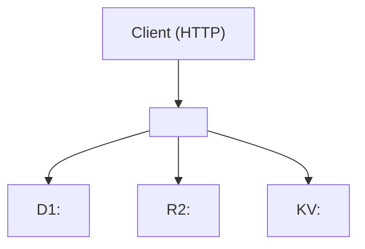

# README Template — Edge (Cloudflare Workers)

Use this template for **Cloudflare Workers** services and any edge-deployed artifacts. Surfaced by audit PR #526 (`edge/`).

Shared conventions inherited from [`README-TEMPLATE.md`](./README-TEMPLATE.md), but several do not apply: there is no `Containerfile`, no ansible, no compose, no 8080/5001 port pair.

## When to use

- **Cloudflare Worker** — any directory with `wrangler.toml` / `wrangler.jsonc`. Single Worker or Worker + bindings (D1, R2, KV, Queues, Durable Objects).
- **Pages → Workers migration target** — Pages projects being migrated to Workers; reference `migrate_pages_to_workers_guide` via the Cloudflare MCP.

If your service is a containerized .NET service that calls a Worker, use [`README-TEMPLATE.md`](./README-TEMPLATE.md) (.NET service) — only the Worker itself uses this template.

## Structure

```markdown
# <WorkerName>

One-line description — Cloudflare Worker that does X.

## Overview

2-3 sentences. State the Worker's role, which upstream / downstream services
interact with it, and the Worker's primary binding(s) (D1, R2, KV, Queues, DO).

## Operational Status

Optional. Edge services may be in non-default state (region restrictions,
sampling rates).

## Architecture



## Bindings

Document all Cloudflare bindings — they are first-class configuration, not generic env vars.

### D1 Databases

| Binding | Database name | Purpose |
|---------|---------------|---------|
| `DB` | `atlas-edge-prod` | Primary data store |

### R2 Buckets

| Binding | Bucket name | Purpose |
|---------|-------------|---------|
| `STORAGE` | `atlas-edge-artifacts` | Static artifacts |

### Workers KV

| Binding | Namespace | Purpose |
|---------|-----------|---------|
| `CACHE` | `atlas-edge-cache` | Read-through cache |

### Queues

| Binding | Queue | Direction | Purpose |
|---------|-------|-----------|---------|
| `INGEST` | `atlas-ingest` | Producer | Submits work for downstream Worker |

### Durable Objects

| Binding | Class | Purpose |
|---------|-------|---------|
| `COORDINATOR` | `Coordinator` | Per-tenant state machine |

### Service Bindings

| Binding | Target | Purpose |
|---------|--------|---------|
| `AUTH_SERVICE` | `atlas-auth-worker` | Worker-to-Worker auth check |

## Cron Triggers

| Schedule (UTC) | Schedule (ET) | Purpose |
|----------------|---------------|---------|
| `0 13 * * 1-5` | 9 AM weekdays | Pre-market warmup |
| `*/15 * * * *` | every 15 min | Refresh KV cache |

ATLAS convention: schedules are authored in UTC; ET noted parenthetically.

## Worker Limits

Cloudflare-specific operational caps.

| Limit | Value | Notes |
|-------|-------|-------|
| `cpu_ms` | 50 | Standard Worker; bump if jobs exceed |
| `usage_model` | bundled \| unbound | |
| `compatibility_date` | 2026-01-01 | |
| `compatibility_flags` | `nodejs_compat` | If applicable |

## Configuration

Worker secrets and vars. Distinguish:
- **Vars** (`[vars]` in wrangler.toml) — visible in dashboard, low-sensitivity.
- **Secrets** (`wrangler secret put`) — encrypted, do not commit to git.

### Vars

| Variable | Description | Default |
|----------|-------------|---------|
| `ENVIRONMENT` | `production` \| `staging` | `production` |

### Secrets

| Secret | Description | Set via |
|--------|-------------|---------|
| `API_KEY` | Upstream API key | `wrangler secret put API_KEY` |

## Endpoints

Workers do not expose ports; they bind routes.

| Route | Method | Description |
|-------|--------|-------------|
| `https://api.atlas.example/v1/<resource>` | GET | What it does |

Local dev: `http://localhost:8787` (wrangler dev default).

## Observability

Workers Observability — `[observability]` block in `wrangler.toml`.

```toml
[observability]
enabled = true
head_sampling_rate = 0.1   # 10% sampling
```

| Metric / signal | Source |
|-----------------|--------|
| Request rate, error rate, latency | Cloudflare Workers Observability dashboard |
| Custom logs | `console.log` → tail with `wrangler tail` |

## D1 Migrations

D1 migrations are SQL files applied in lexical order via `wrangler d1 migrations apply`.

```
edge/
├── schema.sql              # current canonical schema (idempotent, for reference)
└── migrations/
    ├── 0001_initial.sql
    └── 0002_add_index.sql
```

Apply:

```bash
wrangler d1 migrations apply <database> --remote   # production
wrangler d1 migrations apply <database> --local    # local dev
```

**The `--remote` flag is required for production** — otherwise you apply against
the local miniflare D1, not Cloudflare's edge D1.

## Project Structure

```
edge/
├── src/
│   ├── index.ts            # Worker entry (fetch + scheduled handlers)
│   ├── handlers/
│   └── lib/
├── migrations/             # D1 migrations
├── schema.sql              # current schema for reference
├── wrangler.toml           # or wrangler.jsonc
├── package.json
└── README.md
```

## Development

### Prerequisites

- Node.js ≥ 20
- Wrangler ≥ 4 (`npm install -g wrangler` or use `npx wrangler`)
- Cloudflare account with the right bindings provisioned (see `Bindings` above)

### Local run

```bash
cd edge
npm install
wrangler dev                                    # http://localhost:8787
```

### Tests

```bash
npm test                                        # vitest / miniflare
```

### Deploy

```bash
wrangler deploy                                 # production
wrangler deploy --env staging                   # staging
```

There is no `ansible-playbook` step for Workers — deployment goes directly to
Cloudflare's API via wrangler. **Do not** invent a per-service ansible tag for
edge services.

## Ports

N/A. Workers expose HTTPS routes, not ports. Local wrangler dev binds `8787`
on the host for development only.

## Volumes

N/A. Persistent state lives in D1 / R2 / KV / Durable Objects.

## See Also

- [Cloudflare Workers docs](https://developers.cloudflare.com/workers/)
- [`docs/ARCHITECTURE.md`](../docs/ARCHITECTURE.md)
```

## Notes (do not include in service READMEs)

- Replaces ansible / compose / Containerfile sections with wrangler (PR #526).
- Adds Cloudflare bindings (D1, R2, KV, Queues, Durable Objects, Service bindings) as a first-class section (PR #526).
- Adds Cron Triggers with UTC + ET convention (PR #526).
- Adds Worker Limits (`cpu_ms`, `compatibility_date`, `compatibility_flags`) (PR #526).
- Adds D1 Migrations with `--remote` flag callout (PR #526).
- Adds Workers Observability `[observability]` block guidance (PR #526).
