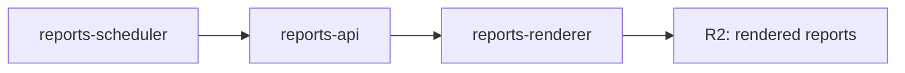
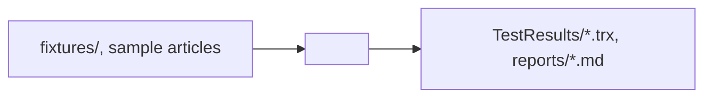

# README Template — Project Index / Multi-Host / Test Harness

Use this template for **directories that are not a single product**: the monorepo root, multi-host directories that ship several services side-by-side, and test/benchmark harnesses that have no service surface. Surfaced by audit PRs #517 (`LlmBenchmark/`), #519 (root), #521 (`Reports/`).

Shared conventions inherited from [`README-TEMPLATE.md`](./README-TEMPLATE.md), but several do not apply (no API, no Ports, no Configuration as a runtime-service concept, often no Deployment).

## When to use

- **Repository root** — `README.md` at monorepo root. Acts as a project index of truth: service inventory, conventions pointer, documentation map.
- **Multi-host directory** — `Reports/` (3 services + 3 shared libraries in one directory). The directory aggregates multiple deployables and shared code; no single product.
- **Test / benchmark harness** — `LlmBenchmark/` (xUnit test project with no `src/`, no network surface, runs via `dotnet test`).

If your directory aggregates one service plus its MCP sidecar (e.g. `FredCollector/` contains `FredCollector/src/` + `FredCollector/mcp/`), that is **not** a multi-host directory — use the .NET service template; the MCP gets its own README under `mcp/`.

## Structure: Repository root (project index)

```markdown
# ATLAS

One-line description of the project.

> **Status**: <production / development / experimental>. <Proprietary note if applicable>.

## Purpose

2-3 sentences. What the project is, who runs it, what problem it solves.

## Service Inventory

| Service | Role | README |
|---------|------|--------|
| FredCollector | FRED macroeconomic series collector | [`FredCollector/`](./FredCollector/README.md) |
| AlphaVantageCollector | Equities / FX / crypto collector | [`AlphaVantageCollector/`](./AlphaVantageCollector/README.md) |
| ThresholdEngine | Regime classifier + pattern matcher | [`ThresholdEngine/`](./ThresholdEngine/README.md) |
| SecMaster | Symbol & entity master registry | [`SecMaster/`](./SecMaster/README.md) |
| <... rest ...> | | |

List every deployable service + sidecar + MCP + shared library. Group by tier if helpful (collectors / processing / alerting / shared / mcp).

## Quick Start

```bash
git clone <repo>
cd ATLAS
cat CLAUDE.md          # project-level rules — read first
cd deployment/ansible
ansible-playbook playbooks/deploy.yml --tags <service>
```

## Conventions

Pointer to the canonical conventions, not a re-statement.

- Engineering rules: [`CLAUDE.md`](./CLAUDE.md)
- README templates: [`docs/README-TEMPLATE.md`](./docs/README-TEMPLATE.md)
- Architecture: [`docs/ARCHITECTURE.md`](./docs/ARCHITECTURE.md)

## Documentation Map

| Topic | Location |
|-------|----------|
| Architecture | [`docs/ARCHITECTURE.md`](./docs/ARCHITECTURE.md) |
| Observability | [`docs/OBSERVABILITY.md`](./docs/OBSERVABILITY.md) |
| Deployment | [`deployment/README.md`](./deployment/README.md) |
| Sentinel pipeline | [`docs/SENTINEL-RLM.md`](./docs/SENTINEL-RLM.md) |
| gRPC architecture | [`docs/GRPC-ARCHITECTURE.md`](./docs/GRPC-ARCHITECTURE.md) |
| Plans | [`docs/plans/`](./docs/plans/) |
| Executive summary | [`docs/EXECUTIVE-SUMMARY.md`](./docs/EXECUTIVE-SUMMARY.md) |

## Where to Look For

Pragmatic pointers for first-time contributors.

| I want to | Look at |
|-----------|---------|
| Add a new collector | [`FredCollector/`](./FredCollector/) as the reference; [`Events/`](./Events/) for proto contracts |
| Add a new MCP sidecar | [`FredCollector/mcp/`](./FredCollector/mcp/); [`docs/README-TEMPLATE-MCP.md`](./docs/README-TEMPLATE-MCP.md) |
| Wire a new alert rule | [`ThresholdEngine/`](./ThresholdEngine/) patterns |
| Add a Grafana dashboard | [`deployment/grafana/dashboards/`](./deployment/grafana/dashboards/) — see grafana-dashboard skill |
| Add a host secret | `ansible-vault edit deployment/ansible/group_vars/secrets.yml` |

## See Also

- [`CLAUDE.md`](./CLAUDE.md) — project rules (read first)
- [`docs/EXECUTIVE-SUMMARY.md`](./docs/EXECUTIVE-SUMMARY.md)
```

**Hard rules for root README**:
- Do not duplicate `CLAUDE.md`, `docs/ARCHITECTURE.md`, `docs/EXECUTIVE-SUMMARY.md` content. Link.
- Verify every link resolves on disk (`awk` / `grep` before commit).
- Do not include test counts, dashboard counts, service counts that drift — link to the live source.

## Structure: Multi-host directory (e.g. `Reports/`)

```markdown
# <DirectoryName>

One-line description — what this directory aggregates.

## Overview

2-3 sentences. State that this directory is multi-host (N services + M shared libraries),
why they're grouped (shared domain, deployment lifecycle, build pipeline), and what each host does.

## Hosts

| Host (deployable) | Role | Containerfile | Tag |
|-------------------|------|---------------|-----|
| `reports-api` | REST API surface | `Reports/Api/Containerfile` | `reports-api` |
| `reports-renderer` | PDF/HTML rendering worker | `Reports/Renderer/Containerfile` | `reports-renderer` |
| `reports-scheduler` | Cron-driven report dispatch | `Reports/Scheduler/Containerfile` | `reports-scheduler` |

## Shared Libraries

| Library | Purpose | Consumed by |
|---------|---------|-------------|
| `Reports.Core` | Domain types, templates | All Reports hosts |
| `Reports.Persistence` | EF context + repositories | All Reports hosts |
| `Reports.Rendering` | HTML→PDF pipeline | reports-renderer |

## Architecture



## Configuration

Configuration spans multiple hosts. List per-host:

### `reports-api`

| Variable | Description | Default |
|----------|-------------|---------|

### `reports-renderer`

| Variable | Description | Default |
|----------|-------------|---------|

### `reports-scheduler`

| Variable | Description | Default |
|----------|-------------|---------|

## Ports

| Host | Internal | Host-mapped |
|------|----------|-------------|
| reports-api | 8080 | 5012 |
| reports-renderer | 8080 | — (internal only) |
| reports-scheduler | — | — |

## Project Structure

```
Reports/
├── Api/
│   ├── src/
│   ├── tests/
│   ├── .devcontainer/
│   └── Containerfile
├── Renderer/
│   ├── src/
│   └── Containerfile
├── Scheduler/
│   ├── src/
│   └── Containerfile
├── Core/                  # shared library (no deployable)
├── Persistence/           # shared library
├── Rendering/             # shared library
└── README.md              # you are here
```

## Build

Hosts build via compose (no per-host `.devcontainer/build.sh` in `Reports/`):

```bash
nerdctl compose build reports-api reports-renderer reports-scheduler
```

## Deployment

```bash
ansible-playbook playbooks/deploy.yml --tags reports-api reports-renderer reports-scheduler
# or, if the playbook has an umbrella tag:
ansible-playbook playbooks/deploy.yml --tags reports
```

## See Also

- Per-host READMEs (if any) at `Reports/<Host>/README.md`
- [`docs/ARCHITECTURE.md`](../docs/ARCHITECTURE.md)
```

## Structure: Test / benchmark harness (e.g. `LlmBenchmark/`)

```markdown
# <HarnessName>

One-line description — what this harness measures and against what.

## Overview

2-3 sentences. State (a) what is benchmarked, (b) the parent service whose
devcontainer this harness executes inside, (c) the result format (xUnit, CSV report, etc.).

## Architecture



Note: the diagram is batch-style (inputs → scorer → reports), not request/response.
The harness exposes no network surface and is not deployed.

## Test Categories

xUnit `Category` / `Strategy` / `Trait` filters used for selective runs.

| Trait | Values | Example |
|-------|--------|---------|
| `Category` | `Smoke`, `Regression`, `Strategy` | `--filter Category=Smoke` |
| `Strategy` | `v6`, `v7`, `cove-v6.1` | `--filter Strategy=v6` |

## Convenience Scripts

| Script | Purpose |
|--------|---------|
| `run-smoke.sh` | Smoke subset, ≤5 min |
| `run-regression.sh` | Full regression, ~45 min |
| `run-strategy.sh` | Compare strategies head-to-head |
| `report.sh` | Render results to `reports/<date>.md` |

## Configuration

| Variable | Description | Default |
|----------|-------------|---------|
| `SENTINEL_ENDPOINT` | Sentinel extraction service URL | `http://sentinel-collector:8080` |
| `MODEL_OVERRIDE` | Override default extraction model | (unset, uses service default) |

Harness reads env vars for endpoint + model overrides only; everything else is
hard-coded in fixtures.

## Project Structure

```
LlmBenchmark/
├── Benchmarks/                   # test classes
│   ├── ExtractionAccuracy.cs
│   └── ExtractionLatency.cs
├── fixtures/                     # sample inputs
├── run-smoke.sh
├── run-regression.sh
├── report.sh
└── LlmBenchmark.csproj           # the project file lives at root, no src/
```

Test harnesses commonly have **no `src/` directory** — the project file is at
the root and test classes live in `Benchmarks/` or similar. Do not pretend there is one.

## Development

Runs inside the parent service's devcontainer (e.g. `SentinelCollector`).

```bash
# from SentinelCollector devcontainer:
dotnet test LlmBenchmark/LlmBenchmark.csproj
dotnet test LlmBenchmark/LlmBenchmark.csproj --filter Category=Smoke
```

## Deployment

N/A — harnesses are not deployed. They execute in CI or interactively in the parent devcontainer.

## See Also

- [`<ParentService>`](../ParentService/README.md) — the service under test
- [`docs/SENTINEL-RLM.md`](../docs/SENTINEL-RLM.md) — methodology, if applicable
```

## Notes (do not include in service READMEs)

- Root README: project-index pattern, no methodology/framework duplication (PR #519).
- Multi-host directory: explicit Hosts table separating deployables from shared libraries (PR #521 — `Reports/`).
- Multi-host directory: build via `compose build` rather than per-project `build.sh` (PR #521).
- Test harness: drops API/Ports/Deployment; adds Test Categories table for xUnit Traits, Convenience Scripts table (PR #517 — `LlmBenchmark/`).
- Test harness: explicitly accommodates "no `src/`, project at root" structure (PR #517).
- All three variants: Mermaid uses double-quoted node labels (PR #521 quoting issue).
