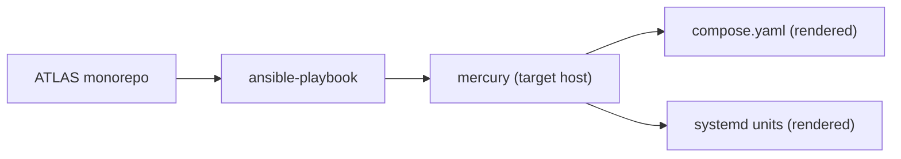

# README Template — Infrastructure / Deployment

Use this template for **infrastructure directories** that contain ansible roles, Jinja templates, systemd units, and host scripts spanning many services — they are not themselves a service. Surfaced by audit PR #540 (`deployment/`).

Shared conventions inherited from [`README-TEMPLATE.md`](./README-TEMPLATE.md).

## When to use

- **`deployment/`** — ansible inventory, group_vars, playbooks, roles, Jinja templates for compose / systemd units, Grafana dashboards-as-code, Prometheus rules.
- **Future infra dirs** — anything that ships infrastructure rather than application code.

If your directory is multi-service application code (e.g. `Reports/` hosts three services), use [`README-TEMPLATE-INDEX.md`](./README-TEMPLATE-INDEX.md).

## Structure

```markdown
# <InfraName>

One-line description — what infrastructure this directory ships and where it deploys.

## Overview

2-3 sentences. State the inventory (host count), the configuration management
system (ansible), the scope (~31 services + four maintenance subsystems for
`deployment/`), and any hard stops (e.g. `compose.yaml` is ansible-managed —
never edit by hand).

## Hard Stops

Repeat the operational hard-stops from `CLAUDE.md` that apply to this directory.
For `deployment/`:

- ✗ Never edit `/opt/ai-inference/compose.yaml` directly — it is ansible-rendered from a Jinja2 template (in ATLAS: `deployment/artifacts/compose.yaml.j2`).
- ✗ Never `ssh mercury` / `ansible mercury` from mercury — you are already there.
- ✓ `ansible-playbook playbooks/deploy.yml --tags <service>` is the only supported deploy path.

## Architecture



## Playbooks

List every playbook in `playbooks/` with its actual purpose. Illustrative
example from ATLAS — adapt to your own playbook set:

| Playbook | Purpose |
|----------|---------|
| `playbooks/deploy.yml` | Primary tag-driven deploy (ZFS snapshot → users → OTEL → compose render → service builds → systemd units) |
| `playbooks/site.yml` | Thin wrapper that imports `deploy.yml` |
| `playbooks/smoke-test.yml` | Health validation (sub-tags: `health`, `containers`, `internal`, `mcp`, `logs`, `loki`, `docker`, `gpu`, `database`) |
| `playbooks/zfs-snapshot.yml` | Create a tagged ZFS snapshot manually |
| `playbooks/zfs-rollback.yml` | Stop atlas, rollback datasets to a snapshot, restart atlas |
| `playbooks/test-templating.yml` | Render templates into `test-output/` for diff-check without deploy |

## Tags

| Tag | Affects | Notes |
|-----|---------|-------|
| `fred-collector` | FredCollector container only | per-service |
| `secmaster` | SecMaster container only | per-service |
| `fredcollector-mcp` | MCP sidecar | concatenated, not kebab-case |
| `dashboards` | Grafana dashboards | hot-reload — no service restart |
| `patterns` | ThresholdEngine patterns | hot-reload via inotify |
| `build` | Cross-cutting alias on every image-build task | rebuilds all services |

Tag conventions live in `playbooks/deploy.yml`; this table mirrors it. If they
drift, the playbook is source-of-truth.

## Templates

ATLAS keeps Jinja2 templates and host-side scripts under `deployment/artifacts/`
rather than ansible roles. List the load-bearing templates:

| Template | Renders to |
|----------|------------|
| `deployment/artifacts/compose.yaml.j2` | `/opt/ai-inference/compose.yaml` |
| `deployment/artifacts/compose.otel.yaml.j2` | `/opt/otel/compose.otel.yaml` |
| `deployment/artifacts/*.service` / `*.timer` | `/etc/systemd/system/` |

## Inventory

| File | Purpose |
|------|---------|
| `inventory/hosts.yml` | Single-host: mercury (`ansible_connection: local`) |
| `group_vars/all.yml` | Cross-service vars (`ports_mcp.*`, image tags, paths) |
| `group_vars/vault.yml` | Vault-encrypted secrets (ansible-vault) |

## Variables

Top-level vars consumed across playbooks and templates. Cross-reference
`group_vars/all.yml` — the playbooks are source-of-truth.

Illustrative excerpt from ATLAS — substitute your own variable names:

| Variable | Purpose | Example |
|----------|---------|---------|
| `ports_mcp.<service>` | Host-mapped port for an MCP sidecar | `3101` |
| `deployment_base` | Target deployment root on host | `/opt/ai-inference` |
| `models_path` | Model cache root | `{{ deployment_base }}/models` |
| `atlas_repo_path` | Monorepo source root (referenced by every `nerdctl build` chdir) | `/home/james/ATLAS` |

## Secrets

Secrets are ansible-vault encrypted in `group_vars/vault.yml`. The vault
password file path is configured in `ansible.cfg`; in ATLAS it's
`~/.ansible_vault_pass`. Decrypt:

```bash
ansible-vault view group_vars/vault.yml
```

List secrets grouped by domain. Illustrative example from ATLAS — replace with
your own:

| Secret group | Examples |
|--------------|----------|
| Database | `postgres_password`, `atlas_db_password` |
| Collector API keys | `fred_api_key`, `alphavantage_api_key`, `finnhub_api_key` |
| Notifications | `ntfy_endpoint`, `ntfy_topic`, `ntfy_username`, `ntfy_password` |
| Internal API auth | `api_key`, `api_key_enabled` |

Never `git add` an unencrypted vault file. `git diff` on vault files shows ciphertext only — use `ansible-vault edit` to modify.

## Ports

Cross-service port map. See `group_vars/all.yml` `ports_*` for the canonical assignment.

| Service | Internal | Host-mapped |
|---------|----------|-------------|
| <list per-service> | | |

## Project Structure

```
deployment/
├── ansible/
│   ├── ansible.cfg
│   ├── inventory/hosts.yml
│   ├── group_vars/
│   │   ├── all.yml
│   │   └── vault.yml                # ansible-vault encrypted
│   ├── playbooks/
│   │   ├── deploy.yml               # primary playbook
│   │   ├── smoke-test.yml
│   │   ├── zfs-snapshot.yml         # ATLAS-specific
│   │   └── ...
│   └── scripts/                     # host-side helpers invoked by playbooks
├── artifacts/                       # Jinja2 templates + systemd units
│   ├── compose.yaml.j2
│   ├── compose.otel.yaml.j2
│   └── *.service / *.timer
├── grafana/
│   └── dashboards/                  # JSON, deployed via --tags dashboards
└── README.md
```

ATLAS does **not** use an ansible `roles/` directory — playbooks include task
files directly and reference templates under `deployment/artifacts/`. If your
infra dir does use roles, substitute the role tree.

## Development

### Prerequisites
- ansible-core ≥ 2.16
- ansible-vault password at `~/.atlas-vault`
- mercury host access (you are mercury if reading this on the target)

### Validate

```bash
ansible-playbook playbooks/deploy.yml --syntax-check
ansible-playbook playbooks/deploy.yml --tags <service> --check --diff
```

### Apply (dry-run first)

```bash
ansible-playbook playbooks/deploy.yml --tags <service> --check --diff   # dry-run
ansible-playbook playbooks/deploy.yml --tags <service>                  # apply
```

## Known Deviations

Optional. Document explicit deviations from `CLAUDE.md` or community ansible conventions.

## See Also

- [`CLAUDE.md`](../CLAUDE.md) — `DEPLOYMENT [HARD_STOP]` section
- [`docs/ARCHITECTURE.md`](../docs/ARCHITECTURE.md)
- [`Reports/`](../Reports/README.md) — multi-host directory (see Index template)
```

## Notes (do not include in service READMEs)

- Replaces API Endpoints with Playbooks + Tags + Roles (PR #540).
- Replaces Deployment section with itself — this *is* the deployment surface.
- Adds Hard Stops as a first-class section (mirrors `CLAUDE.md` hard stops; PR #540).
- Adds Secrets handling (ansible-vault), Variables (group_vars), Inventory (hosts).
