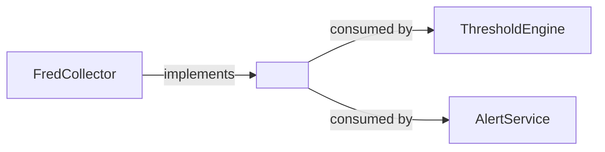

# README Template — Shared Library / Contract Registry

Use this template for **shared .NET libraries** in ATLAS that are consumed via project reference or NuGet — not deployed as services. Surfaced by audit PRs #520 (MacroSubstrate) and #538 (Events).

Shared conventions inherited from [`README-TEMPLATE.md`](./README-TEMPLATE.md).

## When to use

- **Contract registry** — e.g. `Events/`. Compile-time proto + event-type definitions; producers and consumers reference it; ships as project references, not a deployable.
- **Shared client / SDK** — e.g. `MacroSubstrate/Client/`. C# interfaces and DTOs other services consume.
- **Multi-project package** — directory containing several csproj packages (host + Core + Migrator) that are versioned together but consumed independently.

If your library ships with EF migrations (e.g. `MacroSubstrate.Migrator`), include the Migrations section.

## Structure

```markdown
# <LibraryName>

One-line description — what contracts / interfaces this library exposes and who consumes them.

## Overview

2-3 sentences. State (a) what the library is (contracts? client SDK? domain types?),
(b) who produces / consumes / hosts the contracts, (c) whether it ships as project
reference or NuGet.

## Architecture



## Packages

For multi-project libraries, list each csproj.

| Package | Purpose | Consumed via |
|---------|---------|--------------|
| `<Library>.Contracts` | Proto + DTOs | Project reference |
| `<Library>.Client` | gRPC client wrapper | Project reference |
| `<Library>.Migrator` | EF migrations | Built as part of the owner service |

## Contract

Document the public interfaces / abstract classes the library exposes.

```csharp
public interface IMacroObservationWriter
{
    Task WriteAsync(MacroObservation obs, CancellationToken ct);
}

public interface IMacroObservationRepository
{
    Task<IReadOnlyList<MacroObservation>> ReadAsync(SeriesId id, DateRange range, CancellationToken ct);
}
```

For contract registries (Events), the contract is the **proto + event type set** rather than C# interfaces.

## Proto Files

| Proto | Purpose | Producers | Consumers |
|-------|---------|-----------|-----------|
| `Events/proto/market_data.proto` | OHLCV stream | FredCollector, AlphaVantageCollector | ThresholdEngine |
| `Events/proto/alerts.proto` | Threshold breaches | ThresholdEngine | AlertService |

## gRPC Event Types

Enumerate (event name → producer → consumer) for in-memory or transport events.

| Event | Producer | Consumer | Transport |
|-------|----------|----------|-----------|
| `ObservationIngested` | FredCollector | ThresholdEngine | gRPC stream (port 5001) |
| `ThresholdBreached` | ThresholdEngine | AlertService | gRPC stream (port 5001) |

## Schema (for libraries that own DB tables)

| Column | Type | Constraints | Notes |
|--------|------|-------------|-------|
| `id` | bigserial | PK | |
| `series_id` | text | not null, fk → secmaster | |
| `observation_date` | date | not null | |
| `value` | numeric(18,6) | not null | |

Indexes:
- `idx_<table>_series_date` on (series_id, observation_date desc)

## Telemetry contract

If the library exposes its own `ActivitySource` / `Meter`, consumers must opt in:

```csharp
// Tracing
builder.Services.AddOpenTelemetry().WithTracing(t => t.AddSource("MacroSubstrate"));

// Metrics
builder.Services.AddOpenTelemetry().WithMetrics(m => m.AddMeter("MacroSubstrate"));
```

Without `AddSource` / `AddMeter`, the library's telemetry is silently dropped — this is the single most common observability bug for libraries.

## Consumers

| Consumer | What it uses | Where |
|----------|--------------|-------|
| FredCollector | `IMacroObservationWriter` | `FredCollector/src/Services/Persistence.cs` |
| ThresholdEngine | `IMacroObservationRepository` | `ThresholdEngine/src/Workers/RegimeWorker.cs` |

## Usage

```csharp
// In the consumer's DependencyInjection.cs
builder.Services.AddMacroSubstrate(options =>
{
    options.ConnectionString = builder.Configuration.GetConnectionString("MacroDb");
});
```

## Migrations (only if the library owns a schema)

```bash
nerdctl compose exec -T macrosubstrate-dev dotnet ef migrations add <Name> --project src/Migrator
```

Never hand-author migration `.cs` files (Designer.cs / ModelSnapshot drift; CLAUDE.md `MIGRATIONS [HARD_STOP]`).

The owning service runs migrations on startup; consumers do not run migrations.

## Versioning

State the versioning model:

- **Project reference** (default for ATLAS) — version-locked to the monorepo commit.
- **NuGet** — semver; bump major on breaking proto / interface change.

## Project Structure

```
LibraryName/
├── src/
│   ├── Contracts/               # csproj — proto, DTOs, interfaces
│   ├── Client/                  # csproj — gRPC client wrapper
│   ├── Core/                    # csproj — domain logic
│   └── Migrator/                # csproj — EF migrations
├── proto/                       # source-of-truth .proto files
├── tests/
└── README.md
```

Multi-project trees are expected for contract registries — do not flatten.

## Development

### Prerequisites

- Devcontainer (shared with owning service if applicable)
- `dotnet build` at the library root builds all csproj

### Build + Test

```bash
./.devcontainer/compile.sh         # if the library has its own devcontainer
# or
dotnet build && dotnet test        # from the owning service's devcontainer
```

## Deployment

This library does not deploy on its own. Consumers redeploy when the library
version they reference changes.

| Consumer service | Tag |
|------------------|-----|
| FredCollector | `--tags fred-collector` |
| ThresholdEngine | `--tags threshold-engine` |

## Ports

N/A — libraries do not bind ports. Cross-reference consumer ports at point of use
(`gRPC client → fred-collector:5001`).

## See Also

**Consumers** (services that reference this library)
- [FredCollector](../FredCollector/README.md)
- [ThresholdEngine](../ThresholdEngine/README.md)

**Related contracts**
- [`docs/GRPC-ARCHITECTURE.md`](../docs/GRPC-ARCHITECTURE.md)
```

## Notes (do not include in service READMEs)

- Drops Configuration (libraries have compile-time contracts, not runtime config — flagged in PR #538).
- Drops API Endpoints in favor of Contract / Proto Files / gRPC Event Types tables (PR #538).
- Drops Deployment in favor of Usage / Versioning (PR #538).
- Drops Ports — N/A for libraries; cross-reference consumer ports at point of use (PR #538).
- Adds Telemetry contract for `AddSource()` / `AddMeter()` opt-in (PR #520).
- Adds Schema and Migrations sections for libraries that own DB tables (PR #520, MacroSubstrate).
- Multi-project package handling for the host + Core + Migrator case (PR #520).
