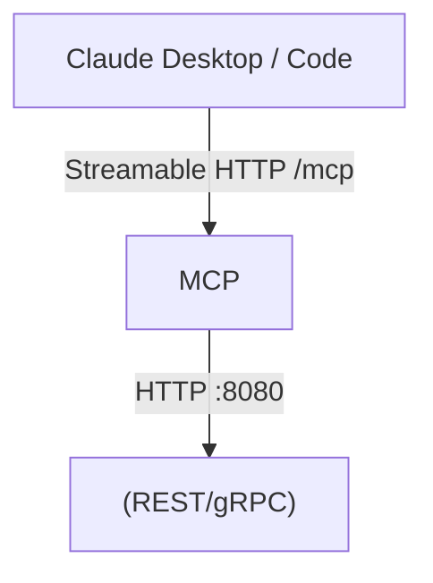

# README Template — MCP Server

Use this template for any **Model Context Protocol** server in ATLAS. Surfaced by audit PRs #524, #530–#537, #539. Shared conventions inherited from [`README-TEMPLATE.md`](./README-TEMPLATE.md).

## When to use

- **Child-of-parent-service MCP** (`<Service>/mcp/`) — `FredCollector/mcp`, `ThresholdEngine/mcp`, `FinnhubCollector/mcp`, `OfrCollector/mcp`, `SecMaster/mcp`, `WhisperService/mcp`. Lives under a parent service directory; shares the parent's devcontainer; exposes only an MCP transport endpoint + healthcheck.
- **Top-level MCP** — `dsl-parser-mcp/`, `markitdown-mcp/`. Standalone container, no parent service.
- **Host-resident stdio MCP** — `ntfy-mcp/`, `gemini-resolver-mcp/`. Runs as a stdio child of Claude Code on the host (no compose entry, no Containerfile) or as a host-systemd unit. Adapt the Deployment section accordingly.

If your MCP runs on Cloudflare's edge, see [`README-TEMPLATE-EDGE.md`](./README-TEMPLATE-EDGE.md) instead.

## Structure

```markdown
# <ServiceName>/mcp  (or <name>-mcp)

One-line description. State the parent service (if any) and what MCP tools it exposes.

## Overview

2-3 sentences. Name the parent service and which subset of the parent's surface
this MCP exposes to Claude. State the **transport** (Streamable HTTP / SSE / stdio).

## Operational Status

Optional. Stopped, disabled, experimental, or actively migrating between transports? Say so.

## Architecture



If the MCP is a thin wrapper, the diagram can be this small. Do not invent internal components.

## Transport

State exactly one:

- **Streamable HTTP** at `/mcp` on port `8080` (internal), host-mapped `31XX`.
- **SSE** at `/sse` on port `8080` (internal), host-mapped `31XX`.
- **stdio** child process — no port, registered in Claude Desktop config.

If your client sees "fails to connect" silently, transport is the first suspect.

## Tools

The tool catalog is the public surface — replaces REST/gRPC tables.

| Tool | Read-only? | Parameters | Description |
|------|------------|------------|-------------|
| `get_series_observations` | yes | `series_id: str`, `start: date?`, `end: date?` | Fetch FRED observations |
| `trigger_backfill` | **no** (destructive) | `series_id: str` | Queues backfill job; fire-and-forget |

Mark destructive tools clearly. Operators routinely confuse "queues work and returns immediately" with "synchronous" — say which.

### Response Envelope

If the MCP wraps upstream responses in a standard envelope, document it once:

```json
{
  "ok": true,
  "http_status": 200,
  "detail": { /* tool-specific payload */ }
}
```

```json
{
  "ok": false,
  "http_status": 503,
  "problem": { "type": "...", "title": "..." }
}
```

Without this, callers have to read source to know how to branch on errors.

## Configuration

Document only env vars the service actually reads. Use `__` separator.

Include the **deployed override** column — Containerfile defaults and compose
overrides commonly diverge (e.g. timeout `30` in Containerfile vs `180` in compose).

| Variable | Description | Default | Deployed (compose) |
|----------|-------------|---------|--------------------|
| `MCP__Transport` | streamable-http \| sse \| stdio | streamable-http | |
| `<Parent>__Endpoint` | Upstream parent service URL | Required | `http://fred-collector:8080` |

Note: do not list env vars set in compose but never read by `Program.cs` / `main.py`.
Earlier MCP READMEs included these (e.g. `THRESHOLDENGINE_MCP_LOG_LEVEL`) and it
caused config drift. Grep the source before publishing.

## Project Structure

### Child-of-parent (e.g. `FredCollector/mcp/`)

```
FredCollector/mcp/
├── Program.cs              # Host bootstrap (transport + tool registration)
├── Tools/                  # MCP tool implementations
├── Client/
│   └── Generated/          # NSwag-generated, do not edit
├── Containerfile           # Image build (parent shares devcontainer)
└── README.md
```

The MCP is built from the **monorepo root** with `nerdctl build -f FredCollector/mcp/Containerfile .` — it does **not** have its own `.devcontainer/` and does **not** carry a `./.devcontainer/build.sh` script.

### Standalone (e.g. `dsl-parser-mcp/`)

```
dsl-parser-mcp/
├── app/
│   ├── main.py             # FastAPI host
│   └── tools.py            # Tool implementations
├── tests/
├── Containerfile
└── README.md
```

### Host-resident stdio (e.g. `ntfy-mcp/`)

```
ntfy-mcp/
├── ntfy/
│   ├── server.py           # MCP stdio server
│   └── client.py
├── pyproject.toml
└── README.md
```

No container, no compose entry.

## Build

### Child-of-parent
```bash
sudo nerdctl build -f FredCollector/mcp/Containerfile -t fred-collector-mcp:latest /home/james/ATLAS
```

### Standalone
```bash
sudo nerdctl build -f dsl-parser-mcp/Containerfile -t dsl-parser-mcp:latest /home/james/ATLAS
```

### Host stdio
```bash
cd ntfy-mcp && python -m venv .venv && . .venv/bin/activate && pip install -e .
```

## Deployment

### Containerized MCP
```bash
ansible-playbook playbooks/deploy.yml --tags <mcp-tag>
```

Real ansible tags for MCP services are concatenated (`fredcollector-mcp`, `thresholdengine-mcp`, `ofrcollector-mcp`), **not** kebab-case (`fred-collector-mcp`). Check `deployment/ansible/playbooks/deploy.yml` for the actual tag.

### Host stdio
No ansible. Register in Claude Desktop config (see below). Restart Claude Desktop to pick up changes.

## Ports

Containerized MCPs expose `8080` internally and host-map to `31XX`. The split matters: callers inside the compose network use `<service>-mcp:8080`; callers from the host use `localhost:31XX`. See `ports_mcp.*` in `deployment/ansible/group_vars/all.yml`.

| Port | Scope | Description |
|------|-------|-------------|
| 8080 | Internal | MCP transport (this sidecar's own listen port) |
| 31XX | Host-mapped | External access from Claude Desktop |

**Sidecar vs backend** — if this MCP wraps a backend that also listens on `:8080`, say so explicitly. The MCP listens on its own `:8080` inside its own container; the backend listens on `:8080` inside the backend's container. They do not collide on the network because each is namespaced by container.

## Health Checks

| Endpoint | Purpose |
|----------|---------|
| `/health` | Liveness — used by compose healthcheck |

## Observability

- **Meter**: `<ServiceName>.Mcp` — metrics: ...
- **ActivitySource**: `<ServiceName>.Mcp` — spans wrap each tool invocation
- **Dashboards**: `deployment/grafana/dashboards/mcp-overview.json`

## Claude Desktop registration

### Streamable HTTP / SSE
```json
{
  "mcpServers": {
    "fred-collector": {
      "url": "http://localhost:3101/mcp",
      "transport": "streamable-http"
    }
  }
}
```

### stdio (host-resident)
```json
{
  "mcpServers": {
    "ntfy": {
      "command": "/home/james/ATLAS/ntfy-mcp/.venv/bin/python",
      "args": ["-m", "ntfy"],
      "env": { "NTFY_BASE_URL": "https://ntfy.elasticdevelopment.com" }
    }
  }
}
```

### stdio bridge (containerized MCP from a host client)
Use `mcp-proxy` to bridge a host stdio call to a containerized SSE/HTTP MCP.

## Smoke Test

```bash
# Containerized
curl -sf http://localhost:31XX/health

# Tool invocation (depends on transport; example for streamable HTTP)
curl -X POST http://localhost:31XX/mcp -H "Content-Type: application/json" -d '{"method":"tools/list"}'
```

## See Also

- [`<ParentService>`](../README.md) — backend service this MCP wraps
- [`docs/SENTINEL-RLM.md`](../../docs/SENTINEL-RLM.md) — if applicable
```

## Notes (do not include in service READMEs)

- The "Transport" section is mandatory; getting it wrong produces a config that silently fails to connect (audit PR #531).
- The "Response Envelope" section is mandatory only for MCPs that wrap upstream HTTP and emit a wrapper shape — flagged in PR #537.
- The "Sidecar vs backend" disambiguation prevents the ambiguous-port-table problem flagged in PR #537.
- The "set-but-unread env var" guidance directly addresses PRs #530, #537.
- The "child-of-parent-service" structure addresses PRs #531, #534, #536.
- The concatenated ansible-tag convention addresses PR #534.
