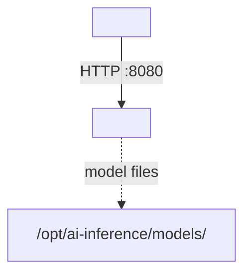

# README Template — Sidecar (Python / wrapper / ML inference)

Use this template for containerized **non-.NET sidecars** in ATLAS: Python/FastAPI sidecars, ML inference sidecars, wrapper-only images that re-package an upstream CLI/tool. Surfaced by audit PRs #523, #539 (and partly by #535 for the host-resident variant — that's now folded into [`README-TEMPLATE-MCP.md`](./README-TEMPLATE-MCP.md) since the only host-resident sidecars are MCP servers).

Shared conventions inherited from [`README-TEMPLATE.md`](./README-TEMPLATE.md).

## When to use

- **Python FastAPI sidecar** — e.g. `FinBertSidecar/`. Has a `.devcontainer/` or a `Containerfile`, runs `uvicorn` (or `python main.py`), exposes HTTP only (no gRPC), no PostgreSQL, often single-file.
- **Wrapper-only image** — e.g. `markitdown-mcp/` (note: this is actually an MCP — see MCP template). Wrapper sidecars run an upstream CLI inside a thin image; the README documents how to call the upstream tool, not in-house code.
- **ML inference sidecar** — stateless, CPU/GPU-bound, model files mounted from `/opt/ai-inference/models/...`.

If your sidecar exposes MCP tools, use [`README-TEMPLATE-MCP.md`](./README-TEMPLATE-MCP.md) instead.
If your sidecar is host-systemd (e.g. `gemini-resolver-mcp`), use the MCP template's "Host-resident stdio" variant.

## Structure

```markdown
# <SidecarName>

One-line description — name the upstream model / tool and the consumer service.

## Overview

2-3 sentences. State (a) what the sidecar does, (b) which service consumes it,
(c) whether it's stateful (model cache) or stateless, (d) CPU vs GPU.

## Architecture



## Features

- **Feature 1**: brief
- **Feature 2**: brief

## Configuration

| Variable | Description | Default | Deployed (compose) |
|----------|-------------|---------|--------------------|
| `MODEL_PATH` | Path to model files (mount point inside container) | `/models` | `/opt/ai-inference/models/<name>` |
| `LOG_LEVEL` | Python logging level | `INFO` | `WARNING` |

Only document env vars the sidecar actually reads (grep `os.environ`, `os.getenv`,
pydantic Settings, etc.). Do **not** copy `OpenTelemetry__*` style .NET vars into
a Python sidecar README — they don't apply.

## API

### REST (Port 8080 internal)

| Endpoint | Method | Body / Query | Description |
|----------|--------|--------------|-------------|
| `/score` | POST | `{text: str}` | Returns sentiment score |
| `/health` | GET | — | Liveness |

Document request body schema inline; FastAPI sidecars usually have Pydantic
models that are the source of truth — link to `models.py` rather than re-stating
the schema in prose.

OpenAPI: served by FastAPI at `/docs` and `/openapi.json` (always | dev-only).

## Resources / Limits

| Resource | Value | Rationale |
|----------|-------|-----------|
| CPU | 4 cores | Model inference is CPU-bound |
| Memory | 8 GiB | Model is ~6 GiB resident |
| GPU | — / cuda:0 (fractional) | If applicable |

## Volumes

| Mount | Purpose |
|-------|---------|
| `/opt/ai-inference/models/<name>` → `/models` (ro) | Model weights — losing this means re-download on every restart |
| `/opt/ai-inference/raw-data/<dir>` → `/data` (rw) | Input/output, if applicable |

## Project Structure

### Single-file FastAPI sidecar
```
SidecarName/
├── main.py                  # FastAPI app + endpoints
├── models.py                # Pydantic request/response models
├── requirements.txt
├── Containerfile
└── README.md
```

Do not invent `src/Endpoints/`, `src/Services/`, `tests/` directories if they
don't exist. The audit campaign caught templates that over-engineered structure
for 200-line sidecars.

### Wrapper-only image
```
SidecarName/
├── Containerfile            # FROM upstream-image; minimal
└── README.md                # Documents the upstream CLI's flags
```

Note that wrapper-only services may have no per-service ansible tag because
there is no build to drive; deployment is via `nerdctl compose up <name>`.

## Development

### Prerequisites

- Python 3.11+ (or whatever the Containerfile uses)
- No PostgreSQL, no observability stack dependency unless you actually emit metrics

### Local run

```bash
cd SidecarName
python -m venv .venv && . .venv/bin/activate
pip install -r requirements.txt
uvicorn main:app --reload --port 8080
```

### Tests

```bash
pytest                                          # if test suite exists
nerdctl compose exec -T <sidecar> pytest        # inside the running container
```

### Build Container

```bash
sudo nerdctl build -f SidecarName/Containerfile -t sidecar-name:latest /home/james/ATLAS
```

## Deployment

```bash
ansible-playbook playbooks/deploy.yml --tags <sidecar-tag>
```

Wrapper-only sidecars may have no tag — deploy via `nerdctl compose up -d <name>`.

## Ports

| Port | Scope | Description |
|------|-------|-------------|
| 8080 | Internal | HTTP API |
| 31XX | Host-mapped | External access (only if needed) |

No gRPC, no 5001. If the template's earlier "8080 + 5001 + 50XX" example is in
your README from the old version, delete the rows that don't apply.

## Observability

- **Metrics**: list any OTEL metrics emitted (e.g. `sidecar.requests_total`, `sidecar.inference_duration_seconds`). If the sidecar emits nothing, omit this section rather than hand-waving.
- **Dashboards**: if applicable

## See Also

- [`<ConsumerService>`](../ConsumerService/README.md) — service that calls this sidecar
- [`deployment/`](../deployment/README.md)
```

## Notes (do not include in service READMEs)

- Drops the `dotnet` / `.devcontainer` / Dev Containers prerequisites flagged in PRs #523, #524, #539.
- Drops the gRPC row from Ports by default (flagged in #523).
- Adds Resources / Limits (flagged in #523).
- Adds Volumes (flagged in #518 for WhisperService).
- Adds explicit "do not over-engineer the project structure tree" guidance (#523, #524, #539).
- Wrapper-only handling for #539 (markitdown-mcp).
