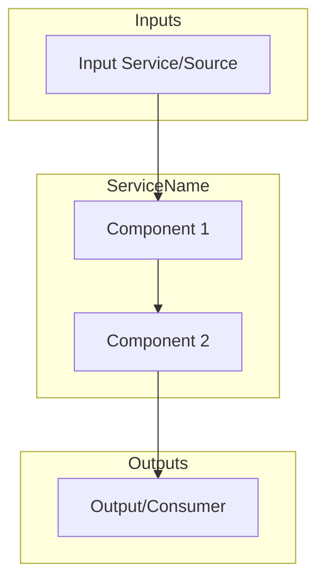

# README Template for ATLAS Services

This is the standard template for service README files in ATLAS.

---

## Structure

```markdown
# ServiceName

One-line description of what the service does.

## Overview

2-3 sentences explaining the service's purpose and role in ATLAS.
Mention key integrations (upstream/downstream services).

## Architecture



Brief explanation of the data flow.

## Features

- **Feature 1**: Brief description
- **Feature 2**: Brief description
- **Feature 3**: Brief description

## Configuration

| Variable | Description | Default |
|----------|-------------|---------|
| `VAR_NAME` | What it does | value or "Required" |

## API Endpoints

### REST API (Port XXXX)

| Endpoint | Method | Description |
|----------|--------|-------------|
| `/api/resource` | GET | What it does |

### gRPC Services (if applicable)

| Service | Method | Description |
|---------|--------|-------------|
| `ServiceName` | `Method` | What it does |

## Project Structure

```
ServiceName/
├── src/
│   ├── Endpoints/      # API handlers
│   ├── Services/       # Business logic
│   └── ...
├── tests/              # Unit tests
└── .devcontainer/      # Dev container config
```

## Development

### Prerequisites
- VS Code with Dev Containers extension
- Access to shared infrastructure (PostgreSQL, observability stack)

### Getting Started

1. Open in VS Code: `code ServiceName/`
2. Reopen in Container (Cmd/Ctrl+Shift+P → "Dev Containers: Reopen in Container")
3. Build: `dotnet build`
4. Run: `dotnet run`

### Build Container

```bash
./devcontainer/build.sh
```

## Deployment

```bash
cd deployment/ansible
ansible-playbook playbooks/deploy.yml --tags service-name
```

## Ports

| Port | Protocol | Description |
|------|----------|-------------|
| 8080 | HTTP | REST API (internal) |
| 50XX | HTTP | REST API (host) |
| 5001 | gRPC | Event streaming (if applicable) |

## See Also

- [Related Service](../RelatedService/README.md) - Brief description
- [docs/ARCHITECTURE.md](../docs/ARCHITECTURE.md) - System design
```

---

## Guidelines

1. **Keep it concise**: Aim for 100-200 lines, not 900+
2. **Mermaid diagrams**: Show data flow, not every internal component
3. **Tables for structured data**: Env vars, endpoints, ports
4. **Tree for project structure**: Show key directories only
5. **Consistent ordering**: Overview → Architecture → Features → Config → API → Structure → Dev → Deploy → See Also
6. **One-line descriptions**: For features, keep explanations brief
7. **Cross-references**: Link to related services and docs
8. **Avoid duplication**: Don't repeat content from main README or docs/
