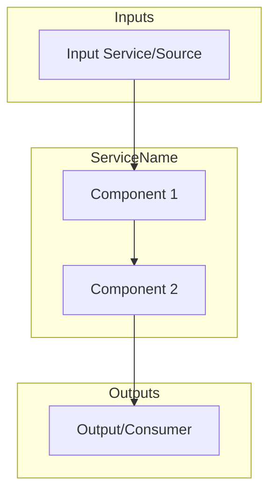

# README Templates for ATLAS

This is the entry point for the ATLAS README template family. Earlier revisions of this file assumed every project was a .NET-shaped service with REST + gRPC endpoints, an `.devcontainer/`, `Containerfile`, and per-service ansible deploy tag. The README audit campaign (PRs #512–#540) demonstrated that this shape does not fit most non-collector projects in the monorepo (MCP servers, Python sidecars, shared libraries, Cloudflare Workers, deployment infra, multi-host directories).

This file now (a) routes you to the correct sibling template by **project archetype**, (b) defines **shared conventions** that all templates inherit, and (c) provides the **.NET service** template inline (the most common archetype).

---

## Pick a template by archetype

| Archetype | Use for | Template file |
|-----------|---------|---------------|
| **.NET service** | Containerized .NET services with REST and/or gRPC endpoints (collectors, processing, alerting) | This file (below) |
| **MCP server** | Model Context Protocol servers (stdio / SSE / Streamable HTTP) — both standalone and child-of-parent-service | [`README-TEMPLATE-MCP.md`](./README-TEMPLATE-MCP.md) |
| **Sidecar** | Containerized Python/FastAPI sidecars, wrapper-only images, ML inference sidecars | [`README-TEMPLATE-SIDECAR.md`](./README-TEMPLATE-SIDECAR.md) |
| **Library** | Shared .NET libraries, contract registries (proto / event definitions), client SDKs | [`README-TEMPLATE-LIBRARY.md`](./README-TEMPLATE-LIBRARY.md) |
| **Infrastructure** | Deployment dirs (ansible roles + Jinja templates + systemd units spanning many services) | [`README-TEMPLATE-INFRA.md`](./README-TEMPLATE-INFRA.md) |
| **Edge** | Cloudflare Workers / D1 / R2 / KV / Queues / Durable Objects | [`README-TEMPLATE-EDGE.md`](./README-TEMPLATE-EDGE.md) |
| **Index** | Project-index / multi-host directories / test-harness directories (multiple services or no single product) | [`README-TEMPLATE-INDEX.md`](./README-TEMPLATE-INDEX.md) |

When in doubt: if the directory does not produce a single deployable artifact, it is **not** a service — pick Library, Infra, or Index.

---

## Shared conventions (apply to every archetype)

These were drift sources across the audit campaign and are codified here once so every template can reference them.

### Configuration

- **Env-var key separator: `__` only** in env vars; the `:` form is the in-memory `IConfiguration` key (not a valid env-var name on POSIX). Do **not** publish "(a.k.a. `Section:Key`)" aliases — pick `__` and stick with it.
- **Source-verified vars only.** Do not document an env var that the codebase does not read. Grep `configuration[...]`, `GetValue`, `GetSection`, `os.environ`, `os.getenv` to verify before listing. If `compose.yaml` sets a var the code ignores, either delete from compose or document it as `Set in compose, **not read** — pending cleanup`.
- **Design-time vs runtime.** Vars used only by `dotnet ef migrations`/`dotnet ef database update` belong in a separate `### Design-time (EF tooling only)` subsection, not the runtime Configuration table.
- **Default vs deployed override.** When `appsettings.json` / `Containerfile` default differs from the `compose.yaml` override that actually runs in prod, document both: add `Deployed (compose)` column alongside `Default`. Do not silently publish the default and let the operator wonder why the running value differs.
- **Conditional registration.** If unsetting a var disables a subsystem (e.g. `SECMASTER_GRPC_ENDPOINT` un-registers the gRPC client; `FRED_API_KEY` un-registers an entire HTTP client + rate limiter), document *what unset means*, not just "Optional".

### API surface

- **REST endpoint tables include an `Auth` column** when any endpoint is anonymous and any other requires auth.
- **REST endpoint tables include a `Query Params` column** when ≥2 endpoints carry query-param contracts; mention the polymorphic-body case (e.g. AlertService accepts batched or single Alertmanager payloads) in a note row, not in prose.
- **gRPC tables reference the `.proto` file path** explicitly (`proto: Events/proto/X.proto`) — without this readers cannot trace claims back to the contract.
- **OpenAPI / Swagger UI policy** is per-service: state whether OpenAPI JSON is always served and whether Swagger UI is dev-only.
- **Generated clients** (e.g. NSwag → `Client/Generated/`) are build-time artifacts; flag them in Project Structure with a `# generated, do not edit` comment.
- **Response envelope** — if the service wraps upstream responses in a standard shape (`{ok, http_status, problem|error|detail}`), document the envelope contract once at the top of the API section.
- **Problem types** — if the service emits RFC 9457 problem details, list the `type` URIs in a small table under API.

### Observability

- **Metrics** — list named OTEL meter + metric names that operators may dashboard or alert on (`<service>.jobs.completed_total`, etc.). Cross-reference any dashboards in `deployment/grafana/dashboards/`.
- **Tracing** — name the `ActivitySource`. Note any spans worth knowing (e.g. long-running background work).
- **Logging** — note Serilog/structured-log conventions only if non-default; production default is `WARN`.

### Operational metadata

- **Health checks** — explicitly list `/health`, `/health/ready`, `/health/live` (or the service's actual endpoints).
- **Volumes** — host-mounted paths that are load-bearing (model cache, transcripts dir, raw-data mount) belong in a `## Volumes` table. Losing a model volume = re-download on every restart.
- **Resources / Limits** — CPU / memory caps from compose, GPU reservations, `cpu_ms` for Workers.
- **Background workers / hosted services** — for services where workers ARE the product (collectors, ThresholdEngine, SecMaster importers, SentinelCollector), enumerate `IHostedService` implementations with cadence and master-switch env vars. Do not bury in `## Features`.
- **Operational status** — if the service is intentionally stopped or in a non-default state (per STATE.md), record it here. Absence of a slot encourages READMEs to omit it (misleading).
- **Cron / scheduler** — cadence, holiday handling, timezone (UTC), retry semantics.

### Conventions sections (when applicable)

- **Known Deviations** — when the project deviates from a `CLAUDE.md` rule (e.g. raw SQL migrations instead of EF, no devcontainer), document it explicitly with rationale.
- **Not Yet Implemented** — enums/types/options scaffolded for future use but with no runtime path. Flag explicitly rather than implying they work.
- **Source bugs / Known inconsistencies** — README-as-canonical-reference needs a place to record drift between code and deployment artifacts honestly.

### Mermaid diagrams

- Use double-quoted node labels for any label containing braces, slashes, or punctuation: `A["path/with/brace{x}"]`. Avoid HTML entity escapes (`&lcub;`).
- Show data flow at the integration boundary (Inputs → Service → Outputs/Consumers). Do not diagram internal classes.

### "See Also" verification

Before submitting a README, run `awk` or `grep` to verify every linked path exists on disk. Stale links are worse than no links because they mislead future agents.

### Line cap

- **Thin services / sidecars / MCP**: 100–250 lines is the right size.
- **Canonical-reference services** (SecMaster, ThresholdEngine, SentinelCollector — service-of-record components with 9+ hosted services, 60+ env vars, 10+ entities): may legitimately run 400+ lines because the README is the contract. Do not contort these to fit a generic cap.

### Build / deploy commands

- The **container build** path is `./.devcontainer/build.sh` (note the **leading dot** — earlier revisions of this template dropped it).
- The **compile + test** path is `./.devcontainer/compile.sh` (omit `--no-test` before push per `CLAUDE.md` GIT_PUSH gate).
- The **deploy** path is `ansible-playbook playbooks/deploy.yml --tags <tag>`. The convention for `<tag>` is service-name-as-kebab (`fred-collector`) for primary services and concatenated (`fredcollector-mcp`, `thresholdengine-mcp`) for MCP sidecars. Check `deployment/ansible/playbooks/deploy.yml` for the real tag if unsure.
- Cross-cutting tags worth mentioning: `--tags dashboards` (Grafana hot-reload), `--tags patterns` (ThresholdEngine pattern hot-reload).

---

## .NET service template (use this for collectors, processing, alerting, calendar, secmaster, etc.)

```markdown
# ServiceName

One-line description of what the service does.

## Overview

2-3 sentences explaining the service's purpose and role in ATLAS.
Mention key integrations (upstream/downstream services).

## Operational Status

Optional. Use when the service is intentionally stopped, disabled in prod
compose, in a non-default operational state, or in active migration to a
new backend. Omit if running as designed.

## Architecture


```mermaid
flowchart TD
    subgraph Inputs
        A["Input Service/Source"]
    end

    subgraph ServiceName
        B[Component 1]
        C[Component 2]
    end

    subgraph Outputs
        D["Output/Consumer"]
    end

    A --> B --> C --> D
```

Brief explanation of the data flow.

## Features

- **Feature 1**: Brief description
- **Feature 2**: Brief description
- **Feature 3**: Brief description

### Not Yet Implemented

Optional. Enums / types / options that exist for future use but have no
runtime path. Flag explicitly to avoid misleading readers.

## Configuration

Document only env vars the service actually reads. Use the `__` separator.

| Variable | Description | Default | Deployed (compose) |
|----------|-------------|---------|--------------------|
| `Section__Key` | What it does and what unsetting it means | value or "Required" | value if different |

### Design-time (EF tooling only)

Optional. Vars used only by `dotnet ef migrations`/`database update`. Operators
should not set these in prod.

| Variable | Description | Default |
|----------|-------------|---------|

## Background Workers / Hosted Services

Optional but recommended for services where workers ARE the product (collectors,
ThresholdEngine, SecMaster). One row per `IHostedService`.

| Worker | Cadence | Master switch | Notes |
|--------|---------|---------------|-------|
| `ImporterWorker` | Every 15 min UTC | `Importer__Enabled` | Backfill on startup |

## API Endpoints

### REST API (Port 8080 internal)

| Endpoint | Method | Auth | Query Params | Description |
|----------|--------|------|--------------|-------------|
| `/api/resource` | GET | Anonymous | `from`, `to` | What it does |

OpenAPI: served at `/swagger/v1/swagger.json` (always | dev-only).
Swagger UI: `/swagger` (always | dev-only | disabled).

### gRPC Services (if applicable)

Proto: `Events/proto/Service.proto`

| Service | Method | Role | Description |
|---------|--------|------|-------------|
| `package.ServiceName` | `Method` | Server (streams downstream) | What it does |

### Health Checks

| Endpoint | Purpose |
|----------|---------|
| `/health` | Liveness |
| `/health/ready` | Readiness (DB, dependencies) |
| `/health/live` | Process-level liveness |

### Problem Types (RFC 9457)

Optional. List `type` URIs returned by error responses.

| Type URI | HTTP Status | When |
|----------|-------------|------|

## Observability

- **Meter**: `ServiceName` — metrics: `servicename.jobs.completed_total`, ...
- **ActivitySource**: `ServiceName` — spans: ...
- **Logging**: Serilog, default WARN in prod.
- **Dashboards**: `deployment/grafana/dashboards/<service>.json`

## Volumes

Optional. Host-mounted paths that are load-bearing.

| Mount | Purpose |
|-------|---------|
| `/opt/ai-inference/<dir>` | What lives here, what breaks if it's lost |

## Project Structure

```
ServiceName/
├── src/
│   ├── Endpoints/         # API handlers
│   ├── Services/          # Business logic
│   ├── Workers/           # IHostedService implementations
│   ├── DependencyInjection.cs  # DI composition root
│   └── Program.cs              # Host bootstrap
├── tests/                 # Unit tests
└── .devcontainer/         # Dev container config
```

## Development

### Prerequisites
- VS Code with Dev Containers extension
- Access to shared infrastructure (PostgreSQL, observability stack)

### Getting Started

1. Open in VS Code: `code ServiceName/`
2. Reopen in Container (Cmd/Ctrl+Shift+P → "Dev Containers: Reopen in Container")
3. Build: `dotnet build`
4. Run: `dotnet run`

### Compile + Test

```bash
./.devcontainer/compile.sh        # full build + tests (required before push)
./.devcontainer/compile.sh --no-test  # build only (CI / quick check)
```

### Build Container

```bash
./.devcontainer/build.sh          # uses cache
./.devcontainer/build.sh --no-cache
```

### EF Migrations

```bash
nerdctl compose exec -T <service>-dev dotnet ef migrations add <Name> --project src/Data
```

Never hand-author migration `.cs` files (Designer.cs / ModelSnapshot drift).

## Deployment

```bash
cd deployment/ansible
ansible-playbook playbooks/deploy.yml --tags <service-tag>
```

Cross-cutting tags that may apply: `--tags dashboards`, `--tags patterns`.

## Ports

Internal services expose 8080 (HTTP) and optionally 5001 (gRPC) for
container-to-container communication only. Services requiring external access
also map to a host port (50XX range).

| Port | Scope | Description |
|------|-------|-------------|
| 8080 | Internal | REST API |
| 5001 | Internal | gRPC event streaming (if applicable) |
| 50XX | Host-mapped | External API (only if external access needed) |

If dev (Kestrel) and prod (Containerfile) bind differently, document both.

## Known Deviations

Optional. Document explicit deviations from `CLAUDE.md` conventions (e.g. raw
SQL migrations instead of EF, no devcontainer) with rationale.

## See Also

Group by relationship tier:

**Consumers** (services that read this service's output)
- [Consumer](../Consumer/README.md)

**Dependencies** (services this service calls)
- [SecMaster](../SecMaster/README.md) — symbol resolution

**Shared libraries / contracts**
- [Events](../Events/README.md) — proto definitions

**Sidecars** (MCP / inference)
- [ServiceName/mcp](./mcp/README.md)

**Docs**
- [docs/ARCHITECTURE.md](../docs/ARCHITECTURE.md)
```

---

## Migration guidance for service owners

If your existing README was authored against the old single-template form:

1. **.NET service** — your README is likely already aligned with the inline template above. Add any missing operational sections (Volumes, Workers, Health Checks, Metrics, Operational Status) as applicable.
2. **MCP server** (anything under `<Service>/mcp/`, or top-level `*-mcp/`) — switch to [`README-TEMPLATE-MCP.md`](./README-TEMPLATE-MCP.md). The Tools table replaces the API Endpoints tables; add the Transport row to Configuration.
3. **Python sidecar** (e.g. `FinBertSidecar/`) — switch to [`README-TEMPLATE-SIDECAR.md`](./README-TEMPLATE-SIDECAR.md). Drop the dotnet/devcontainer prerequisites; document venv + pip install instead. Note: `dsl-parser-mcp/` is Python but is an MCP — use the MCP template.
4. **Library** (`Events/`, `MacroSubstrate/`) — switch to [`README-TEMPLATE-LIBRARY.md`](./README-TEMPLATE-LIBRARY.md). Drop Ports / Deployment / API Endpoints; add Contract, Schema, Consumers, Telemetry-contract sections.
5. **Infrastructure** (`deployment/`) — switch to [`README-TEMPLATE-INFRA.md`](./README-TEMPLATE-INFRA.md). Replace API Endpoints with Playbooks, Tags, Variables, Secrets.
6. **Edge** (`edge/`) — switch to [`README-TEMPLATE-EDGE.md`](./README-TEMPLATE-EDGE.md). Replace ansible with wrangler; add Cloudflare bindings, Cron triggers, Worker limits, D1 migrations sections.
7. **Index / multi-host** (root `README.md`, `Reports/`, `LlmBenchmark/`) — switch to [`README-TEMPLATE-INDEX.md`](./README-TEMPLATE-INDEX.md). The directory is not a single product; list the services / harnesses / scripts and route the reader.

No service README needs to be regenerated from scratch — the audit campaign (PRs #512–#540) corrected each README to its source-of-truth, and those READMEs are now authoritative. Use the templates only when authoring a new project or revising an existing one.

---

## Why multiple templates rather than one with conditionals

The audit surfaced ~50 distinct flag instances across 18 PRs. The differences between archetypes are **structural** (different sections, different first-class concepts — Tools vs Endpoints, Playbooks vs Endpoints, Contract vs Endpoints), not additive. A single template with "if X skip section Y" guidance would be a 600-line forest no one reads; archetype-specific templates are each 80–150 lines and answer "what should my README look like" with a single example.

Source PRs: #512 alphavantage-collector, #513 nasdaq-collector, #514 finnhub-collector, #515 ofr-collector, #516 fred-collector, #517 llm-benchmark, #518 whisper-service, #519 root, #520 macro-substrate, #521 reports, #522 threshold-engine, #523 finbert-sidecar, #524 dsl-parser-mcp, #525 calendar-service, #526 edge, #527 secmaster, #528 sentinel-collector, #529 alert-service, #530 finnhub-collector-mcp, #531 whisper-service-mcp, #532 ntfy-mcp, #533 ofr-collector-mcp, #534 fred-collector-mcp, #535 gemini-resolver-mcp, #536 secmaster-mcp, #537 threshold-engine-mcp, #538 events, #539 markitdown-mcp, #540 deployment.
