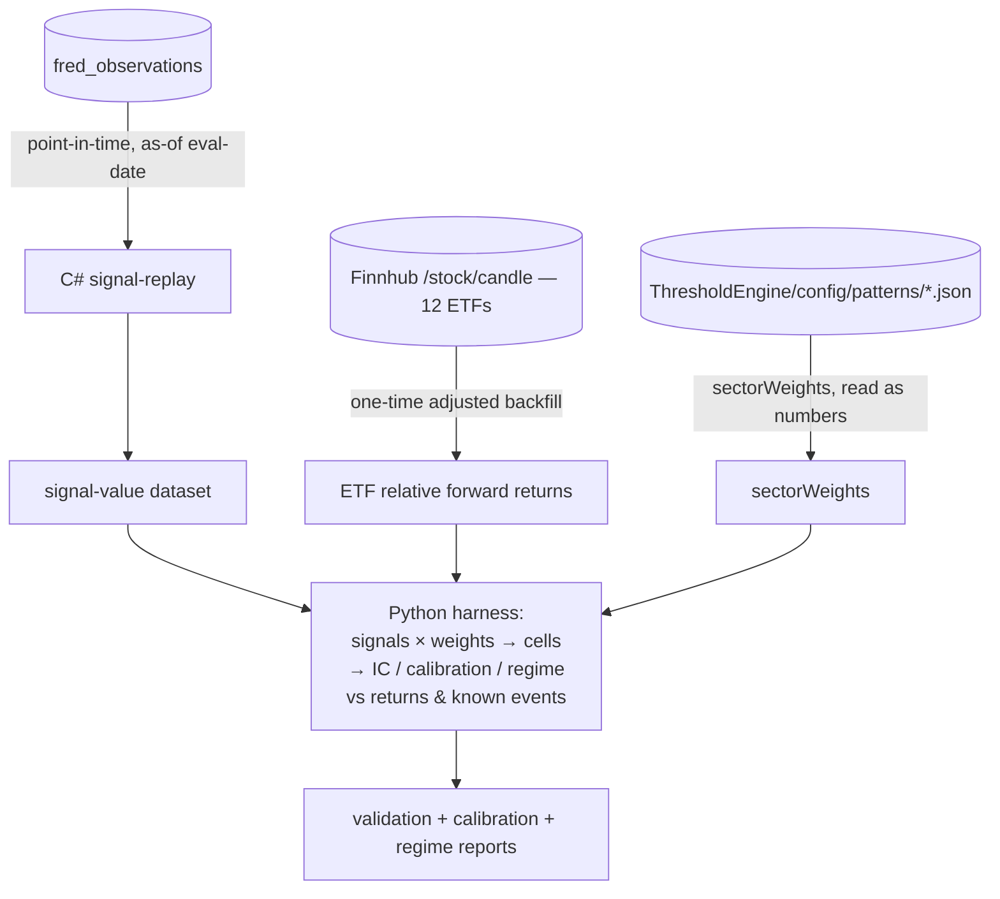

# ATLAS Matrix-Backtesting Harness — Design Spec

*Status: design spec for review. No implementation code is written or implied as committed by this document. This is the design the implementation work will follow.*

**Companion docs:** `docs/atlas-matrix-realignment-brief.md` (plain-English brief — the matrix mechanics, the cell formula, the four decisions) and `docs/atlas-sectorweights-methodology.md` (the `sectorWeights` 7-level signed scale, the relative-rotation sign convention, the starter vectors). Read those for the *why* of the matrix; this doc is the *how-to-validate-and-calibrate* it against history.

---

## Purpose & scope

The ATLAS macro-signal matrix (`cell = signal_value × sectorWeight[sector] × freshness × temporal × confidence × trust`) ships signed `sectorWeights` chosen by an economic-transmission rubric (methodology §B). Those weights are *judgment*, authored before the matrix had any history to learn from — the methodology brief itself defers empirical refinement to a later pass (Decision 1, option (c): "Derive empirically from historical cell correlations — but the matrix has to run first to generate that history"). This harness is that later pass, run against *historical FRED data* instead of waiting for the live matrix to accumulate years of cells.

**Three goals, in priority order:**

1. **VALIDATE** — did the signed matrix cells have historical explanatory / predictive power against sector returns? For each `(signal, sector, horizon)`, did the sign and magnitude of `signal × weight` line up with the sector's subsequent *relative* return (sector minus market)? This tests the model as authored — is the rubric producing cells that point the right way?

2. **CALIBRATE** — fit the `sectorWeights` empirically. This realizes the deferred Decision-1 option (c). For each signal, measure the empirical signal→sector relationship over history and emit a *suggested* weight on the same `[−1, +1]` 7-level grid the methodology uses, with a confidence flag. Output is a **proposal**, not an applied change.

3. **REGIME / DISAGREEMENT CHECK** — did the regime classification (the band-classified sector score) and the FRED-vs-news disagreement flag mark *real* historical turning points? Event-study the FRED-driven regime timeline against NBER recession dates and known market drawdowns; check disagreement against the (short) window the Sentinel news pipeline has existed.

**Out of scope / explicitly deferred:**

- **Strategy P&L simulation.** No backtested equity curve, no Sharpe, no "what would this have returned." The user has trade-count, holding-period, and tradeable-instrument constraints that a naive long/short-the-cells simulation would misrepresent — a P&L number computed without those constraints is worse than no number, because it invites a false read of the matrix as a trading strategy. The matrix stays **"situational awareness, not advice"** (brief §1). If a constrained P&L study is ever wanted, it is a separate spec with the constraints as first-class inputs.
- **ALFRED point-in-time vintages.** v1 uses latest-vintage FRED data with the resulting lookahead bias *flagged* (see Limitations). True release-vintage replay is a named hardening step, not part of v1.
- **Auto-applying calibrated weights.** Nothing this harness produces is hot-reloaded automatically. Outputs are research artifacts the user reviews; the user decides which (if any) calibrated weights to adopt and applies them via the existing `--tags patterns` hot-reload loop (methodology §E).

**What it is:** a **research harness**, not a production service. It runs offline, on demand, against historical data. It produces validation reports + a calibrated-weight proposal that feed the methodology-iteration loop: user reviews → optionally edits pattern JSONs → hot-reloads. It is not deployed, not on the gRPC mesh, not in `compose.yaml`.

---

## Approach (Approach C — hybrid)

**C# emits production-faithful signal values over history; Python does `cell = signal × weight` and all analysis.**

The matrix cell formula splits cleanly into two halves with very different drift profiles:

- The **drift-prone half** is the `signal_value` — produced by each pattern's `signalExpression`, a Roslyn-compiled C# snippet (`ThresholdEngine/src/Compilation/RoslynExpressionCompiler.cs`) reading point-in-time series through a `PatternEvaluationContext`. These expressions are real code: spreads, ratios, YoY/MoM transforms, moving averages, normalization-to-`±3`, clamps. They change as patterns are edited. Reimplementing them outside C# means maintaining a second copy that silently drifts from production.
- The **stable half** is the `sectorWeights` — a flat JSON object of 11 signed decimals per pattern. Plain numbers. Trivially read and re-applied anywhere.

Approach C keeps the drift-prone half in **production C#** and the stable half in **Python**:

- **C# replays the real `signalExpression`s** over historical eval-dates and emits a tidy dataset of `signal_value`s. The backtest therefore validates *the real model*, not a proxy — a `signalExpression` bug or quirk shows up in the backtest exactly as it does in production.
- **Python applies `cell = signal × weight`** and does IC / calibration / regime analysis. Because weights are just numbers in Python, the **calibration loop is cheap**: to test a candidate weight vector, Python re-multiplies the already-computed signal dataset — no C# re-run. Sweeping hundreds of weight candidates is a Python `groupby`, not hundreds of backtest passes.

**Rejected alternatives:**

- **(A) Full-C# replay** — C# computes finished *cells* (signal × weight) over history; Python only reads cells. Rejected for **calibration**: every candidate weight vector requires re-running the C# replay, because the weight is baked into the emitted cell. Calibration is inherently a sweep over weights; baking the weight in makes the sweep cost a full replay each. Validation alone would be fine with (A); calibration makes it painful.
- **(B) Pure-Python** — reimplement the `signalExpression`s in Python and compute everything in one language. Rejected because it **validates a proxy, not the model**: the Python reimplementation is a second source of truth for the signal math that drifts from the Roslyn-compiled production code. Tolerable for a rough validation; **dangerous for calibration**, where the whole point is to feed numbers back into the *production* pattern files — calibrating a proxy and applying the result to production is calibrating the wrong thing.

Approach C is the only one where both validation and calibration operate on production-faithful signal values *and* the weight sweep is cheap.

---

## Components & interfaces

### Component 1 — C# signal-replay (backtest mode)

A thin backtest entry point that reuses ThresholdEngine's pattern-evaluation libraries to replay production `signalExpression`s over history. **It emits signal values only — no cells, no weights.** Weights and the `× weight` multiply are deliberately Python's job (Approach C).

**Reuse, not reimplement.** The infrastructure for point-in-time historical evaluation already exists in the codebase:

- `ThresholdEngine/src/Entities/HistoricalPatternEvaluationContext.cs` — a `PatternEvaluationContext` subclass whose `GetLatest(seriesId)` returns the value *as known on `CurrentDate`* via `IObservationRepository.GetValueAtDateAsOfAsync(seriesId, date, asOfDate)`. This is exactly the as-of read the replay needs.
- `ThresholdEngine/src/Compilation/RoslynExpressionCompiler.cs` + `CompiledExpressionCache.cs` — compile and cache the `signalExpression` / `expression` snippets.
- `ThresholdEngine/src/Configuration/PatternConfigurationLoader.cs` — loads the pattern JSONs (`ThresholdEngine/config/patterns/**/*.json`), the source of `signalExpression`, `requiredSeries`, `temporalType`, `leadTimeMonths`, `confidence`, `weight`, and `sectorWeights`.

**Algorithm:**

1. Load all pattern configurations (`PatternConfigurationLoader`). Default: every pattern that carries a `signalExpression`, **including the currently-disabled ones** (see Limitations — the replay reads `fred_observations` directly, so a pattern that is `enabled: false` in the live engine can still be backtested as long as its required FRED series exist).
2. Build a list of monthly eval-dates from a configurable start (default the first month for which the required series have data; for the broad macro set this is ~1998, bounded per-signal by series inception) through the present, on a fixed day-of-month (default: month-end).
3. For each `(eval-date, pattern)`:
   - Construct a `HistoricalPatternEvaluationContext` with `asOfDate = eval-date`.
   - Run the pattern's compiled `signalExpression` against that context to produce one `signal_value` in `[−3, +3]` — the identical code path production uses, so the replayed value *is* the production value for that as-of date.
   - Skip-and-record (do not crash the run) when required series have no data as of the eval-date — emit a row with a null `signal_value` and a `missing_data` reason so coverage is auditable.
4. Emit one row per `(pattern_id, signal_identity, eval_date, signal_value)`.

`signal_identity` is the catalog key carried alongside `pattern_id` (the realignment re-keys patterns to signal-identities; the catalog is `SecMaster/data/signal-identities-v1.csv`). Emitting both lets Python group by the stable identity while keeping the pattern file traceable. For patterns not yet keyed to an identity, `signal_identity` falls back to `pattern_id`.

**Interface (output):** a **signal-value dataset** — a flat table written as CSV and/or Parquet:

| column | type | meaning |
|---|---|---|
| `pattern_id` | string | the pattern file's `patternId` |
| `signal_identity` | string | catalog key (or `pattern_id` fallback) |
| `eval_date` | date (ISO-8601) | the as-of evaluation date |
| `signal_value` | float, `[−3,+3]` or null | replayed production signal; null when data missing as-of |
| `missing_data_reason` | string or empty | populated only when `signal_value` is null |

No cells. No weights. No returns. That join happens in Python.

### Component 2 — ETF relative-forward-returns dataset

A one-time historical pull of sector-ETF prices and the forward relative returns derived from them.

- **Instruments:** the 11 SPDR sector ETFs mapped 1:1 to the ATLAS sector codes, plus SPY as the market benchmark:

  | ATLAS sector code | ETF |
  |---|---|
  | `ENERGY` | XLE |
  | `MATERIALS` | XLB |
  | `INDUSTRIALS` | XLI |
  | `CONS_DISC` | XLY |
  | `CONS_STAPLES` | XLP |
  | `HEALTHCARE` | XLV |
  | `FINANCIALS` | XLF |
  | `INFOTECH` | XLK |
  | `COMM_SVC` | XLC |
  | `UTILITIES` | XLU |
  | `REAL_ESTATE` | XLRE |
  | *(market)* | SPY |

  (Sector codes are canonical per `Events/src/Events.Client/AtlasSectorCode.cs`; the ETF↔sector mapping is the standard GICS SPDR correspondence.)

- **Source:** Finnhub daily candles (`resolution=D`), via the existing `FinnhubCollector` — `FinnhubApiClient.GetStockCandlesAsync` (Finnhub `/stock/candle`), exposed at `GET /api/live/candles/{symbol}` (`SeriesType.Candle`). Finnhub is the source over AlphaVantage on **rate limits**: AlphaVantage's free tier is **25 requests/day** *and* gates its adjusted series (`TIME_SERIES_DAILY_ADJUSTED`) behind premium — unworkable for this backfill; the Finnhub plan allows **60 calls/min and 30,000 calls/month**, ample for the 12-symbol one-time pull (and any later re-pull). The 12 symbols are a one-time backfill; this is the **data dependency to wire** (see Location).
- **Adjusted close is required** so dividends/splits don't contaminate returns — sector ETFs (especially Utilities, Staples, Real Estate) pay meaningful dividends. Finnhub's `Candle` is **raw** OHLCV (no adjusted field) and `GetStockCandlesAsync` currently passes no adjustment flag, so the one wiring detail is to request Finnhub's split/dividend-**adjusted** candles (`adjusted=true`, premium — covered by the plan above) by threading that parameter through `GetStockCandlesAsync` / `GetCandlesInternalAsync`. Component 2 consumes the adjusted close.

- **Computed output — relative forward returns:** at each eval-date `t` and for each horizon `h ∈ {1, 3, 6}` months, for each sector `s`:

  ```
  rel_ret(s, t, h) = fwd_ret(ETF_s, t, h) − fwd_ret(SPY, t, h)
  ```

  where `fwd_ret(x, t, h) = adjclose(x, t+h) / adjclose(x, t) − 1`. **Relative (sector minus market), not absolute** — the matrix is a *rotation* map under the methodology's locked relative-rotation convention (methodology §A.4): a cell says "this sector outperforms/underperforms the market in this macro environment," not "this sector goes up." Validating against relative return is the like-for-like test; validating against absolute return would mostly measure beta to the overall market, which the matrix is not trying to predict.

  Forward returns at `t` use prices at `t+h`, which is correct (the matrix is a forward-looking projection); the lookahead concern is on the *input* (FRED vintages), not the *target* (returns are unrevised market prices).

**Interface (output):** a relative-returns table:

| column | type | meaning |
|---|---|---|
| `sector` | string | ATLAS sector code |
| `eval_date` | date | aligned to the signal dataset's eval-dates |
| `horizon_months` | int ∈ {1,3,6} | forward horizon |
| `rel_ret` | float or null | sector forward return minus SPY forward return; null past data end |

### Component 3 — Python analysis harness

Reads the three inputs and runs the three goals. Inputs:

- the **signal-value dataset** (Component 1),
- the **`sectorWeights`** parsed directly from the pattern JSONs (`ThresholdEngine/config/patterns/**/*.json`) — read once, the same files production uses, so Python applies the *current* authored weights,
- the **ETF relative-returns table** (Component 2).

Three modules, one per goal (Validation / Calibration / Regime-disagreement). Methods below. The harness computes cells itself (`signal × weight`) so it never depends on a C#-produced cell, which is what makes the weight sweep cheap.

---

## Data flow



The split is the whole point: C# owns the path from `fred_observations` to `signal_value` (the production code); Python owns everything downstream of the signal value (the `× weight` and all statistics). The two never share a process; they share two flat files.

---

## Methods

### Validation — information coefficient + hit-rate

For each `(signal_identity, sector, horizon)`:

- Compute `cell = signal_value × weight[sector]` per eval-date (the analysis uses the cell's `signal × weight` core; the full production cell additionally multiplies `freshness × temporal × confidence × trust`, but those are per-eval-date attenuators that scale magnitude without changing the *sign* or the *rank* — so for a rank-correlation validation they are noise to be excluded, not signal. Magnitude-sensitive readouts note this.).
- **Information coefficient (IC):** Spearman rank correlation between the cell time series and the sector's forward `rel_ret` at that horizon. IC is the standard cross-sectional/temporal predictive-power measure; rank correlation is robust to the cell's bounded `[−3,+3]` scale and to return outliers.
- **Hit-rate:** fraction of eval-dates where `sign(cell) == sign(rel_ret)`. A blunt, interpretable companion to IC — "when the cell said this sector should out/under-perform, how often did it?"
- **Empirical lead/lag readout:** compute IC at all three horizons and report the horizon where each signal's IC peaks. A signal whose IC is strongest at 6 months is empirically *leading*; one strongest at 1 month is more *coincident*. This peak-horizon is a data-grounded check on each pattern's authored `temporalType` / `leadTimeMonths` and feeds back into those fields.

A positive IC means the authored cell sign agrees with subsequent relative returns — the model points the right way. IC near zero or negative for a `(signal, sector)` pair is a flag for the calibration module and for human review.

### Calibration — empirical weight proposal (the deferred Decision-1 option-c)

Per `(signal_identity, sector)`, derive a *suggested* weight from the empirical signal→sector-return relationship, then map it onto the methodology's grid:

1. **Empirical relationship.** Regress the sector's forward `rel_ret` on the raw `signal_value` (univariate, per sector), and/or take the IC, at the signal's empirically-best horizon (from the validation lead/lag readout). The regression beta's sign and the IC's sign must agree for the estimate to be trusted.
2. **Map to the 7-level grid.** Scale the standardized relationship strength onto the methodology's discrete signed scale `{−1, −0.66, −0.33, 0, +0.33, +0.66, +1}` (methodology §A.3). The mapping is **monotonic and bounded**: strongest empirical relationships map to `±1`, weakest non-zero to `±0.33`, statistically-insignificant to `0`. Bounded-and-discrete is deliberate — it keeps the proposal *interpretable* (same scale the human authors on) and acts as an **overfitting guard** (a noisy regression cannot propose `+0.91`; it proposes `+0.66` or `0`).
3. **Confidence flag.** Every proposed weight carries a flag derived from sample size (eval-dates with non-null signal *and* return) and significance (regression p-value / IC significance). Low-confidence proposals (short history, e.g. a signal whose series starts late, or an insignificant relationship) are marked and **not** treated as recommendations — they are shown so the human sees "we don't have enough history to calibrate this one."
4. **Human decides.** The module emits a proposal; it never edits a pattern file. Adopted weights map **1:1** into the pattern JSON `sectorWeights` object (same keys, same scale), so applying an accepted proposal is a copy of 11 numbers into the file, followed by the existing `--tags patterns` hot-reload.

**Overfitting discipline is built into the method, not bolted on:** the discrete bounded grid, the confidence flag, the in-sample/out-of-sample split (see Limitations), and the rule that beta-sign and IC-sign must agree before a non-zero weight is proposed. Noisy calibrated weights are treated skeptically by construction.

### Regime / disagreement — event study vs known turning points

- **Regime timeline (FRED-driven, deep history).** Replay the FRED-driven sector scores over the full history and run them through the regime band-classifier (`ThresholdEngine/src/Services/SectorRegimeClassifier.cs`, the configurable contiguous-band taxonomy: severe-contraction / contraction / neutral / expansion / overheating). This produces a regime timeline back to the signal data's start (~1998), because it depends only on FRED inputs that exist over that span.
- **Event study vs known events.** Overlay the regime timeline against **NBER recession dates** (the standard US business-cycle reference; the dates are public and fixed) and a curated list of **known equity drawdowns** (e.g. 2000–02, 2008–09, 2020, 2022). The question: did the classifier flip to a contraction/severe-contraction regime *before or at* these turning points, and how far ahead? This is a descriptive event study (lead time, hit/miss on each known event), not a fitted model.
- **FRED-vs-news disagreement — short window only.** The disagreement metric (FRED signal vs Sentinel news signal on the same row diverging) can only be studied over the window the Sentinel news pipeline has actually produced observations — months, not decades. The disagreement half of this module is therefore **explicitly scoped to that short window**, reported as a small-sample qualitative check ("did the few historical disagreements coincide with known regime changes?"), not a statistical claim. This limit is stated in every disagreement output so it is never read as a long-history result.

---

## Limitations & rigor

- **Lookahead bias (input side).** `fred_observations` carries an `AsOf` column (`FredCollector` migration `AddAsOfColumn`), and the replay reads through `GetValueAtDateAsOfAsync`, so the *machinery* for point-in-time reads is real. **But** for the pre-ATLAS-collection span, `AsOf` is the *ingestion* timestamp, not the true FRED *release vintage* — the values are latest-vintage (revised) data stamped as if known at ingestion. This **overstates real-time availability**: a GDP figure that was revised upward months after first release is replayed at its revised value. v1 **accepts this bias and flags it prominently** on every validation/calibration output. True release-vintage replay (ALFRED point-in-time vintages, which carry the actual first-release-and-revisions history) is the named **hardening step** — it would replace the latest-vintage reads with vintage-correct ones, with no change to the harness's structure (the replay already reads through an as-of interface). Until then, results are "as if the revised data were known at the time," and predictive power may be optimistic where revisions are large.
- **Overfitting / multiple testing.** The search space is large: ~40 signals × 11 sectors × 3 horizons ≈ **1,300 `(signal, sector, horizon)` cells** tested against ~25 years of *monthly* data (~300 observations per series, fewer for late-inception series). With that many tests some IC values will look significant by chance. Mitigations, all reported: (1) report significance (p-values / multiple-testing-aware thresholds) alongside every IC, not just the point estimate; (2) an **in-sample / out-of-sample split** — calibrate weights on an early sub-period, check they still hold on a held-out later sub-period; a weight that only works in-sample is flagged noise; (3) the discrete bounded calibration grid (above) caps how confidently a noisy fit can speak. Calibrated weights with weak out-of-sample agreement are treated skeptically and surfaced as such, not silently proposed.
- **ETF inception (per-sector history length).** Sector-ETF histories are not equal length. XLE/XLB/XLI/XLY/XLP/XLV/XLF/XLK/XLU trade from 1998–1999; **XLRE (Real Estate) starts October 2015; XLC (Communication Services) starts June 2018.** Real Estate and Comm-Services therefore have far shorter return histories — IC and calibration for those two sectors rest on ~10 years and ~7 years respectively, and their confidence flags reflect it. Every per-sector output **notes the usable date range and observation count** so a short-history sector is never compared apples-to-apples with a full-history one. (Pre-2015 Real Estate exposure lived inside Financials; the harness does not attempt to synthesize a pre-XLRE real-estate proxy in v1.)
- **Bonus coverage — backtests more than the live matrix renders.** Because the replay reads `fred_observations` directly and runs `signalExpression`s, it can evaluate **patterns that are currently disabled in the live engine** as long as their required FRED series exist. The audit quarantined a set of patterns (the realignment brief's CUT/REALIGN bucket and any `enabled: false` rows); for those whose raw FRED data still exists, the backtest can still measure historical power — useful evidence for whether a quarantined-but-data-backed signal is worth reviving. So backtest coverage is a *superset* of what the live matrix currently shows. (Patterns CUT for having *no* data source — e.g. the FRED-less valuation stubs in the brief §5 — remain un-backtestable; the harness records them as `no_series` and skips them.)

---

## Outputs

All outputs are **research artifacts for human review — nothing is auto-applied.**

- **IC heatmaps** — a `signal × sector` grid of information coefficients (one heatmap per horizon), green/red by sign and saturation by magnitude. The at-a-glance "which cells the history supports."
- **IC-vs-horizon curves** — per signal, IC at 1/3/6 months, showing where predictive power peaks (the empirical lead/lag readout that feeds `temporalType`).
- **Calibrated-weights proposal** — per signal, the suggested 11-sector vector on the 7-level grid, each entry with its confidence flag and a **diff against the current authored weight** in the pattern JSON. The diff is what feeds the hot-reload decision: the user sees "rubric said `+0.66`, history says `+0.33` (high confidence)" and chooses. Emitted in a form (per-pattern `sectorWeights` JSON blocks) that drops straight into the pattern files if adopted.
- **Regime-timeline-vs-known-events chart** — the FRED-driven regime band over time, with NBER recessions and known drawdowns marked, plus a small table of lead time / hit-miss per known event. Includes the short-window disagreement check, clearly labeled as small-sample.

No dashboards, no alerts, no persisted metrics — this is offline research output (markdown reports + figures + the proposal JSON), reviewed once per iteration, not a live surface.

---

## Testing

- **Drift-check (the key test).** The replayed `signal_value` for a recent eval-date must match the live system's signal component for the same date. Pick a recent date for which the live engine has emitted cells; for a sample of patterns, divide the live cell by the weight (and the known attenuators) to recover the live signal, and assert the replay's `signal_value` equals it within float tolerance. **This is the test that proves replay == production** — the entire value of Approach C rests on the replayed signal being the production signal, so this is the non-negotiable gate. If it fails, the backtest is validating a divergent code path and its results are void.
- **IC-math tests on synthetic data.** Feed the analysis modules synthetic signal/return series with a *known* injected correlation (e.g. a signal that is the forward return plus noise → IC must be high and positive; a signal independent of returns → IC ≈ 0; a sign-flipped signal → IC strongly negative). Assert the computed IC, hit-rate, and calibrated-weight sign come out as constructed. This tests the statistics independently of any real-data ambiguity.
- The C# replay reuses already-tested production components (`HistoricalPatternEvaluationContext`, `RoslynExpressionCompiler`, `PatternConfigurationLoader`), so it does not re-test the signal math itself — it tests only the new orchestration (eval-date walk, dataset emission) and the drift-check above.

---

## Location

A new **`backtest/` area** containing both halves of the hybrid:

- **C# signal-replay** — a small tool / subcommand that references ThresholdEngine's pattern-evaluation libraries (`HistoricalPatternEvaluationContext`, `RoslynExpressionCompiler`, `PatternConfigurationLoader`, `IObservationRepository`). Implementation form is an implementation-time choice between (a) a `--backtest` subcommand on the existing ThresholdEngine host and (b) a separate small console project under `backtest/` that project-references the ThresholdEngine library; either reuses the same libraries — the spec requires reuse, not a particular packaging. It is **not** added to `compose.yaml` and is **not** deployed via ansible; it is a developer-run offline tool.
- **Python analysis** — a `backtest/` directory (Python venv per project convention — never system Python) holding the three analysis modules, the report/figure generation, and the synthetic-data tests. Reads the signal-value dataset, the pattern JSONs, and the ETF relative-returns table; writes the reports/figures/proposal.

**Data dependency to wire:** the Finnhub sector-ETF history (the 12 symbols above) must be backfilled before Component 2 can produce returns. This is a one-time pull through the existing `FinnhubCollector` candle path (`GetStockCandlesAsync`, `resolution=D`), requesting split/dividend-adjusted candles (`adjusted=true` — the one small collector addition, see Component 2). The harness consumes the resulting adjusted-close series. This is the single external prerequisite and the first build step.

---

## Build sequence (for the implementation plan that follows this spec)

1. Backfill the 12 ETF symbols via `FinnhubCollector` adjusted daily candles — thread `adjusted=true` through the candle client (the data dependency; see Component 2).
2. C# signal-replay → emit the signal-value dataset; **pass the drift-check** before trusting any output.
3. Component 2 → ETF relative-forward-returns table.
4. Python harness — Validation module first (IC heatmaps), then Calibration (weight proposal), then Regime/disagreement.
5. Review outputs with the user → optionally adopt calibrated weights → `--tags patterns` hot-reload.

This spec defines *what* and *why*; the build sequence is the seam to the implementation plan and is intentionally the only forward-looking, non-design content here.
