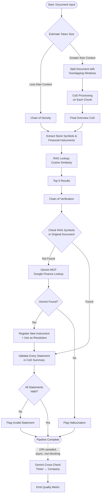

# Sentinel Edge Realization — Planning Doc

**Created:** 2026-05-17 (post-session pause; pre-dispatch planning artifact)
**Status:** Discussion artifact, **not** a fix plan. Pulls the whole picture together so we can methodically decide what to dispatch next.
**Context:** Two days of intensive Sentinel work + deep diagnostics have exposed a layered set of architectural and operational gaps. This doc steps back from fix-mode into plan-mode. No work should be dispatched against this doc without an explicit decision in §6 / §7.

## 1. Goal

> Sentinel is the edge. We are card counters, not by-the-book players. The whole point is to surface signals from unstructured prose that FRED/OFR baselines can't deliver. **Validation IS the edge** — without trustworthy validation, we're just charting FRED.

Every architectural decision in this doc is judged against that frame. The pipeline doesn't have to be cheap or fast; it has to be _correct enough that we trust an AutoApproved row_. Anything that erodes that trust — silent gates, parallel paths drifting apart, lazy-load that doesn't lazy-load — is a direct hit on the edge.

## 2. Architectural intent vs implementation gap

Canonical reference: [`docs/sentinel-extraction-pipeline.md`](../sentinel-extraction-pipeline.md). The Mermaid pipeline below is reproduced from that doc; each stage is annotated with what's actually happening in production today per the morning's OTEL recon.

### Stage-by-stage: intent vs reality

| Stage | Intent (per canonical doc) | Actually happening today | Gap |
|---|---|---|---|
| **1. Token estimate** | Route oversize docs to chunk path, in-budget to direct path. | Working as designed. | — |
| **2. Chain of Density** | Dense summary that preserves entities + numbers. Per SENTINEL rule, ≥30B model. | CoD runs on **qwen2.5:7b on `ollama-cpu-gen`**. NFP-contamination prompt bug fixed (PR #342). | **Rule violation.** 7B violates the ≥30B SENTINEL constraint. Quality of the downstream extraction is bottlenecked by CoD summary quality. |
| **3. Final overview CoD** | Coherent merged summary for chunked path. | Working. Same 7B caveat as Stage 2. | Same as Stage 2. |
| **4. Extract symbols + structured fields** | `sentinel-cove-v6.2` base on 32B-AWQ. JSON-schema-enforced decode. `subject_entity` populated. | V2 path active. `subject_entity` 100% populated. LoRA removed (PR #344). | — (structurally healthy on V2; V1 path divergence — see §4 gap 1) |
| **5a. RAG top-N** | Cosine similarity over v5 embeddings (`ticker + name + description + industry + sector`); top-5 default, cap 10. | Working. | — |
| **5b. CoVe Symbol grounding** | Pick first top-N candidate whose Symbol or Name appears literally in `text_quote ∪ context_summary`. Length-aware predicate (≥4-char Symbol → `\bSYM\b`; ≤3-char → Name-only). PR #314, #331 tightening. | Active. ~60% rows → `no_match`, 34% → `rag_synthesis`, 3% real hits. | The high `no_match` rate is _expected_ from the CoVe predicate **if lazy-load is doing its job**. It isn't — see Stage 5c. |
| **5c. Phase 7 Gemini fallback** | On cascade-exhausted, call Gemini MCP Google Finance → if hit, register new instrument in SecMaster (`discovery_source='GeminiFallback'`) and use ticker as resolution. | Wrapper firing **146× / 30min**. Result: **100% `no_match`. Zero auto-registrations.** | **Critical.** The lazy-load chain is broken end-to-end. Either wrapper isn't being invoked from V2, Gemini is returning useless responses, or the register-step is silently failing. PR #328 metrics never registered → can't tell which. |
| **6. Statement-level validation** | Validate every numeric/factual field against source. Failed fields → `[cove] statement-ungrounded:<field>` + force `review_status = Pending`. PR #329 landed. | **Metric never emitted as Prometheus series.** Silent in logs too despite `Sentinel__StatementValidationEnabled=true`. Code path may not be invoked from V2. | **Critical.** Validation IS the edge per §1. If Stage 6 is silently no-op'd, every row that passes Stage 5b is AutoApproved on extraction-confidence alone. |
| **AutoApprove** | Single gate (`AutoApprovePolicy.cs`): `extraction_conf ≥ 0.9 ∧ resolved ∧ resolution_conf ≥ 0.8 ∧ instrument_id != null`. Invoked in **all** persistence paths. | Just wired into `ReExtract` path (PR #343). **V2 production path (`RunV2ProductionAsync`) still doesn't invoke the gate.** | The production hot path bypasses the central policy. This is what §4 gap 1 is about. |
| **Catalog** | Seeded narrow from FRED/Finnhub. Lazy-load + auto-register fills it from real article traffic. See §3. | 8,379 / 9,420 rows (89%) unresolved. Catalog has only seeded sources. Lazy-load chain broken (see Stage 5c). | **Not a structural narrowness problem.** This is the lazy-load chain not lazy-loading. Bulk catalog expansion would be wrong-architecture. |

## 3. SecMaster lazy-load design — the corrected understanding

Reference: [`SecMaster/README.md`](../../SecMaster/README.md), "Catalog Discovery" + "Embedding Backfill" features; and the Phase 7 description in `docs/sentinel-extraction-pipeline.md` §"Stage 5c".

**How the system is supposed to work:**

1. **Catalog seeded narrow.** SecMaster is populated from upstream collectors (FRED, Finnhub, AlphaVantage, OFR, EDGAR) at startup. This covers the universe those collectors care about — US macro series, US equities with material SEC filings, etc. By design it does **not** cover every globally-listed ticker.
2. **Extraction surfaces an entity.** Sentinel processes an article and extracts a candidate Symbol or company name.
3. **RAG cosine lookup against seeded catalog.** Top-N similarity search. If the right answer is already in the catalog, CoVe grounds it and we're done.
4. **Miss → Phase 7 Gemini fallback.** When CoVe rejects all top-N (or top-N is empty), the Phase 7 wrapper calls the Gemini MCP Google Finance integration with the article's company-name context.
5. **Gemini returns ticker → auto-register.** On a verified hit, SecMaster registers the new instrument with `discovery_source = 'GeminiFallback'`. Embedding backfill picks it up. The row uses the ticker as its resolution.
6. **Future references resolve correctly.** Next article mentioning that company finds it in the now-expanded catalog via normal RAG.

**Consequence:** 89% unresolved is _not_ a bug. It's the "we haven't seen these yet" state — exactly the entry condition for lazy-load. As real article traffic flows through and Phase 7 fires, the catalog _earns_ its expansion driven by what the market is actually writing about. We don't seed Wikidata's global universe up front; we let real signal pull instruments into existence.

**The actual bug:** the lazy-load is not lazy-loading. Phase 7 fires 146× in 30 minutes and registers **zero** instruments. The cascade is failing somewhere between "wrapper fires" and "instrument persists in SecMaster." Fixing that closes the loop and the unresolved-rate trends down naturally with traffic.

This is the architectural correction that drove the rest of this doc.

## 4. Five compounding gaps — the integration story

The diagnostic pattern over the last two days has been: fix one thing, discover that the next gate downstream is silently no-op on the production path, fix that, discover the next one. This isn't five independent bugs. It's one architectural shape — **features built incrementally, each landed in V1 path or standalone code, never refactored into common middleware. V2 was built in parallel and didn't pick up V1's accumulated gates.** The five gaps that fall out of that shape:

### Gap 1 — Parallel-path inconsistency

V1, V2 `RunV2ProductionAsync`, and `ReExtract` paths each invoke different subsets of the gates. AutoApprovePolicy, Phase 6 statement validation, Phase 7 Gemini fallback are each wired in some subset of paths. Last night's flip to V2 silenced any gate that lived only in V1.

**Why it compounds:** every new gate added in the future re-runs this risk. Each PR has to remember "wire it into all three paths"; the diff doesn't enforce that. The fix is structural: a common middleware that all paths invoke.

### Gap 2 — Lazy-load not lazy-loading

Phase 7 wrapper firing 146× / 30min with 100% `no_match` and 0 auto-registrations. Hypothesis space (need evidence to narrow):

- **(a)** Wrapper not actually invoked from V2 — the "146 calls" metric might be coming from a different code path (e.g. the old `sentinel_gemini_resolver_calls_total` series, not the PR #328 wrapper).
- **(b)** Gemini API returning no useful ticker — prompt issue, MCP timeout, or genuinely no result for the article's context.
- **(c)** Auto-register step failing silently — gRPC call to SecMaster swallowed, DbContext duplicate-key, etc.
- **(d)** Firing metric is the OLD `sentinel_gemini_resolver_calls_total`, NOT the new PR #328 wrapper. In which case "0 registrations" means PR #328 isn't actually running at all.

**Why it compounds:** until (a)-(d) are disambiguated by metrics, we're guessing. See Gap 3.

### Gap 3 — Observability gaps on the very things we built

PR #328 (Phase 7 fallback), PR #329 (Phase 6 statement validation), and PR #332 metrics were added in code but **never registered as Prometheus series** in production. We can't measure whether the features fire. This is the meta-failure that makes Gap 2 hard to diagnose — we shipped instrumentation that doesn't instrument.

**Why it compounds:** every fix attempt for Gap 2 needs Gap 3 fixed first, or we're flying blind. And every _future_ gate addition risks the same silent-metric pattern unless registration is enforced.

### Gap 4 — Validation layers built but not all firing end-to-end

Phase 6 statement validation: feature-flag-gated, flag set to `true`, but silent in metrics **and** logs. Code path may not be invoked from V2. The qualitative-extraction path has it wired (`QualitativeVerificationService.cs:299-403`); the structured-extraction path was the explicit Phase 6 target and the wiring may not have crossed paths after the V2 flip.

**Why it compounds:** Phase 6 _is_ the validation half of "validation IS the edge." Without it, AutoApprove approves on extraction-confidence + grounded-Symbol alone — the numeric `value`, `period_end_date`, `metric_label` are taken on faith. That defeats the point.

### Gap 5 — Quality thresholds set by guess

`extraction_confidence ≥ 0.9` AND `resolution_confidence ≥ 0.8`. These numbers came from intuition, not calibration. Morning recon: 4 of 7 `cove_VectorSearch` hits hovered at 0.791-0.795 — _just under_ the gate. We have no ground-truth labels, so we don't know whether 0.8 is "right" or whether we're rejecting good rows / approving bad ones.

**Why it compounds:** every other fix in §5 changes the distribution of confidence scores at the gate. Thresholds tuned today against the broken-pipeline distribution will be wrong tomorrow when Phase 6 + Phase 7 are firing correctly. This is the **last** thing to tune, not the first.

## 5. Corrected priority order

Sequenced so each item _enables_ verifying the next. Specifically: Phase 7 lazy-load is the highest leverage (it's most of the `no_match` rate), but you can't verify any fix to it without metrics — so metrics are #2. Architectural unification (#3) prevents the next "discovered another gate silent on V2" surprise. Catalog enrichment background service (#4) is independent and unblocks the Finnhub-side classification of newly-discovered instruments. Threshold calibration (#5) goes last because it depends on the post-fix distribution being stable.

| # | Work | Why this slot |
|---|---|---|
| 1 | **Verify Phase 7 lazy-load chain end-to-end on V2 path** — trace invocation → Gemini call → ticker returned → auto-register fires → instrument persists in SecMaster. Disambiguate hypotheses (a)-(d) in §4 Gap 2. | Most leverage. Lazy-load chain not working IS the dominant cause of the 60% `no_match`. Until this closes, the catalog can't earn its expansion via real traffic. |
| 2 | **Wire missing metrics (PR #328, #329, #332)** — make sure the series register on container start, surface in Prometheus, and reflect actual code-path invocations (not parallel old series). | Need observability to verify any fix in #1 actually works. Also unblocks Phase 6 silent-or-not investigation. |
| 3 | **Unify V1 / V2 / ReExtract gate invocation** — common middleware so AutoApprove, Phase 6, Phase 7 invoke at the same point on all three paths. | Architectural. Stops the "discovered another gate-X-silent-on-V2" pattern. Pays back on every future gate addition. |
| 4 | **`CatalogEnrichmentBackgroundService` DbContext duplicate-key bug** — fix so newly-discovered instruments get embedded and classified into Finnhub source mappings. | Independent of #1-#3. Blocks the Finnhub-side classification of instruments that Phase 7 will start registering once #1 is fixed. Parallelisable. |
| 5 | **Calibrate quality thresholds against actual extraction distribution** — possibly via golden test set, LLM-as-judge, or manual sample. Tune `extraction_confidence` + `resolution_confidence` thresholds against real data. | Must come after #1-#4 are stable. Threshold tuning against a broken-pipeline distribution gives wrong numbers. |

## 6. Open questions — for discussion before dispatch

These are decisions the user wants to make before agents go back to work. Captured here as the discussion agenda for the next conversation, not as items to dispatch:

- **Parallel paths long-term.** Do we accept V1 / V2 / ReExtract as long-term parallel surfaces, or commit to refactoring to a common middleware (priority #3)? The middleware decision affects how priority #1 should be implemented — fix in V2 only, or fix once in the middleware?
- **CoD model.** Should the CoD producer move off `qwen2.5:7b` on `ollama-cpu-gen` (CLAUDE.md SENTINEL rule violation: ≥30B required)? Trade-off: GPU pressure + extra context budget on the 32B vs current 7B CPU. Quality impact on the downstream extraction needs to be measured.
- **Edge-realization target.** What's the target volume of AutoApprovals per day to declare "edge realized"? Currently ~3/hr ≈ 72/day. Is the goal 500/day? 5,000/day? Affects how aggressively we tune thresholds in priority #5.
- **Threshold calibration method.** Without ground-truth labels, how do we calibrate? Options: manual sample (slow, accurate), LLM-as-judge (fast, cheap, drifty), build a golden test set (slow upfront, durable). Different methods imply different downstream automation.
- **Phase 6 specifically.** Was the flip actually wired into the V2 production path, or only V1? Worth confirming before dispatching priority #1 — they share the same investigative trail.

## 7. Decision log

| Date | Decision | Rationale | Status |
|---|---|---|---|
| 2026-05-17 | Remove LoRA from extraction pipeline | F4.6.3 diagnostic + morning recon showed LoRA degrades extraction vs `sentinel-cove-v6.2` base | Live (PR #344) |
| 2026-05-17 | Flip Phase 6 + Phase 7 + AutoApprove ON | User: "no risk in PoC, validation IS the edge" | Live (PR #341), but V2-path wiring incomplete — see §4 |
| 2026-05-17 | Defer bulk catalog expansion (OpenFIGI + Wikidata) | User correction citing `SecMaster/README.md` lazy-load + discover-on-demand design intent. The 89% unresolved rate is the entry condition for lazy-load, not a structural narrowness problem. | Captured in this plan §3 |
| _(this session)_ | _(next decision goes here)_ | | |
