# Sentinel Extraction Pipeline

**Status:** Canonical architecture reference (as of 2026-05-16)
**Scope:** End-to-end flow from document input to persisted observation, including CoD summarization, structured extraction, RAG-based Symbol resolution, and CoVe verification.

This document is the load-bearing description of the Sentinel extraction pipeline as actually deployed in `SentinelCollector`. It complements the configuration/troubleshooting reference in `docs/SENTINEL-RLM.md`.

See also:
- `docs/plans/symbol-identification-remediation.md` — the remediation plan that drove Phases 1-3 (rich RAG, top-N, CoVe Symbol grounding) and frames Phase 6 (statement-level validation).
- `docs/SENTINEL-RLM.md` — model/backend/VRAM reference; do not change context window or model size from the values documented there.
- `docs/sentinel-product-spec-v2.md` — product-level requirements and what the LLM is and is **not** allowed to do.

## Pipeline overview

The extraction pipeline is a six-stage flow with a Phase 7 fallback (Stage 5c) planned between Symbol grounding and statement validation. Stages 1-5b are deployed today; Stage 5c (Gemini MCP Google Finance fallback) and Stage 6 (statement-level validation on the structured-extraction path) are both planned. Stage 6 is already wired for the qualitative-extraction path but **not** for the structured-extraction path that writes `sentinel.extracted_observations`. See "Implementation status" below.

### Stage 1 — Token estimation

The normalized document is fed to the token estimator. If the document fits inside the model's context budget (currently 32K — see `SENTINEL-RLM.md`), Stage 2 runs the direct path; otherwise Stage 2 takes the split/chunk path.

### Stage 2 — Chain of Density (direct or chunked)

- **Direct path** (fits in context): a single Chain-of-Density (CoD) summarization pass produces a dense `context_summary`.
- **Chunked path** (oversize): the document is split into overlapping windows; each chunk runs its own CoD pass; the per-chunk summaries are merged into a single overview in Stage 3.

CoD is implemented under `SentinelCollector/src/Extraction/ChainOfDensity.cs` and `DensityPrompts.cs`; the document chunker lives at `SentinelCollector/src/Extraction/DocumentChunker.cs`.

### Stage 3 — Final overview CoD

For the chunked path, a final overview CoD pass produces a single coherent `context_summary` across the whole document. The direct path skips this stage (the Stage 2 summary is already the final summary).

### Stage 4 — Extract Symbols (and structured fields)

The extraction model (currently Qwen2.5-32B-Instruct-AWQ + `sentinel-cove-v6.2` LoRA — see `SENTINEL-RLM.md`) emits a structured observation: `Symbol` candidate(s), `value`, `period_end_date`, `metric_label`, `text_quote`, `extraction_confidence`, `certainty`, etc. JSON-schema-enforced decode via vLLM's `response_format` keeps the output parseable.

Service entry point: `SentinelCollector/src/Services/ExtractionService.cs` (structured path) or `QualitativeExtractionService.cs` (qualitative path).

### Stage 5a — RAG top-N retrieval

The extracted observation's `text_quote` ∪ `context_summary` is sent to SecMaster's local resolution endpoint, which runs cosine-similarity vector search over instrument embeddings (template v5: `ticker + name + description + industry + sector`) and returns the top-N candidates (default 5, cap 10) ordered by similarity descending.

Client: `ISecMasterClient.ResolveLocalFromQuoteAsync(..., topN: 5)`.
Server endpoint: `SemanticSearchEndpoints.HybridResolveLocal` in SecMaster.

### Stage 5b — CoVe Symbol grounding

`CoveSymbolVerifier.PickFirstGrounded` iterates the top-N candidates in similarity-descending order and picks the first one whose Symbol or Name **literally appears in the source** (`text_quote` ∪ `raw_content.context_summary`). The predicate is length-aware (per PR #314):

- **Symbol length ≥ 4 characters** — word-boundary regex (`\bSYMBOL\b`) against the source. Word-boundary avoids spurious matches inside larger tokens.
- **Symbol length ≤ 3 characters** — Symbol matching is disabled (too noise-prone as a substring; e.g. "F", "GE", "C" appear in unrelated prose). Falls back to Name-only matching.
- **Name** — substring match with a minimum length of 4 characters; case-insensitive.

If no candidate grounds in source:
- `Symbol`/`InstrumentId` set to `null`
- `ResolutionState = NoResolution`
- `review_notes` gets `[cove] no-symbol-grounded-in-source` appended (constant: `CoveSymbolVerifier.NoGroundingNote`)
- Row is sent to human review (never auto-approved)

Service: `SentinelCollector/src/Services/CoveSymbolVerifier.cs`, wired from `ExtractionProcessor.ApplyLocalResolutionAsync` (see `SentinelCollector/src/Workers/ExtractionProcessor.cs:461`).

### Stage 5c — Gemini MCP Google Finance fallback (Phase 7, planned)

**Scope:** Fires **only** when Stage 5b rejects all candidates (`[cove] no-symbol-grounded-in-source` branch) OR when Stage 5a returned no candidates at all (cascade-exhausted). Does **not** fire on rows where CoVe accepted a Symbol — those continue straight to Stage 6.

The fallback calls the Gemini MCP integration (Google Finance lookup) with the article's company-name context. Gemini returns either a verified ticker (with name + exchange metadata) or null.

- **On hit:** register the new instrument in SecMaster (single fire-and-forget gRPC call), then use the ticker as the resolution. The row continues into Stage 6 as if RAG/CoVe had succeeded.
- **On miss (Gemini also null):** Symbol/InstrumentId stay null; `review_notes` gets `[gemini] no-match-from-google-finance` appended (parallel marker to the `[cove]` family). Row goes to human review.
- **On timeout / Gemini error:** Symbol stays null; `[gemini] timeout` (or `[gemini] error`) marker appended. Same review-pending fate as the no-match case.

Latency budget: ≤3s p95 (non-blocking on the pipeline overall — timeout falls through to the null branch). Cost is metered per call (`sentinel_gemini_fallback_cost_usd_total`) with an alert if it exceeds the daily ceiling.

Rationale: closes the **catalog-gap failure mode** — foreign tickers (`.PA`, `.TO`, `.V`, `.SI`, `.WA`, `.MC`), newly-listed equities, and name-only mentions where the right answer literally isn't in our SecMaster catalog yet. Without this layer, those rows pass through to NULL Symbol every time and accumulate in review. With Gemini as the catalog-of-last-resort plus auto-registration, the catalog actively learns from real article traffic.

Planned service: `SentinelCollector/src/Services/GeminiSymbolFallbackService.cs`, wired from `ExtractionProcessor.ApplyLocalResolutionAsync` at the same call site as the CoVe rejection / cascade-exhausted branches. See `docs/plans/symbol-identification-remediation.md` Phase 7 for the full plan.

### Stage 6 — Statement-level validation (planned)

After Stage 5b passes, every emitted numeric/factual field (`value`, `period_end_date`, `metric_label`, …) is checked against the source. Numerics use a small tolerance; dates and labels must appear verbatim (or in a recognised equivalent format for dates). Failed fields:

- Append `[cove] statement-ungrounded:<field>` to `review_notes`
- Force `review_status = Pending` (block AutoApprove)

This is currently wired for the qualitative-extraction path (`macro_observations` flow) in `SentinelCollector/src/Services/QualitativeVerificationService.cs:299-403`. It is **not** wired for the structured-extraction path (`extracted_observations`). Closing this gap is Phase 6 of the remediation plan — see `docs/plans/symbol-identification-remediation.md`.

## Pipeline diagram

```mermaid
flowchart TD
    Start([Start: Document Input]) --> EstimateTokens{Estimate Token Size}
    EstimateTokens -->|Less than Context| DirectCoD[Chain of Density]
    EstimateTokens -->|Greater than Context| SplitDoc[Split Document with<br/>Overlapping Windows]
    SplitDoc --> ChunkCoD[CoD Processing<br/>on Each Chunk]
    ChunkCoD --> FinalCoD[Final Overview CoD]
    DirectCoD --> ExtractSymbols[Extract Stock Symbols &<br/>Financial Instruments]
    FinalCoD --> ExtractSymbols
    ExtractSymbols --> RAGLookup[RAG Lookup:<br/>Cosine Similarity]
    RAGLookup --> TopResults[Top 5 Results]
    TopResults --> VerifyStep[Chain of Verification]
    VerifyStep --> CheckHallucinations{Check RAG Symbols<br/>in Original Document}
    CheckHallucinations -->|Not Found| GeminiFallback[Gemini MCP<br/>Google Finance Lookup]
    GeminiFallback --> GeminiResult{Gemini Found?}
    GeminiResult -->|Yes| RegisterInstrument[Register New Instrument<br/>+ Use as Resolution]
    GeminiResult -->|No| FlagHallucination[Flag Hallucination]
    RegisterInstrument --> ValidateStatements[Validate Every Statement<br/>in CoD Summary]
    CheckHallucinations -->|Found| ValidateStatements
    ValidateStatements --> ValidateResult{All Statements<br/>Valid?}
    ValidateResult -->|No| FlagInvalid[Flag Invalid Statement]
    ValidateResult -->|Yes| Success([Pipeline Complete])
    Success -.->|10% sampled,<br/>async, non-blocking| GeminiCrossCheck[Gemini Cross-Check<br/>Ticker ↔ Company]
    GeminiCrossCheck --> CrossCheckMetric[Emit Quality Metric]
    FlagHallucination --> Success
    FlagInvalid --> Success

    classDef processNode stroke:#818cf8,fill:#eef2ff
    classDef decisionNode stroke:#fb923c,fill:#fff7ed
    classDef outputNode stroke:#4ade80,fill:#f0fdf4
    classDef errorNode stroke:#f87171,fill:#fef2f2
    classDef geminiNode stroke:#a855f7,fill:#faf5ff

    class DirectCoD,ChunkCoD,FinalCoD,ExtractSymbols,RAGLookup,VerifyStep,ValidateStatements,RegisterInstrument,CrossCheckMetric processNode
    class EstimateTokens,CheckHallucinations,ValidateResult,GeminiResult decisionNode
    class Start,Success outputNode
    class FlagHallucination,FlagInvalid errorNode
    class GeminiFallback,GeminiCrossCheck geminiNode
```

## Implementation status

| Stage | Status | Notes |
|---|---|---|
| Token estimate + split + chunked CoD | Deployed | Qualitative-extraction model path. |
| Final overview CoD | Deployed | |
| Extract Symbols | Deployed | Extraction model emits Symbol candidates with JSON-schema-enforced decode. |
| RAG top-N | Deployed | Phase 2, PR #312. Default top-5, cap 10. Rich embeddings (v5: `ticker + name + description + industry + sector`) from Phase 1 / PR #311. |
| CoVe Symbol grounding | Deployed | Phase 3, PR #313. Predicate-tightening follow-up PR #314 (word-boundary for ≥4-char Symbols, Name-only for ≤3-char Symbols, persists `[cove] no-symbol-grounded-in-source` to `review_notes`). |
| Gemini MCP fallback (Position 1) | NOT YET (Phase 7) | closes the catalog-gap failure mode for foreign tickers and newly-listed equities |
| Statement-level validation | NOT YET (Phase 6) | Wired for qualitative-extraction (`QualitativeVerificationService.cs:299-403`); not for structured-extraction (`ExtractionProcessor`). |
| Gemini sampled cross-check (Position 2) | NOT YET (sidebar) | out-of-band quality drift detection on Approved rows |

## AutoApprove gating policy

AutoApprove decides whether an extracted row goes straight to `Approved` (and is published to ThresholdEngine via gRPC) or sits in human-review `Pending`. The policy is the single source of truth in `SentinelCollector/src/Services/AutoApprovePolicy.cs`:

| Decision | Condition |
|---|---|
| **Approved** | `extraction_confidence ≥ 0.9` AND `resolution_state == Resolved` AND `resolution_confidence ≥ 0.8` AND `instrument_id IS NOT NULL` |
| **Rejected** | `extraction_confidence < 0.5` |
| **Pending** | otherwise (default — human reviews in the UI) |

The same gate runs in two callers: the live extraction hot path (`ExtractionProcessor`) and the operational backfill endpoint (`POST /admin/review/backfill-auto-approve`). They must agree on thresholds and condition shape — divergence would cause retroactively-processed rows to land in different buckets than live rows, defeating the point of the backfill.

**AutoApprove stays OFF (env `Extraction__AutoApproveEnabled=false`) until Phase 6 lands and post-fix quality is verified.** Phase 5 of the remediation plan covers re-engaging AutoApprove and the spot-check protocol. Until then every Phase-3-grounded row still requires a human Approve in the review UI.

## Quality monitoring: Gemini sampled cross-check (Position 2)

Separate from the inline Phase 7 fallback (Position 1, Stage 5c above), the Gemini integration also drives an **out-of-band sampled cross-check** on rows that the inline pipeline has already Approved. This is a quality-monitoring concern, not a gating concern — it does **not** sit on the critical path.

- **Sampling rate:** 10% of Approved rows are selected at random for cross-check.
- **Trigger:** asynchronous, fire-and-forget after the row has been written to `extracted_observations` with `review_status = Approved`. Pipeline latency is unaffected — the inline path returns before the cross-check runs.
- **Question to Gemini:** "Does ticker `<Symbol>` correspond to the company described in this article context (`text_quote ∪ context_summary`)?" Structured yes/no/unknown response.
- **Output:** metric `sentinel_gemini_cross_check_agreement` (a counter or rate gauge, bucketed by agreement outcome). Feeds a quality dashboard.
- **Action on disagreement:** none inline. The metric drives drift detection — sustained disagreement above threshold pages an operator to review the inline RAG/CoVe stack for regression. Individual disagreements are visible in the dashboard for spot-investigation; they are **not** auto-quarantined.

Rationale: Gemini is too expensive and too slow to put on the inline critical path for every row, but a 10% sample is cheap enough to function as a continuous integration test against the real pipeline. If the inline RAG embeddings drift, a model rev regresses Symbol grounding, or a new article source has a structure the CoVe predicate doesn't handle, agreement-rate decay surfaces it before the next quality audit would.

This work is tracked as the "Position 2" sidebar item in `docs/plans/symbol-identification-remediation.md` Phase 7.

## Cross-references

Code:
- `SentinelCollector/src/Workers/ExtractionProcessor.cs` — orchestrates the structured-extraction pipeline; `ApplyLocalResolutionAsync` is the wiring point for RAG top-N + CoVe Symbol grounding (and the future Phase 6 statement-level validator).
- `SentinelCollector/src/Services/CoveSymbolVerifier.cs` — Symbol grounding predicate (`PickFirstGrounded`, `NoGroundingNote`).
- `SentinelCollector/src/Services/QualitativeVerificationService.cs` (lines 299-403) — statement-level validation for the qualitative-extraction path; the template to extend for Phase 6.
- `SentinelCollector/src/Services/AutoApprovePolicy.cs` — single source of truth for the AutoApprove decision.
- `SentinelCollector/src/Extraction/ChainOfDensity.cs`, `DocumentChunker.cs` — CoD + chunking.
- `SecMaster/src/Endpoints/SemanticSearchEndpoints.cs` — `HybridResolveLocal` endpoint that returns the top-N candidate list with similarity scores.

Plans and history:
- `docs/plans/symbol-identification-remediation.md` — canonical remediation plan.
- PR #266 — LoRA revert to base `sentinel-cove-v6.2`.
- PR #310 — quarantine of 30,111 hallucinated-Symbol Approved rows.
- PR #311 — Phase 1, rich RAG embeddings (v5).
- PR #312 — Phase 2, RAG top-N candidate API.
- PR #313 — Phase 3, CoVe Symbol grounding in `ExtractionProcessor`.
- PR #314 — Phase 3 follow-up, CoVe predicate tightening + `review_notes` persistence.

Reference:
- `docs/SENTINEL-RLM.md` — model/backend/VRAM constraints.
- `docs/sentinel-product-spec-v2.md` — product spec (what Sentinel is and is not allowed to do).
