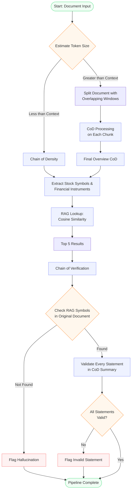

# Sentinel Extraction Pipeline

**Status:** Canonical architecture reference (as of 2026-05-16)
**Scope:** End-to-end flow from document input to persisted observation, including CoD summarization, structured extraction, RAG-based Symbol resolution, and CoVe verification.

This document is the load-bearing description of the Sentinel extraction pipeline as actually deployed in `SentinelCollector`. It supersedes the pipeline-flow material in `docs/sentinel-v2-architecture.md` (which is marked HISTORICAL for the gate/scoring sections) and complements the configuration/troubleshooting reference in `docs/SENTINEL-RLM.md`.

See also:
- `docs/plans/symbol-identification-remediation.md` — the remediation plan that drove Phases 1-3 (rich RAG, top-N, CoVe Symbol grounding) and frames Phase 6 (statement-level validation).
- `docs/SENTINEL-RLM.md` — model/backend/VRAM reference; do not change context window or model size from the values documented there.
- `docs/sentinel-product-spec-v2.md` — product-level requirements and what the LLM is and is **not** allowed to do.

## Pipeline overview

The extraction pipeline is a six-stage flow. Stages 1-5 are deployed today; Stage 6 (statement-level validation) is wired for the qualitative-extraction path but **not** for the structured-extraction path that writes `sentinel.extracted_observations`. See "Implementation status" below.

### Stage 1 — Token estimation

The normalized document is fed to the token estimator. If the document fits inside the model's context budget (currently 32K — see `SENTINEL-RLM.md`), Stage 2 runs the direct path; otherwise Stage 2 takes the split/chunk path.

### Stage 2 — Chain of Density (direct or chunked)

- **Direct path** (fits in context): a single Chain-of-Density (CoD) summarization pass produces a dense `context_summary`.
- **Chunked path** (oversize): the document is split into overlapping windows; each chunk runs its own CoD pass; the per-chunk summaries are merged into a single overview in Stage 3.

CoD is implemented under `SentinelCollector/src/Extraction/ChainOfDensity.cs` and `DensityPrompts.cs`; the document chunker lives at `SentinelCollector/src/Extraction/DocumentChunker.cs`.

### Stage 3 — Final overview CoD

For the chunked path, a final overview CoD pass produces a single coherent `context_summary` across the whole document. The direct path skips this stage (the Stage 2 summary is already the final summary).

### Stage 4 — Extract Symbols (and structured fields)

The extraction model (currently Qwen2.5-32B-Instruct-AWQ + `sentinel-cove-v6.2` LoRA — see `SENTINEL-RLM.md`) emits a structured observation: `Symbol` candidate(s), `value`, `period_end_date`, `metric_label`, `text_quote`, `extraction_confidence`, `certainty`, etc. JSON-schema-enforced decode via vLLM's `response_format` keeps the output parseable.

Service entry point: `SentinelCollector/src/Services/ExtractionService.cs` (structured path) or `QualitativeExtractionService.cs` (qualitative path).

### Stage 5a — RAG top-N retrieval

The extracted observation's `text_quote` ∪ `context_summary` is sent to SecMaster's local resolution endpoint, which runs cosine-similarity vector search over instrument embeddings (template v5: `ticker + name + description + industry + sector`) and returns the top-N candidates (default 5, cap 10) ordered by similarity descending.

Client: `ISecMasterClient.ResolveLocalFromQuoteAsync(..., topN: 5)`.
Server endpoint: `SemanticSearchEndpoints.HybridResolveLocal` in SecMaster.

### Stage 5b — CoVe Symbol grounding

`CoveSymbolVerifier.PickFirstGrounded` iterates the top-N candidates in similarity-descending order and picks the first one whose Symbol or Name **literally appears in the source** (`text_quote` ∪ `raw_content.context_summary`). The predicate is length-aware (per PR #314):

- **Symbol length ≥ 4 characters** — word-boundary regex (`\bSYMBOL\b`) against the source. Word-boundary avoids spurious matches inside larger tokens.
- **Symbol length ≤ 3 characters** — Symbol matching is disabled (too noise-prone as a substring; e.g. "F", "GE", "C" appear in unrelated prose). Falls back to Name-only matching.
- **Name** — substring match with a minimum length of 4 characters; case-insensitive.

If no candidate grounds in source:
- `Symbol`/`InstrumentId` set to `null`
- `ResolutionState = NoResolution`
- `review_notes` gets `[cove] no-symbol-grounded-in-source` appended (constant: `CoveSymbolVerifier.NoGroundingNote`)
- Row is sent to human review (never auto-approved)

Service: `SentinelCollector/src/Services/CoveSymbolVerifier.cs`, wired from `ExtractionProcessor.ApplyLocalResolutionAsync` (see `SentinelCollector/src/Workers/ExtractionProcessor.cs:461`).

### Stage 6 — Statement-level validation (planned)

After Stage 5b passes, every emitted numeric/factual field (`value`, `period_end_date`, `metric_label`, …) is checked against the source. Numerics use a small tolerance; dates and labels must appear verbatim (or in a recognised equivalent format for dates). Failed fields:

- Append `[cove] statement-ungrounded:<field>` to `review_notes`
- Force `review_status = Pending` (block AutoApprove)

This is currently wired for the qualitative-extraction path (`macro_observations` flow) in `SentinelCollector/src/Services/QualitativeVerificationService.cs:299-403`. It is **not** wired for the structured-extraction path (`extracted_observations`). Closing this gap is Phase 6 of the remediation plan — see `docs/plans/symbol-identification-remediation.md`.

## Pipeline diagram

## Implementation status

| Stage | Status | Notes |
|---|---|---|
| Token estimate + split + chunked CoD | Deployed | Qualitative-extraction model path. |
| Final overview CoD | Deployed | |
| Extract Symbols | Deployed | Extraction model emits Symbol candidates with JSON-schema-enforced decode. |
| RAG top-N | Deployed | Phase 2, PR #312. Default top-5, cap 10. Rich embeddings (v5: `ticker + name + description + industry + sector`) from Phase 1 / PR #311. |
| CoVe Symbol grounding | Deployed | Phase 3, PR #313. Predicate-tightening follow-up PR #314 (word-boundary for ≥4-char Symbols, Name-only for ≤3-char Symbols, persists `[cove] no-symbol-grounded-in-source` to `review_notes`). |
| Statement-level validation | NOT YET (Phase 6) | Wired for qualitative-extraction (`QualitativeVerificationService.cs:299-403`); not for structured-extraction (`ExtractionProcessor`). |

## AutoApprove gating policy

AutoApprove decides whether an extracted row goes straight to `Approved` (and is published to ThresholdEngine via gRPC) or sits in human-review `Pending`. The policy is the single source of truth in `SentinelCollector/src/Services/AutoApprovePolicy.cs`:

| Decision | Condition |
|---|---|
| **Approved** | `extraction_confidence ≥ 0.9` AND `resolution_state == Resolved` AND `resolution_confidence ≥ 0.8` AND `instrument_id IS NOT NULL` |
| **Rejected** | `extraction_confidence < 0.5` |
| **Pending** | otherwise (default — human reviews in the UI) |

The same gate runs in two callers: the live extraction hot path (`ExtractionProcessor`) and the operational backfill endpoint (`POST /admin/review/backfill-auto-approve`). They must agree on thresholds and condition shape — divergence would cause retroactively-processed rows to land in different buckets than live rows, defeating the point of the backfill.

**AutoApprove stays OFF (env `Extraction__AutoApproveEnabled=false`) until Phase 6 lands and post-fix quality is verified.** Phase 5 of the remediation plan covers re-engaging AutoApprove and the spot-check protocol. Until then every Phase-3-grounded row still requires a human Approve in the review UI.

## Cross-references

Code:
- `SentinelCollector/src/Workers/ExtractionProcessor.cs` — orchestrates the structured-extraction pipeline; `ApplyLocalResolutionAsync` is the wiring point for RAG top-N + CoVe Symbol grounding (and the future Phase 6 statement-level validator).
- `SentinelCollector/src/Services/CoveSymbolVerifier.cs` — Symbol grounding predicate (`PickFirstGrounded`, `NoGroundingNote`).
- `SentinelCollector/src/Services/QualitativeVerificationService.cs` (lines 299-403) — statement-level validation for the qualitative-extraction path; the template to extend for Phase 6.
- `SentinelCollector/src/Services/AutoApprovePolicy.cs` — single source of truth for the AutoApprove decision.
- `SentinelCollector/src/Extraction/ChainOfDensity.cs`, `DocumentChunker.cs` — CoD + chunking.
- `SecMaster/src/Endpoints/SemanticSearchEndpoints.cs` — `HybridResolveLocal` endpoint that returns the top-N candidate list with similarity scores.

Plans and history:
- `docs/plans/symbol-identification-remediation.md` — canonical remediation plan.
- PR #266 — LoRA revert to base `sentinel-cove-v6.2`.
- PR #310 — quarantine of 30,111 hallucinated-Symbol Approved rows.
- PR #311 — Phase 1, rich RAG embeddings (v5).
- PR #312 — Phase 2, RAG top-N candidate API.
- PR #313 — Phase 3, CoVe Symbol grounding in `ExtractionProcessor`.
- PR #314 — Phase 3 follow-up, CoVe predicate tightening + `review_notes` persistence.

Reference:
- `docs/SENTINEL-RLM.md` — model/backend/VRAM constraints.
- `docs/sentinel-product-spec-v2.md` — product spec (what Sentinel is and is not allowed to do).
- `docs/sentinel-v2-architecture.md` — HISTORICAL component-level architecture (gate/scoring sections superseded; routing/normalizer sections still informative).
