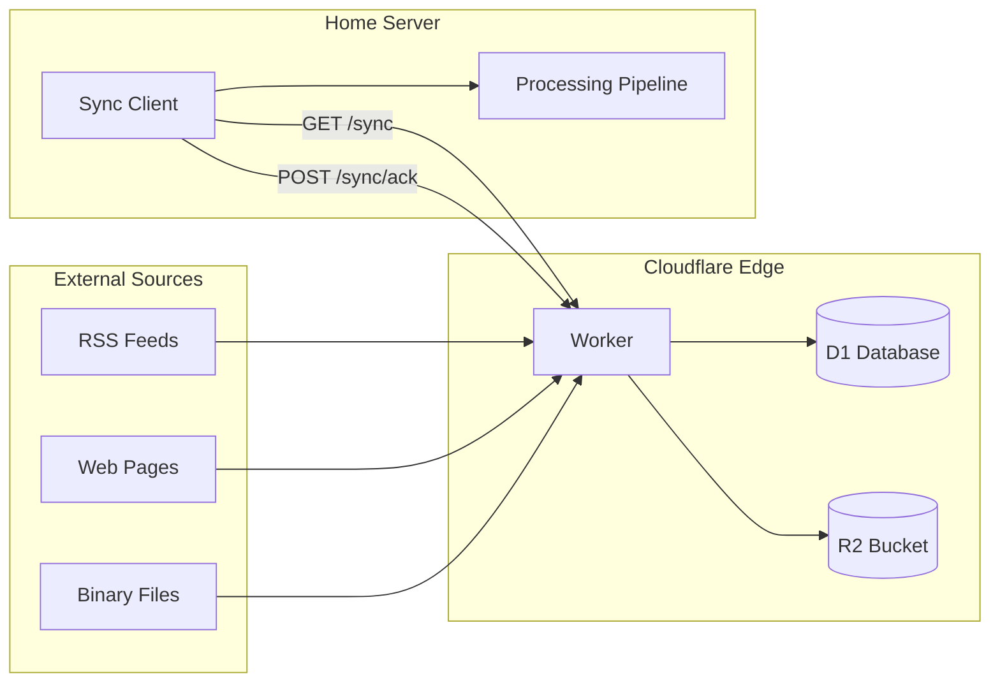

# edge - Cloudflare Workers edge infrastructure

## Overview

Edge compute infrastructure for ATLAS, running on Cloudflare Workers. These workers handle data collection from external sources that benefit from edge locality, low latency, or geo-distributed access. Content is buffered at the edge and synced back to the home server for processing.

## Architecture



## Components

| Directory | Description |
|-----------|-------------|
| `sentinel-edge/` | Alternative data collector (RSS, scraper, binary) |

### sentinel-edge

Edge worker for collecting alternative financial data from various sources. Buffers metadata to D1 and binary content to R2.

**Configured Sources:**

| Source | Type | Description |
|--------|------|-------------|
| challenger-rss | RSS | Challenger Gray layoff announcements |
| fed-press-all | RSS | Federal Reserve all press releases |
| fed-press-monetary | RSS | Federal Reserve monetary policy |
| fed-press-bcreg | RSS | Federal Reserve bank regulation |
| fed-speeches | RSS | Federal Reserve speeches |
| tsa-checkpoint | Scraper | TSA passenger volume data |

**Endpoints:**

| Endpoint | Method | Auth | Purpose |
|----------|--------|------|---------|
| `/health` | GET | No | Health check |
| `/stats` | GET | No | Collection statistics |
| `/sources` | GET | No | List configured sources |
| `/sync` | GET | API Key | Fetch unsynced content |
| `/sync/ack` | POST | API Key | Mark content as synced |
| `/collect` | POST | API Key | Manual collection trigger |

## Configuration

**wrangler.toml** - Worker configuration:

| Setting | Value |
|---------|-------|
| Runtime | Cloudflare Workers |
| Database | D1 (sentinel-edge-db) |
| Storage | R2 (sentinel-raw) |
| Cron | See schedule below |

**Cron Triggers:**

| Schedule | Source | Pattern |
|----------|--------|---------|
| Challenger | First Thu of month, 7:30 AM ET | `30 12 1-7 * 4` |
| Fed RSS | Every 6 hours | `0 */6 * * *` |
| TSA | Daily 6 AM ET | `0 11 * * *` |

**sources.json** - Data source configuration:

```json
{
  "rss": [{ "name": "source-name", "url": "...", "itemFilter": "optional regex" }],
  "scraper": [{ "name": "source-name", "url": "...", "accept": "text/html" }],
  "binary": [{ "name": "source-name", "url": "...", "contentType": "..." }]
}
```

## Deployment

### Initial Setup

```bash
cd edge/sentinel-edge

# Login to Cloudflare
wrangler login

# Create D1 database
wrangler d1 create sentinel-edge-db
# Update database_id in wrangler.toml

# Apply schema
wrangler d1 execute sentinel-edge-db --file=schema.sql

# Create R2 bucket
wrangler r2 bucket create sentinel-raw

# Set API key secret
wrangler secret put API_KEY
```

### Deploy

```bash
cd edge/sentinel-edge
wrangler deploy
```

### Development

```bash
# Using devcontainer (recommended)
# Opens VS Code, auto-starts wrangler dev on port 8787

# Manual
cd edge/sentinel-edge
npm install
npm run dev
```

### Testing

```bash
# Health check
curl http://localhost:8787/health

# Manual collection
curl -X POST http://localhost:8787/collect -H "X-API-Key: $KEY"

# Get unsynced content
curl http://localhost:8787/sync -H "X-API-Key: $KEY"

# Acknowledge sync
curl -X POST http://localhost:8787/sync/ack \
  -H "X-API-Key: $KEY" \
  -H "Content-Type: application/json" \
  -d '{"ids": ["01ABCD..."]}'
```

## See Also

- `edge/sentinel-edge/STATE.md` - Implementation status and deployment steps
- `edge/sentinel-edge/schema.sql` - D1 database schema
- `docs/` - System documentation
