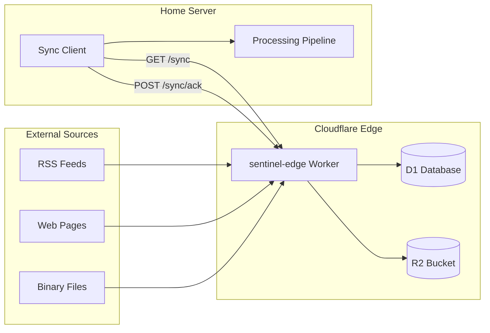

# Edge

Cloudflare Workers edge infrastructure for alternative data collection.

## Overview

Edge compute layer for ATLAS, running on Cloudflare Workers. The `sentinel-edge` worker collects alternative financial data from RSS feeds, web pages, and binary files at the edge, buffering content to D1 (metadata/text) and R2 (binary). A home-side sync client pulls unsynced content for downstream processing.

## Architecture



Content flows from external sources into the worker on cron schedules, gets deduplicated via SHA-256 hashing, and is stored in D1/R2. The home server pulls unsynced content via the sync API and acknowledges receipt.

## Features

- **RSS collection**: Parses RSS/Atom feeds, stores individual items with metadata, supports regex filtering
- **HTML scraping**: Fetches web pages and stores raw content with content-hash deduplication
- **Binary collection**: Downloads files (PDF, Office docs) to R2 with D1 metadata references
- **URL fetching**: On-demand batch URL fetching with seen-URL deduplication tracking
- **Cron scheduling**: Automated collection on configurable schedules per source type
- **Sync API**: Pull-based sync with acknowledgment for reliable home-side ingestion
- **Admin API**: CRUD management of source configurations stored in D1
- **Auto-purge**: Daily maintenance cleans synced content (>7 days) and stale seen URLs (>30 days)

## Configuration

### Environment Variables

| Variable | Description | Default |
|----------|-------------|---------|
| `API_KEY` | Secret for authenticated endpoints (set via `wrangler secret`) | Required |
| `ENVIRONMENT` | Runtime environment label | `"production"` |

### Cloudflare Bindings

| Binding | Type | Resource |
|---------|------|----------|
| `DB` | D1 Database | `sentinel-edge-db` |
| `R2` | R2 Bucket | `sentinel-raw` |

### Cron Triggers

| Schedule | Description | Cron |
|----------|-------------|------|
| Daily purge | Clean synced content and stale URLs | `0 3 * * *` |
| Challenger RSS | First Thursday of month, 7:30 AM ET | `30 12 1-7 * 4` |
| Fed RSS | Every 6 hours | `0 */6 * * *` |
| TSA scraper | Daily at 6 AM ET | `0 11 * * *` |

### Configured Sources

| Source | Type | Description |
|--------|------|-------------|
| `challenger-rss` | RSS | Challenger Gray layoff announcements (filtered) |
| `fed-press-all` | RSS | Federal Reserve all press releases |
| `fed-press-monetary` | RSS | Federal Reserve monetary policy |
| `fed-press-bcreg` | RSS | Federal Reserve bank regulation |
| `fed-speeches` | RSS | Federal Reserve speeches |
| `tsa-checkpoint` | Scraper | TSA passenger volume data |

## API Endpoints

### Public

| Endpoint | Method | Description |
|----------|--------|-------------|
| `/health` | GET | Health check with D1 connectivity and last collection time |
| `/stats` | GET | Collection statistics (total, unsynced, by source) |
| `/sources` | GET | List statically configured sources from `sources.json` |

### Authenticated (X-API-Key header)

| Endpoint | Method | Description |
|----------|--------|-------------|
| `/sync` | GET | Fetch unsynced content (query: `?limit=N`, max 500) |
| `/sync/ack` | POST | Mark content as synced (body: `{"ids": [...]}`) |
| `/collect` | POST | Manual collection trigger (body: `{"source?", "type?"}`) |
| `/fetch` | POST | Batch URL fetch and store (body: `{"urls": [...]}`, max 50) |
| `/purge` | POST | Manual purge of old synced content and seen URLs |

### Admin (X-API-Key header, `/admin/` prefix)

| Endpoint | Method | Description |
|----------|--------|-------------|
| `/admin/sources` | GET | List all D1-managed source configs |
| `/admin/sources` | POST | Create a new source config |
| `/admin/sources/:id` | GET | Get a single source config |
| `/admin/sources/:id` | PUT | Update a source config |
| `/admin/sources/:id` | DELETE | Delete a source config |
| `/admin/sources/:id/test` | POST | Test-collect from a source config |

## Project Structure

```
edge/
├── sentinel-edge/
│   ├── src/
│   │   ├── index.ts             # Worker entry point and route handler
│   │   ├── admin.ts             # Admin CRUD for source configs
│   │   ├── collectors/
│   │   │   ├── rss.ts           # RSS/Atom feed collector
│   │   │   ├── scraper.ts       # HTML page collector
│   │   │   ├── binary.ts        # Binary file collector (R2)
│   │   │   └── url-fetcher.ts   # On-demand URL batch fetcher
│   │   ├── config/
│   │   │   └── sources.json     # Static source definitions
│   │   └── lib/
│   │       ├── d1.ts            # D1 query helpers
│   │       ├── hash.ts          # SHA-256 hashing
│   │       └── ulid.ts          # ULID generation
│   ├── migrations/              # D1 schema migrations
│   ├── schema.sql               # Base D1 schema
│   ├── wrangler.toml            # Cloudflare Worker config
│   ├── tsconfig.json            # TypeScript config
│   ├── package.json             # Node dependencies
│   └── .devcontainer/           # Dev container config
└── README.md
```

## Development

### Prerequisites

- VS Code with Dev Containers extension
- Node.js 18+ (provided by devcontainer)
- Cloudflare account with Wrangler CLI access

### Getting Started

1. Open in VS Code: `code edge/sentinel-edge/`
2. Reopen in Container (Cmd/Ctrl+Shift+P -> "Dev Containers: Reopen in Container")
3. Dev server starts automatically on port 8787

### Manual Development

```bash
cd edge/sentinel-edge
npm install
npm run dev          # Start wrangler dev server
npm run typecheck    # TypeScript type checking
```

## Deployment

### Initial Setup

```bash
cd edge/sentinel-edge
wrangler login
wrangler d1 create sentinel-edge-db    # Update database_id in wrangler.toml
wrangler d1 execute sentinel-edge-db --file=schema.sql
wrangler r2 bucket create sentinel-raw
wrangler secret put API_KEY
```

### Deploy

```bash
cd edge/sentinel-edge
wrangler deploy
```

## Ports

| Port | Description |
|------|-------------|
| 8787 | Wrangler dev server (local development only) |

Production traffic is routed by Cloudflare's edge network; no host port mapping is needed.

## See Also

- [sentinel-edge/schema.sql](sentinel-edge/schema.sql) - D1 database schema
- [sentinel-edge/wrangler.toml](sentinel-edge/wrangler.toml) - Worker and cron configuration
- [docs/](../docs/) - System documentation
