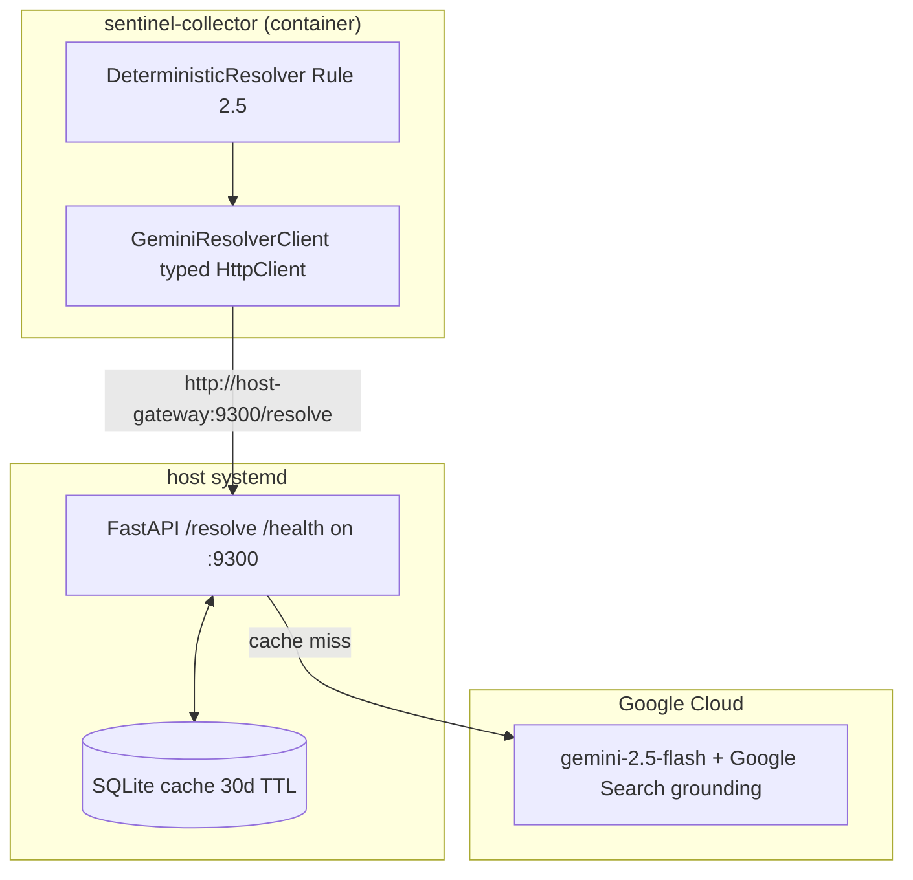

# gemini-resolver-mcp

HTTP fallback resolver for Sentinel: maps `subject_entity` -> US-listed ticker / FRED series via Gemini grounded search.

> Despite the `-mcp` suffix (kept for naming consistency with `ntfy-mcp`), the wire protocol is plain JSON over HTTP, not MCP/stdio. The consumer is a long-running C# service (`sentinel-collector`) that needs concurrent inflight requests, not a per-process child. See `gemini_resolver/server.py` module docstring.

## Overview

Phase 4.2 Gemini fallback resolver invoked by `SentinelCollector` after the deterministic + hybrid SecMaster resolvers fail to identify a `subject_entity`. Runs as a host `systemd` unit (no container) so the `sentinel-collector` container reaches it via `host-gateway:9300`. Uses `google-genai` with the Google Search grounding tool; results are SQLite-cached for 30 days to keep cost bounded under shadow-mode reprocessing.

## Architecture



`sentinel-collector` calls `POST /resolve` with `subject_entity`, `description`, `text_quote`, and `content_snippet`. On cache hit the server returns immediately at `cost_usd=0.0`; on miss it issues a grounded Gemini call, persists the result, and returns the structured payload. Strict null preference is enforced both in the prompt and at the boundary (confidence < 0.6 clears `symbol`).

## Features

- **Google Search grounding**: real-time web retrieval (gemini-2.5-flash + `GoogleSearch` tool), so newly-listed SPAC/IPO names absent from the training cutoff still resolve correctly.
- **Strict null preference**: prompt + boundary normalization both clear `symbol` when the model is uncertain (`confidence < 0.6`); better empty than wrong for downstream auto-registration.
- **SQLite result cache**: 30-day TTL keyed by `sha256(subject|description|quote[:100])`. `content_snippet` excluded from the key so per-occurrence variation doesn't defeat caching.
- **Hourly rate-limit gate**: returns HTTP 429 once `GEMINI_RATE_LIMIT_PER_HOUR` is reached in any rolling 1h window. Defensive cap against a runaway caller.
- **Cost ledger**: 24h rolling input/output token + USD totals exposed on `/health`.
- **Fail-soft Gemini errors**: any SDK exception is logged and translated to a "no resolution" payload so Sentinel's v2 path keeps running during Google outages.
- **Grounding-URL salvage**: if the JSON `source_url` is absent, the first `grounding_chunks[].web.uri` from the response is returned.

## Configuration

All configuration via environment variables (see `gemini-resolver-mcp.service` for the systemd-managed values).

| Variable | Description | Default |
|----------|-------------|---------|
| `GEMINI_API_KEY` | Gemini API key (string). If empty, falls back to `GEMINI_KEY_FILE`. | `""` |
| `GEMINI_KEY_FILE` | Path to a file containing the API key. Used when `GEMINI_API_KEY` is empty. | `/home/james/.gemini-key` |
| `GEMINI_MODEL` | Gemini model id. | `gemini-2.5-flash` |
| `GEMINI_CACHE_DB` | SQLite cache path. Parent dir is auto-created. | `/opt/ai-inference/gemini-resolver-cache.db` |
| `GEMINI_ENABLE_GROUNDING` | Enable `GoogleSearch` tool. When `false`, the client requests `response_mime_type=application/json` instead (google-genai forbids both together). | `true` |
| `GEMINI_RATE_LIMIT_PER_HOUR` | Per-hour call cap before `/resolve` returns 429. | `1000` |
| `GEMINI_RESOLVER_PORT` | Uvicorn bind port. | `9300` |
| `GEMINI_RESOLVER_HOST` | Uvicorn bind host. | `0.0.0.0` |

Either `GEMINI_API_KEY` or a readable `GEMINI_KEY_FILE` is **required**; startup fails otherwise.

## HTTP API (port 9300)

| Endpoint | Method | Description |
|----------|--------|-------------|
| `/resolve` | POST | Resolve a `subject_entity` to a US-listed instrument. Returns `ResolveResponse` (see below). 429 on rate-limit. |
| `/health` | GET | Liveness + 24h call/cost stats. Returns 200 even when Gemini is degraded (`status="degraded"`). |
| `/` | GET | Service banner: `{service, version, endpoints}`. |

### POST `/resolve` request

```json
{
  "subject_entity": "Dynatrace",
  "description": "Dynatrace observability platform",
  "text_quote": "Dynatrace announced new features...",
  "content_snippet": "Dynatrace Inc. continues to grow..."
}
```

`subject_entity` is optional; the prompt explicitly instructs the model to infer from `description`/`text_quote`/`content_snippet` when empty. `description` is required (`min_length=1`). `text_quote` is truncated to 500 chars and `content_snippet` to 1500 chars before prompting.

### POST `/resolve` response

```json
{
  "symbol": "DT",
  "exchange": "NYSE",
  "asset_class": "equity",
  "instrument_type": "common_stock",
  "confidence": 0.92,
  "source_url": "https://...",
  "rationale": "one sentence explaining the choice",
  "cached": false,
  "cost_usd": 0.000054
}
```

- `asset_class` ∈ `{equity, etf, fred_series, treasury, fx, commodity, crypto}` (or `null`).
- `exchange` ∈ `{NYSE, NASDAQ, AMEX, OTC, FRED}` (or `null`).
- `symbol` is uppercased; literal strings `"null"`, `"none"`, `"n/a"`, `"unknown"` are normalized to `null`.
- `confidence` clamped to `[0.0, 1.0]`; `symbol` is forced to `null` when `confidence < 0.6`.
- `cost_usd` is `0.0` on cache hit; otherwise `input_tokens * $0.075/1M + output_tokens * $0.30/1M`.

### GET `/health` response

```json
{
  "status": "ok",
  "gemini_reachable": true,
  "cache_hit_rate_24h": 0.7321,
  "total_calls_24h": 412,
  "total_cost_usd_24h": 0.022144
}
```

`status` is `"degraded"` when the on-demand `models.list()` reachability probe fails; the endpoint still returns 200 so the systemd liveness check stays accurate during partial Google outages.

## Project structure

```
gemini-resolver-mcp/
├── gemini_resolver/
│   ├── __main__.py          # python -m gemini_resolver entrypoint
│   ├── server.py            # FastAPI app, config, rolling stats
│   ├── gemini_client.py     # google-genai wrapper + prompt + JSON extractor
│   └── cache.py             # SQLite (sqlitedict) result cache, 30d TTL
├── tests/
│   └── test_smoke.py        # live-Gemini smoke tests (skip with SKIP_NETWORK=1)
├── gemini-resolver-mcp.service  # systemd unit
└── pyproject.toml
```

## Install

```bash
cd /home/james/ATLAS/gemini-resolver-mcp
python3 -m venv .venv
source .venv/bin/activate
pip install -e .
```

For tests:

```bash
pip install -e '.[test]'
```

## Run (development)

```bash
source .venv/bin/activate
GEMINI_API_KEY=... python -m gemini_resolver
```

## Deployment (host systemd)

The unit file `gemini-resolver-mcp.service` runs the venv directly under user `james` with `ProtectSystem=strict` + `ReadWritePaths=/opt/ai-inference`. There is no container build and no ansible role for this service — it lives on the host so the in-container `sentinel-collector` can reach it via `host-gateway`. The `extra_hosts: ["host-gateway:host-gateway"]` entry on the `sentinel-collector` service in `/opt/ai-inference/compose.yaml` is what wires the two together.

```bash
sudo cp /home/james/ATLAS/gemini-resolver-mcp/gemini-resolver-mcp.service /etc/systemd/system/
sudo systemctl daemon-reload
sudo systemctl enable --now gemini-resolver-mcp
sudo systemctl status gemini-resolver-mcp
```

Smoke test once running:

```bash
curl -s http://localhost:9300/health | jq
curl -s -X POST http://localhost:9300/resolve \
  -H 'content-type: application/json' \
  -d '{"subject_entity":"Microsoft","description":"Microsoft Corporation"}' | jq
```

## Tests

```bash
source .venv/bin/activate
pytest tests/ -v
# skip live Gemini calls:
SKIP_NETWORK=1 pytest tests/ -v
```

The smoke suite hits live Gemini and asserts known-good resolutions (`DT`, `BSX`, a FRED discount-rate id) plus a per-call cost ceiling of `$0.01`.

## Ports

| Port | Description |
|------|-------------|
| 9300 | FastAPI `/resolve` + `/health` (host-bound; reached from containers via `host-gateway:9300`) |

## See also

- [SentinelCollector/src/Services/GeminiResolverClient.cs](../SentinelCollector/src/Services/GeminiResolverClient.cs) - typed HttpClient consumer
- [SentinelCollector/src/Services/DeterministicResolver.cs](../SentinelCollector/src/Services/DeterministicResolver.cs) - Rule 2.5 invocation site
- [ntfy-mcp/README.md](../ntfy-mcp/README.md) - sibling host-resident Python sidecar
