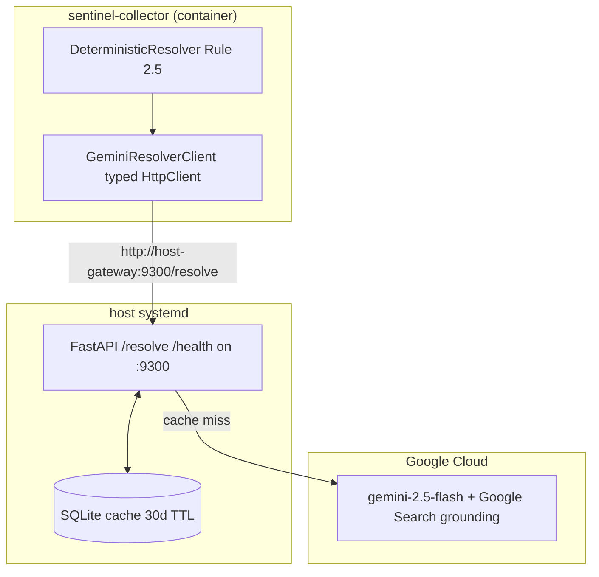

# gemini-resolver-mcp

HTTP fallback resolver for Sentinel: maps `subject_entity` -> US-listed ticker / FRED series via Gemini grounded search.

> Despite the `-mcp` suffix (kept for naming consistency with `ntfy-mcp`), the wire protocol is plain JSON over HTTP, not MCP/stdio. The consumer is a long-running C# service (`sentinel-collector`) that needs concurrent inflight requests, not a per-process child. See `gemini_resolver/server.py` module docstring.

## Overview

Phase 4.2 Gemini fallback resolver invoked by `SentinelCollector` after the deterministic + hybrid SecMaster resolvers fail to identify a `subject_entity`. Runs as a host `systemd` unit (no container) so the `sentinel-collector` container reaches it via `host-gateway:9300`. Uses `google-genai` with the Google Search grounding tool; results are SQLite-cached for 30 days to keep cost bounded under shadow-mode reprocessing.

## Architecture


```mermaid
flowchart TD
    subgraph SentinelCollector["sentinel-collector (container)"]
        DR[DeterministicResolver Rule 2.5]
        GRC[GeminiResolverClient typed HttpClient]
    end

    subgraph Host["host systemd"]
        SVR[FastAPI /resolve /health on :9300]
        CACHE[(SQLite cache 30d TTL)]
    end

    subgraph Google["Google Cloud"]
        GEM[gemini-2.5-flash + Google Search grounding]
    end

    DR --> GRC -->|http://host-gateway:9300/resolve| SVR
    SVR <--> CACHE
    SVR -->|cache miss| GEM
```

`sentinel-collector` calls `POST /resolve` with `subject_entity`, `description`, `text_quote`, and `content_snippet`. On cache hit the server returns immediately at `cost_usd=0.0`; on miss it issues a grounded Gemini call, persists the result, and returns the structured payload. Strict null preference is enforced both in the prompt and at the boundary (confidence < 0.6 clears `symbol`).

## Features

- **Google Search grounding**: real-time web retrieval (gemini-2.5-flash + `GoogleSearch` tool), so newly-listed SPAC/IPO names absent from the training cutoff still resolve correctly.
- **Strict null preference**: prompt + boundary normalization both clear `symbol` when the model is uncertain (`confidence < 0.6`); better empty than wrong for downstream auto-registration.
- **SQLite result cache**: 30-day TTL keyed by the `subject_entity` **plus the description's semantic residue** — the tokens `description` adds beyond the subject, minus **quantities** (a numeral carrying a currency glyph, a percent, or a scale word) and legal-form scaffolding. An abbreviated scale suffix counts as part of the numeral when it is *attached* to a currency amount, so `"$8bn"` keys with `"$8 billion"`; it is never stripped as a standalone token, because `bn`/`m`/`k`/`tn` are identity elsewhere in the catalog (`M & T BANK CORP`, `K Top REITS Co Ltd`, `… in Montgomery County, TN`). A *bare* numeral is kept: it is usually a tenor, and tenors are identity. A leading **sign** is kept too — see *A sign is not punctuation* below. The subject is the identity of the question, but it is not sufficient alone: `SentinelCollector` sends `description` specifically so Gemini can separate an ambiguous surface (`"Coinbase"` the exchange vs the FRED series of the same name), so keying on the subject alone would serve one article's equity answer to another article's macro question for 30 days — at `cached:true`/`cost_usd 0`, i.e. **unbilled and invisible to every burn alert**. Folding in the *raw* description is the opposite failure: it re-billed one entity per mention. The two callers drift differently — SecMaster sends `proposedName ?? surface`, a fuzzy catalog **name** that lands differently run to run (`"Samsung"` as `SAMSUNG C&T CORP` and as `SAMSUNG ELECTRONICS CO LTD`), while the money drift (`"David Ellison"` billed 3x in 70s under `"$8 billion"`/`"$7 million"`/`"$80 billion"`) comes off the **Sentinel** path, where the description is a numeric block's raw span; SecMaster's own gate refuses a `$`-leading surface outright. `text_quote` and `content_snippet` are excluded entirely (per-article on the SecMaster path, per-mention on both Sentinel pipelines). A subjectless request keys on `description|quote[:100]` under a separate namespace, since without a subject those *are* the identity; both variable parts are length-prefixed so caller text containing the separator cannot forge a boundary.

  **The residue is not free**, and the earlier "22 keys, identical to subject-only" reading was an artifact of a 24-request sample holding one duplicate group. Measured over the **30-day journal** (9,598 logged subject/description pairs, 6,803 distinct):

  | key | distinct keys | vs subject-only |
  |---|---|---|
  | subject only (collides different instruments) | 4,447 | — |
  | **subject + residue (current)** | **5,453** | **+22.6%** |
  | subject + raw description (the re-bill bug) | 6,735 | +51.5% |

  304 subjects keep more than one key, most on junk residue a cache cannot tell from intent (`'a barrel'`, `'days'`, `'monday'`; `"Donald Trump"` arrives under 89 descriptions and holds 36 keys). That +22.6% is the deliberate price of not colliding: under D-1, an extra paid call is the cheaper error than a wrong instrument served free for a month.

  **Read +22.6% as an estimate over a failure-only sample, not a bound.** Three log statements carry a subject and **none of them is a success**: two `WARNING`s in `gemini_client.py` ("call failed", "response not parseable") and one `INFO` in `server.py:336`, the pre-call gate rejection added in #823. Re-measured 2026-08-06 over the 30-day journal (136,247 lines): 9,533 lines carry a subject — 9,440 `WARNING` (9,011 unparseable + 429 failed) and 93 `INFO` gate rejections (57 of them on a real, non-`None` subject). The gate lines are non-successes as well, and **0 of the 93 carry a `desc=`**, so they cannot enter the subject/description pair sample from either direction; that sample is exactly the 9,440 `WARNING`s.
  **No line records the *subject* of a success.** 39,015 lines do record a successful `generateContent` POST — but that is httpx logging a URL and a status code, and the subject never appears in one. A cache hit logs nothing at all: `record_cache_hit` (`server.py:319`) only appends to an in-memory ledger, so **0** of the 136,247 lines mention one. That gap is the argument: of the 39,015 calls that returned HTTP 200, 9,011 came back unparseable, leaving **~30,004 that answered cleanly and left no subject anywhere** — corroborated independently by the cache, which holds **29,946 entries written inside the same window**. So the pair sample is ~9.4k of the ~39.4k requests that reached Gemini, and the ~30k it structurally cannot contain are precisely the ones that get cached and re-billed, which is what the ratio is being used to predict.
  **What is quantified, and what is not.** Exactly one bias is measured, and it pushes the figure **up**: the journal truncates `description` to 60 chars, capping 424 of the 9,438 keyed pairs (4.5%; 9,438 of the 9,440 carry a non-empty subject and so key through the residue at all — the other two route to the `subjectless:` namespace). Over all 9,438 the ratio is **+22.6%** — the table's ratio, reproduced on this window, with only the absolute counts drifting — and over the 9,014 untruncated pairs it is **+23.6%**, a gap of **0.96pp**. Pulling the other way, and **not** quantified: unparseable responses concentrate on long, ambiguous non-company surfaces that fan out across far more descriptions than a clean company name does (the subjects holding the most keys are `'donald trump'`, `'india stocks'`, `'munis'` — not issuers), and the successes' subjects cannot be recovered from the cache to size that effect, because the keys are SHA-256. One thing that *looks* like a bias is not one: repeat mentions cannot inflate the ratio, because it is computed over **distinct** keys — deduplicating the 9,438 pairs to their 6,729 distinct forms leaves +22.6% unchanged.
  So the earlier "at most +22.6%" is **withdrawn**: the only correction anyone has measured raises the figure, the countervailing effects are structurally real but unsized, and the net direction is therefore not established. The decision does not rest on the exact number — the residue is bought to prevent a wrong instrument served free for 30 days, and even the untruncated +23.6% is less than half the raw-description key's cost.

  **Tenors are not quantities.** Stripping *every* digit-bearing token collapses **317 catalog name families** (734 names in `atlas_secmaster.instruments`, 19,445 distinct) onto one residue each — `"1-Year Expected Inflation"` and `"10-Year Expected Inflation"` both reduce to `expected inflation year`, 30 `EXPINF` series to a single key — and since SecMaster's description *is* a catalog name, the 10-year answer would serve the 1-year question for the full TTL. The quantity-only rule cuts those 317 families to 7, of which 5 are case-variant spellings of the same instrument.

  **A sign is not punctuation.** `-3X` is the leveraged *inverse* of `3X`, so dropping the sign is a **direction inversion**, not a near-miss — the resulting signal looks healthy and points exactly the wrong way. Both `BETAPRO -3X NSDQ-100 DLB ALT` and `BETAPRO 3X NSDQ-100 DLB ALT` are live catalog names and SecMaster's fuzzy top-hit drifts between them, so the inverse would have been served the long's ticker at `cached:true`/`cost_usd 0` for 30 days. `_tokens` therefore keeps a leading `+`/`-` before a numeral. It is kept **only at a token boundary**, so a hyphen joining two runs stays a separator (`NSDQ-100` → `nsdq`,`100`; `1-Year` → `1`,`year`) and tenors are untouched. Re-measured over `atlas_secmaster.instruments` (19,433 distinct names): distinct residues **18,769 → 18,770**, one key across the whole catalog (+0.005%), exactly one family separated and nothing merged.

  One genuine residual remains, known and accepted: `Lloyds … 9.25% Non Cum. Irrd. Pfd.` vs the `9.75%` issue. A coupon is identity, but percent-marked numerals are treated as quantities because percentage drift in prose is a common re-bill driver; keeping them would cost **+40.3% instead of +22.6%** to close one two-name family. That cost is scoped to the *percent* case alone — it was never the price of the sign, which was near-free.
- **Output budget sized for reasoning**: `max_output_tokens=2048`. gemini-2.5-flash bills reasoning tokens on the same response as the answer, so a small ceiling cuts the JSON mid-object rather than saving money — see [Output truncation](#output-truncation).
- **Hourly rate-limit gate**: returns HTTP 429 once `GEMINI_RATE_LIMIT_PER_HOUR` is reached in any rolling 1h window. Defensive cap against a runaway caller.
- **Cost ledger**: 24h rolling input/output token + USD totals exposed on `/health`.
- **Fail-soft Gemini errors**: any SDK exception is logged and translated to a "no resolution" payload so Sentinel's v2 path keeps running during Google outages.
- **Grounding-URL salvage**: if the JSON `source_url` is absent, the first `grounding_chunks[].web.uri` from the response is returned.

## Configuration

All configuration via environment variables (see `gemini-resolver-mcp.service` for the systemd-managed values).

| Variable | Description | Default |
|----------|-------------|---------|
| `GEMINI_API_KEY` | Gemini API key (string). If empty, falls back to `GEMINI_KEY_FILE`. | `""` |
| `GEMINI_KEY_FILE` | Path to a file containing the API key. Used when `GEMINI_API_KEY` is empty. | `/home/james/.gemini-key` |
| `GEMINI_MODEL` | Gemini model id. | `gemini-2.5-flash` |
| `GEMINI_CACHE_DB` | SQLite cache path. Parent dir is auto-created. | `/opt/ai-inference/gemini-resolver-cache.db` |
| `GEMINI_ENABLE_GROUNDING` | Enable `GoogleSearch` tool. When `false`, the client requests `response_mime_type=application/json` instead (google-genai forbids both together). | `true` |
| `GEMINI_RATE_LIMIT_PER_HOUR` | Per-hour call cap before `/resolve` returns 429. | `1000` |
| `GEMINI_RESOLVER_PORT` | Uvicorn bind port. | `9300` |
| `GEMINI_RESOLVER_HOST` | Uvicorn bind host. | `0.0.0.0` |

Either `GEMINI_API_KEY` or a readable `GEMINI_KEY_FILE` is **required**; startup fails otherwise.

## HTTP API (port 9300)

| Endpoint | Method | Description |
|----------|--------|-------------|
| `/resolve` | POST | Resolve a `subject_entity` to a US-listed instrument. Returns `ResolveResponse` (see below). 429 on rate-limit. |
| `/health` | GET | Liveness + 24h call/cost stats. Returns 200 even when Gemini is degraded (`status="degraded"`). |
| `/` | GET | Service banner: `{service, version, endpoints}`. |

### POST `/resolve` request

```json
{
  "subject_entity": "Dynatrace",
  "description": "Dynatrace observability platform",
  "text_quote": "Dynatrace announced new features...",
  "content_snippet": "Dynatrace Inc. continues to grow..."
}
```

`subject_entity` is optional; the prompt explicitly instructs the model to infer from `description`/`text_quote`/`content_snippet` when empty. `description` is required (`min_length=1`). `text_quote` is truncated to 500 chars and `content_snippet` to 1500 chars before prompting.

### POST `/resolve` response

```json
{
  "symbol": "DT",
  "exchange": "NYSE",
  "asset_class": "equity",
  "instrument_type": "common_stock",
  "confidence": 0.92,
  "source_url": "https://...",
  "rationale": "one sentence explaining the choice",
  "cached": false,
  "cost_usd": 0.000374
}
```

- `asset_class` ∈ `{equity, etf, fred_series, treasury, fx, commodity, crypto}` (or `null`).
- `exchange` ∈ `{NYSE, NASDAQ, AMEX, OTC, FRED}` (or `null`).
- `symbol` is uppercased; literal strings `"null"`, `"none"`, `"n/a"`, `"unknown"` are normalized to `null`.
- `confidence` clamped to `[0.0, 1.0]`; `symbol` is forced to `null` when `confidence < 0.6`.
- `cost_usd` is `0.0` on cache hit; otherwise `input_tokens * $0.075/1M + output_tokens * $0.30/1M`, where `input_tokens = prompt_token_count + tool_use_prompt_token_count` and `output_tokens = candidates_token_count + thoughts_token_count`. All four are billed — counting only prompt+candidates under-reported the bill 4.2x ($0.000089 against the true $0.000374 mean per call, measured over the 24-input replay).

> **`cost_usd` is not alerted on.** It aggregates into `gemini_resolver_total_cost_usd_24h`, which currently has **zero consumers** — no alert rule, no recording rule, no dashboard panel. Every shipped burn guard is *call-count* denominated (`GeminiResolverApproachingFreeGroundingCap`, `GeminiResolverBillableCallRateHigh`, and the fail-closed `DAILY_CALL_CAP`), which is the correct primary bound because grounding is billed per prompt with the first 1,500/day free. Correcting the token accounting therefore re-based no threshold. The open gap: **token spend itself has no alert**, so a drain that stays under the call cap while burning tokens (a prompt-size or reasoning-budget regression) would not page. Deliberately not filled in this PR — the accurate figure above is the precondition for filling it.

### Output truncation

`GEMINI_ENABLE_GROUNDING=true` means the response **cannot** be schema-constrained: the API rejects `response_mime_type`/`response_schema` alongside a tool with `400 INVALID_ARGUMENT — "Tool use with a response mime type: 'application/json' is unsupported"`. The only producer constraint available is the token ceiling, so it has to be sized for reasoning **plus** answer.

Measured 2026-08-05 by replaying the 24 real inputs that had failed in production:

| `max_output_tokens` | truncated (`finish_reason=MAX_TOKENS`) | cost per usable result |
|---|---|---|
| 512 (old) | 24 / 24 | — (nothing usable) |
| 1024 | 2 / 24 | $0.000371 |
| 2048 (current) | 0 / 24 | $0.000374 |

A larger ceiling only bills when tokens are actually generated, whereas a truncated call still bills every reasoning token and discards the answer. Do not lower this to "bound cost".

A truncation that does slip through is cached for **1 hour** (`TRUNCATION_CACHE_TTL_SECONDS`) so it cannot re-bill, while staying far below the 30-day result TTL — it is a config artifact, not a resolution. Transient failures (transport errors, malformed bodies) remain **uncacheable**; caching those is the 2026-06-24 poisoning bug guarded by `tests/test_cache_guard.py`.

### GET `/health` response

```json
{
  "status": "ok",
  "gemini_reachable": true,
  "cache_hit_rate_24h": 0.7321,
  "total_calls_24h": 412,
  "total_cost_usd_24h": 0.022144
}
```

`status` is `"degraded"` when the on-demand `models.list()` reachability probe fails; the endpoint still returns 200 so the systemd liveness check stays accurate during partial Google outages.

## Project structure

```
gemini-resolver-mcp/
├── gemini_resolver/
│   ├── __main__.py          # python -m gemini_resolver entrypoint
│   ├── server.py            # FastAPI app, config, rolling stats
│   ├── gemini_client.py     # google-genai wrapper + prompt + JSON extractor
│   └── cache.py             # SQLite (sqlitedict) result cache, 30d TTL
├── tests/
│   ├── test_smoke.py        # live-Gemini smoke tests (skip with SKIP_NETWORK=1)
│   ├── test_cache_guard.py  # transient failures must never be cached (2026-06-24)
│   ├── test_budget_guard.py # fail-closed daily call cap
│   ├── test_metrics.py      # /metrics and /health cannot desync
│   └── test_billing_waste.py # one subject = one paid call; no re-bill after abandon/truncate
├── gemini-resolver-mcp.service  # systemd unit
└── pyproject.toml
```

## Install

```bash
cd /home/james/ATLAS/gemini-resolver-mcp
python3 -m venv .venv
source .venv/bin/activate
pip install -e .
```

For tests:

```bash
pip install -e '.[test]'
```

## Run (development)

```bash
source .venv/bin/activate
GEMINI_API_KEY=... python -m gemini_resolver
```

## Deployment (host systemd)

The unit file `gemini-resolver-mcp.service` runs the venv directly under user `james` with `ProtectSystem=strict` + `ReadWritePaths=/opt/ai-inference`. There is no container build and no ansible role for this service — it lives on the host so the in-container `sentinel-collector` can reach it via `host-gateway`. The `extra_hosts: ["host-gateway:host-gateway"]` entry on the `sentinel-collector` service in `/opt/ai-inference/compose.yaml` is what wires the two together.

```bash
sudo cp /home/james/ATLAS/gemini-resolver-mcp/gemini-resolver-mcp.service /etc/systemd/system/
sudo systemctl daemon-reload
sudo systemctl enable --now gemini-resolver-mcp
sudo systemctl status gemini-resolver-mcp
```

Smoke test once running:

```bash
curl -s http://localhost:9300/health | jq
curl -s -X POST http://localhost:9300/resolve \
  -H 'content-type: application/json' \
  -d '{"subject_entity":"Microsoft","description":"Microsoft Corporation"}' | jq
```

## Tests

```bash
source .venv/bin/activate
pytest tests/ -v
# skip live Gemini calls:
SKIP_NETWORK=1 pytest tests/ -v
```

The smoke suite hits live Gemini and asserts known-good resolutions (`DT`, `BSX`, a FRED discount-rate id) plus a per-call cost ceiling of `$0.01`.

## Ports

| Port | Description |
|------|-------------|
| 9300 | FastAPI `/resolve` + `/health` (host-bound; reached from containers via `host-gateway:9300`) |

## See also

- [SentinelCollector/src/Services/GeminiResolverClient.cs](../SentinelCollector/src/Services/GeminiResolverClient.cs) - typed HttpClient consumer
- [SentinelCollector/src/Services/DeterministicResolver.cs](../SentinelCollector/src/Services/DeterministicResolver.cs) - Rule 2.5 invocation site
- [ntfy-mcp/README.md](../ntfy-mcp/README.md) - sibling host-resident Python sidecar
