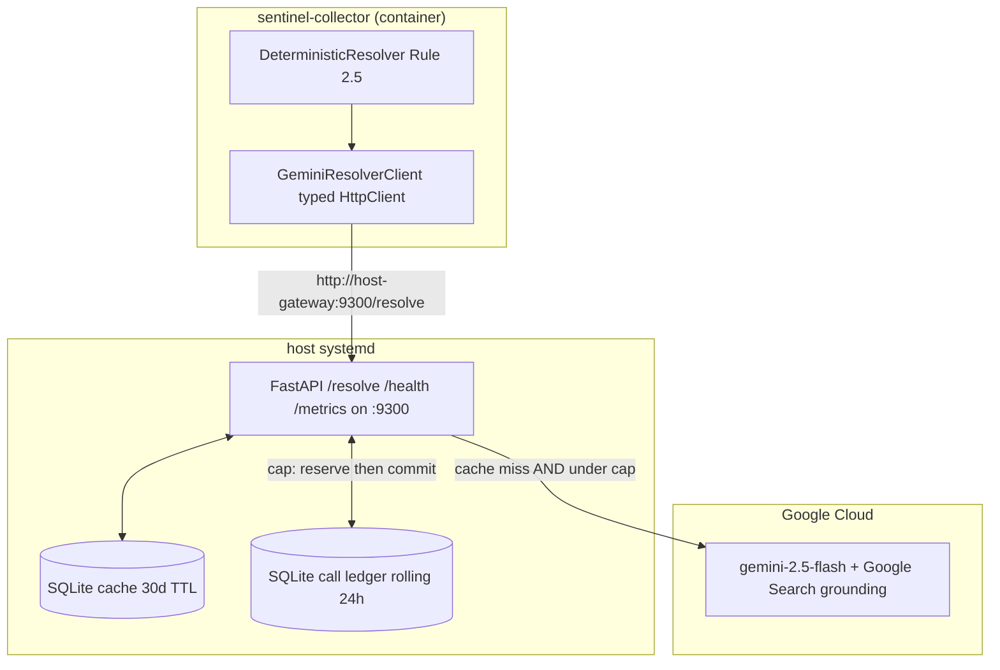

# gemini-resolver-mcp

HTTP fallback resolver for Sentinel: maps `subject_entity` -> US-listed ticker / FRED series via Gemini grounded search.

> Despite the `-mcp` suffix (kept for naming consistency with `ntfy-mcp`), the wire protocol is plain JSON over HTTP, not MCP/stdio. The consumer is a long-running C# service (`sentinel-collector`) that needs concurrent inflight requests, not a per-process child. See `gemini_resolver/server.py` module docstring.

## Overview

Phase 4.2 Gemini fallback resolver invoked by `SentinelCollector` after the deterministic + hybrid SecMaster resolvers fail to identify a `subject_entity`. Runs as a host `systemd` unit (no container) so the `sentinel-collector` container reaches it via `host-gateway:9300`. Uses `google-genai` with the Google Search grounding tool; results are SQLite-cached for 30 days to keep cost bounded under shadow-mode reprocessing.

## Architecture


```mermaid
flowchart TD
    subgraph SentinelCollector["sentinel-collector (container)"]
        DR[DeterministicResolver Rule 2.5]
        GRC[GeminiResolverClient typed HttpClient]
    end

    subgraph Host["host systemd"]
        SVR[FastAPI /resolve /health /metrics on :9300]
        CACHE[(SQLite cache 30d TTL)]
        LEDGER[(SQLite call ledger rolling 24h)]
    end

    subgraph Google["Google Cloud"]
        GEM[gemini-2.5-flash + Google Search grounding]
    end

    DR --> GRC -->|http://host-gateway:9300/resolve| SVR
    SVR <--> CACHE
    SVR <-->|cap: reserve then commit| LEDGER
    SVR -->|cache miss AND under cap| GEM
```

`sentinel-collector` calls `POST /resolve` with `subject_entity`, `description`, `text_quote`, and `content_snippet`. On cache hit the server returns immediately at `cost_usd=0.0`; on miss it issues a grounded Gemini call, persists the result, and returns the structured payload. Strict null preference is enforced both in the prompt and at the boundary (confidence < 0.6 clears `symbol`).

## Features

- **Google Search grounding**: real-time web retrieval (gemini-2.5-flash + `GoogleSearch` tool), so newly-listed SPAC/IPO names absent from the training cutoff still resolve correctly.
- **Strict null preference**: prompt + boundary normalization both clear `symbol` when the model is uncertain (`confidence < 0.6`); better empty than wrong for downstream auto-registration.
- **SQLite result cache**: 30-day TTL keyed by the `subject_entity` **plus the description's semantic residue** — the tokens `description` adds beyond the subject, minus **quantities** (a numeral carrying a currency glyph, a percent, or a scale word) and legal-form scaffolding. An abbreviated scale suffix counts as part of the numeral when it is *attached* to a currency amount, so `"$8bn"` keys with `"$8 billion"`; it is never stripped as a standalone token, because `bn`/`m`/`k`/`tn` are identity elsewhere in the catalog (`M & T BANK CORP`, `K Top REITS Co Ltd`, `… in Montgomery County, TN`). A *bare* numeral is kept: it is usually a tenor, and tenors are identity. A leading **sign** is kept too — see *A sign is not punctuation* below. The subject is the identity of the question, but it is not sufficient alone: `SentinelCollector` sends `description` specifically so Gemini can separate an ambiguous surface (`"Coinbase"` the exchange vs the FRED series of the same name), so keying on the subject alone would serve one article's equity answer to another article's macro question for 30 days — at `cached:true`/`cost_usd 0`, i.e. **unbilled and invisible to every burn alert**. Folding in the *raw* description is the opposite failure: it re-billed one entity per mention. The two callers drift differently — SecMaster sends `proposedName ?? surface`, a fuzzy catalog **name** that lands differently run to run (`"Samsung"` as `SAMSUNG C&T CORP` and as `SAMSUNG ELECTRONICS CO LTD`), while the money drift (`"David Ellison"` billed 3x in 70s under `"$8 billion"`/`"$7 million"`/`"$80 billion"`) comes off the **Sentinel** path, where the description is a numeric block's raw span; SecMaster's own gate refuses a `$`-leading surface outright. `text_quote` and `content_snippet` are excluded entirely (per-article on the SecMaster path, per-mention on both Sentinel pipelines). A subjectless request keys on `description|quote[:100]` under a separate namespace, since without a subject those *are* the identity; both variable parts are length-prefixed so caller text containing the separator cannot forge a boundary.

  **The residue is not free**, and the earlier "22 keys, identical to subject-only" reading was an artifact of a 24-request sample holding one duplicate group. Measured over the **30-day journal** (9,598 logged subject/description pairs, 6,803 distinct):

  | key | distinct keys | vs subject-only |
  |---|---|---|
  | subject only (collides different instruments) | 4,447 | — |
  | **subject + residue (current)** | **5,453** | **+22.6%** |
  | subject + raw description (the re-bill bug) | 6,735 | +51.5% |

  304 subjects keep more than one key, most on junk residue a cache cannot tell from intent (`'a barrel'`, `'days'`, `'monday'`; `"Donald Trump"` arrives under 89 descriptions and holds 36 keys). That +22.6% is the deliberate price of not colliding: under `AGENT_README.md` D-4, an extra paid call is the cheaper error than a wrong instrument served free for a month.

  **Read +22.6% as an estimate over a failure-only sample, not a bound.** Three log statements carry a subject and **none of them is a success**: two `WARNING`s in `gemini_client.py` ("call failed", "response not parseable") and one `INFO` in `server.py:936`, the pre-call gate rejection added in #823. Re-measured 2026-08-06 over the 30-day journal (136,247 lines): 9,533 lines carry a subject — 9,440 `WARNING` (9,011 unparseable + 429 failed) and 93 `INFO` gate rejections (57 of them on a real, non-`None` subject). The gate lines are non-successes as well, and **0 of the 93 carry a `desc=`**, so they cannot enter the subject/description pair sample from either direction; that sample is exactly the 9,440 `WARNING`s.
  **No line records the *subject* of a success.** 39,015 lines do record a successful `generateContent` POST — but that is httpx logging a URL and a status code, and the subject never appears in one. A cache hit logs nothing at all: `record_cache_hit` (`server.py:706`) only appends to an in-memory ledger, so **0** of the 136,247 lines mention one. That gap is the argument: of the 39,015 calls that returned HTTP 200, 9,011 came back unparseable, leaving **~30,004 that answered cleanly and left no subject anywhere** — corroborated independently by the cache, which holds **29,946 entries written inside the same window**. So the pair sample is ~9.4k of the ~39.4k requests that reached Gemini, and the ~30k it structurally cannot contain are precisely the ones that get cached and re-billed, which is what the ratio is being used to predict.
  **What is quantified, and what is not.** Exactly one bias is measured, and it pushes the figure **up**: the journal truncates `description` to 60 chars, capping 424 of the 9,438 keyed pairs (4.5%; 9,438 of the 9,440 carry a non-empty subject and so key through the residue at all — the other two route to the `subjectless:` namespace). Over all 9,438 the ratio is **+22.6%** — the table's ratio, reproduced on this window, with only the absolute counts drifting — and over the 9,014 untruncated pairs it is **+23.6%**, a gap of **0.96pp**. Pulling the other way, and **not** quantified: unparseable responses concentrate on long, ambiguous non-company surfaces that fan out across far more descriptions than a clean company name does (the subjects holding the most keys are `'donald trump'`, `'india stocks'`, `'munis'` — not issuers), and the successes' subjects cannot be recovered from the cache to size that effect, because the keys are SHA-256. One thing that *looks* like a bias is not one: repeat mentions cannot inflate the ratio, because it is computed over **distinct** keys — deduplicating the 9,438 pairs to their 6,729 distinct forms leaves +22.6% unchanged.
  So the earlier "at most +22.6%" is **withdrawn**: the only correction anyone has measured raises the figure, the countervailing effects are structurally real but unsized, and the net direction is therefore not established. The decision does not rest on the exact number — the residue is bought to prevent a wrong instrument served free for 30 days, and even the untruncated +23.6% is less than half the raw-description key's cost.

  **Tenors are not quantities.** Stripping *every* digit-bearing token collapses **317 catalog name families** (734 names in `atlas_secmaster.instruments`, 19,445 distinct) onto one residue each — `"1-Year Expected Inflation"` and `"10-Year Expected Inflation"` both reduce to `expected inflation year`, 30 `EXPINF` series to a single key — and since SecMaster's description *is* a catalog name, the 10-year answer would serve the 1-year question for the full TTL. The quantity-only rule cuts those 317 families to 7, of which 5 are case-variant spellings of the same instrument.

  **A sign is not punctuation.** `-3X` is the leveraged *inverse* of `3X`, so dropping the sign is a **direction inversion**, not a near-miss — the resulting signal looks healthy and points exactly the wrong way. Both `BETAPRO -3X NSDQ-100 DLB ALT` and `BETAPRO 3X NSDQ-100 DLB ALT` are live catalog names and SecMaster's fuzzy top-hit drifts between them, so the inverse would have been served the long's ticker at `cached:true`/`cost_usd 0` for 30 days. `_tokens` therefore keeps a leading `+`/`-` before a numeral. It is kept **only at a token boundary**, so a hyphen joining two runs stays a separator (`NSDQ-100` → `nsdq`,`100`; `1-Year` → `1`,`year`) and tenors are untouched. Re-measured over `atlas_secmaster.instruments` (19,433 distinct names): distinct residues **18,769 → 18,770**, one key across the whole catalog (+0.005%), exactly one family separated and nothing merged.

  One genuine residual remains, known and accepted: `Lloyds … 9.25% Non Cum. Irrd. Pfd.` vs the `9.75%` issue. A coupon is identity, but percent-marked numerals are treated as quantities because percentage drift in prose is a common re-bill driver; keeping them would cost **+40.3% instead of +22.6%** to close one two-name family. That cost is scoped to the *percent* case alone — it was never the price of the sign, which was near-free.
- **Output budget sized for reasoning**: `max_output_tokens=2048`. gemini-2.5-flash bills reasoning tokens on the same response as the answer, so a small ceiling cuts the JSON mid-object rather than saving money — see [Output truncation](#output-truncation).
- **Hourly rate-limit gate**: returns HTTP 429 once `GEMINI_RATE_LIMIT_PER_HOUR` is reached in any rolling 1h window. Defensive cap against a runaway caller. Its **behaviour changed** on 2026-08-06 even though the constant did not: it counts the window `CallStats` reconstructs from the durable ledger, so a restart no longer clears the hour and the backstop now sees calls a restart used to hide. Strictly tighter, which is the intended direction for a flood guard, and benign in practice — 0 firings in the 30 days to 2026-08-06, against a 1,000/hour limit under a 1,500/day cap.
- **Cost ledger**: 24h rolling input/output token + USD totals exposed on `/health`. The ledger is **durable** and the daily cap survives a restart — see [Durable call ledger](#durable-call-ledger).
- **Fail-soft Gemini errors**: any SDK exception is logged and translated to a "no resolution" payload so Sentinel's v2 path keeps running during Google outages.
- **Grounding-URL salvage**: if the JSON `source_url` is absent, the first `grounding_chunks[].web.uri` from the response is returned.

## Configuration

All configuration via environment variables (see `gemini-resolver-mcp.service` for the systemd-managed values).

| Variable | Description | Default |
|----------|-------------|---------|
| `GEMINI_API_KEY` | Gemini API key (string). If empty, falls back to `GEMINI_KEY_FILE`. | `""` |
| `GEMINI_KEY_FILE` | Path to a file containing the API key. Used when `GEMINI_API_KEY` is empty. | `/home/james/.gemini-key` |
| `GEMINI_MODEL` | Gemini model id. | `gemini-2.5-flash` |
| `GEMINI_CACHE_DB` | SQLite cache path. Parent dir is auto-created. | `/opt/ai-inference/gemini-resolver-cache.db` |
| `GEMINI_LEDGER_DB` | SQLite path for the durable rolling-24h call ledger behind the daily cap. **Deleting or repointing this resets the cap** — see [Durable call ledger](#durable-call-ledger). | `/opt/ai-inference/gemini-resolver-ledger.db` |
| `GEMINI_ENABLE_GROUNDING` | Enable `GoogleSearch` tool. When `false`, the client requests `response_mime_type=application/json` instead (google-genai forbids both together). | `true` |
| `GEMINI_RATE_LIMIT_PER_HOUR` | Per-hour call cap before `/resolve` returns 429. Counted over the durable ledger, so it no longer resets with the process. | `1000` |
| `GEMINI_LEDGER_REFUSAL_LOG_INTERVAL` | Seconds between the fail-closed refusal's per-request `ERROR` lines. The failure-site `ERROR` that names the cause is never throttled. | `3600` |
| `GEMINI_LEDGER_REARM_BACKOFF` | Seconds before a **transient** ledger fault (`SQLITE_BUSY`/`SQLITE_LOCKED`) is retried. Structural damage never re-arms. | `30` |
| `GEMINI_RESOLVER_PORT` | Uvicorn bind port. | `9300` |
| `GEMINI_RESOLVER_HOST` | Uvicorn bind host. | `0.0.0.0` |

Either `GEMINI_API_KEY` or a readable `GEMINI_KEY_FILE` is **required**; startup fails otherwise.

## HTTP API (port 9300)

| Endpoint | Method | Description |
|----------|--------|-------------|
| `/resolve` | POST | Resolve a `subject_entity` to a US-listed instrument. Returns `ResolveResponse` (see below). 429 on rate-limit. |
| `/health` | GET | Liveness + 24h call/cost stats. Returns 200 even when Gemini is degraded (`status="degraded"`). |
| `/` | GET | Service banner: `{service, version, endpoints}`. |

### POST `/resolve` request

```json
{
  "subject_entity": "Dynatrace",
  "description": "Dynatrace observability platform",
  "text_quote": "Dynatrace announced new features...",
  "content_snippet": "Dynatrace Inc. continues to grow..."
}
```

`subject_entity` is optional; the prompt explicitly instructs the model to infer from `description`/`text_quote`/`content_snippet` when empty. `description` is required (`min_length=1`). `text_quote` is truncated to 500 chars and `content_snippet` to 1500 chars before prompting.

### POST `/resolve` response

```json
{
  "symbol": "DT",
  "exchange": "NYSE",
  "asset_class": "equity",
  "instrument_type": "common_stock",
  "confidence": 0.92,
  "source_url": "https://...",
  "rationale": "one sentence explaining the choice",
  "cached": false,
  "cost_usd": 0.000374
}
```

- `asset_class` ∈ `{equity, etf, fred_series, treasury, fx, commodity, crypto}` (or `null`).
- `exchange` ∈ `{NYSE, NASDAQ, AMEX, OTC, FRED}` (or `null`).
- `symbol` is uppercased; literal strings `"null"`, `"none"`, `"n/a"`, `"unknown"` are normalized to `null`.
- `confidence` clamped to `[0.0, 1.0]`; `symbol` is forced to `null` when `confidence < 0.6`.
- `cost_usd` is `0.0` on cache hit; otherwise `input_tokens * $0.075/1M + output_tokens * $0.30/1M`, where `input_tokens = prompt_token_count + tool_use_prompt_token_count` and `output_tokens = candidates_token_count + thoughts_token_count`. All four are billed — counting only prompt+candidates under-reported the bill 4.2x ($0.000089 against the true $0.000374 mean per call, measured over the 24-input replay).

> **`cost_usd` is not alerted on.** It aggregates into `gemini_resolver_total_cost_usd_24h`, which currently has **zero consumers** — no alert rule, no recording rule, no dashboard panel. Every shipped burn guard is *call-count* denominated (`GeminiResolverApproachingFreeGroundingCap`, `GeminiResolverBillableCallRateHigh`, and the fail-closed `DAILY_CALL_CAP`), which is the correct primary bound because grounding is billed per prompt with the first 1,500/day free. Correcting the token accounting therefore re-based no threshold. The open gap: **token spend itself has no alert**, so a drain that stays under the call cap while burning tokens (a prompt-size or reasoning-budget regression) would not page. Deliberately not filled in this PR — the accurate figure above is the precondition for filling it.

### Output truncation

`GEMINI_ENABLE_GROUNDING=true` means the response **cannot** be schema-constrained: the API rejects `response_mime_type`/`response_schema` alongside a tool with `400 INVALID_ARGUMENT — "Tool use with a response mime type: 'application/json' is unsupported"`. The only producer constraint available is the token ceiling, so it has to be sized for reasoning **plus** answer.

Measured 2026-08-05 by replaying the 24 real inputs that had failed in production:

| `max_output_tokens` | truncated (`finish_reason=MAX_TOKENS`) | cost per usable result |
|---|---|---|
| 512 (old) | 24 / 24 | — (nothing usable) |
| 1024 | 2 / 24 | $0.000371 |
| 2048 (current) | 0 / 24 | $0.000374 |

A larger ceiling only bills when tokens are actually generated, whereas a truncated call still bills every reasoning token and discards the answer. Do not lower this to "bound cost".

A truncation that does slip through is cached for **1 hour** (`TRUNCATION_CACHE_TTL_SECONDS`) so it cannot re-bill, while staying far below the 30-day result TTL — it is a config artifact, not a resolution. Transient failures (transport errors, malformed bodies) remain **uncacheable**; caching those is the 2026-06-24 poisoning bug guarded by `tests/test_cache_guard.py`.

### GET `/health` response

```json
{
  "status": "ok",
  "gemini_reachable": true,
  "resolving": true,
  "live_calls_1h": 18,
  "live_calls_24h": 305,
  "gated_24h": 96,
  "cache_hit_rate_24h": 0.7321,
  "total_calls_24h": 412,
  "total_cost_usd_24h": 0.022144,
  "ledger_available": true,
  "breaker_open": false
}
```

`status` is `"degraded"` when the on-demand `models.list()` reachability probe fails, when the resolver is up but not resolving, when `ledger_available` is `false`, or when `breaker_open` is `true`; the endpoint still returns 200 so the systemd liveness check stays accurate during partial Google outages.

**`resolving` is the health field, not `gemini_reachable`.** `models.list()` answers 200 straight through a credit outage in which every `generateContent` is refused, so reachability is not resolution. `resolving` has **two legs** and neither sees the other's outage:

- **billing** — at least `GEMINI_HEALTH_MIN_LIVE_1H` (5) live calls in the trailing hour, *all* billing $0. That catches calls Google **accepts** and answers nothing for: a broken model, an empty grounded response, a usage/pricing regression. It is volume-gated, so idle traffic never trips it.
- **breaker** — sustained dispatch **rejection**. A refused call releases its cap slot (see below), so it never enters the window at all; during a pure-429 credit outage `live_calls_1h` is 0 and the billing leg alone reads "idle, not broken". `breaker_open` says which leg tripped.

**The dispatch breaker.** After `GEMINI_BREAKER_REJECTIONS` (5) **consecutive** rejections — 429 quota/credit, 401/403 auth — the resolver stops dispatching and answers 429 locally, admitting exactly one probe call per `GEMINI_BREAKER_COOLING_SECONDS` (300s) until one is accepted. Consecutive rather than a ratio, so a topped-up account resumes at full rate immediately instead of waiting out a window. Only a call Google **accepted** closes it: a 504, a 503 or a read timeout says nothing about the account either way and leaves both the streak and the open state untouched. It exists because releasing a rejected call's cap slot removed the accidental throttle a depleted account used to get from its own failures filling the cap — without it, every eligible request would dispatch and fail for as long as credits stayed dead.

## Durable call ledger

The fail-closed `DAILY_CALL_CAP` (1,500/day = the free-grounding boundary) counts live calls over a **rolling 24h window**. That count lives in `GEMINI_LEDGER_DB`, so it survives the process.

It did not always. Until 2026-08-06 the ledger was a plain in-memory deque, which made **every restart a cap reset**. Measured over 30 days of `journalctl -u gemini-resolver-mcp` (live-call proxy: the `httpx` `generateContent` line, the only per-call success trace the journal carries — so these figures *under*-count, because a transport failure is committed to the ledger and logs no POST):

| | |
|---|---|
| restarts that erased a ledger at 1500/1500 | 3 of 12 (Jul 28 06:43, Jul 30 20:25, Jul 31 14:44) |
| gap to the next paid call after those | 4s, 2m51s, 2m03s |
| peak rolling-24h live-call count | **2,999** against a 1,500 cap |
| calls dispatched while already over cap | **6,801** |

It is still happening on the deployed build, and you can watch it from two numbers that disagree. At `2026-08-06T15:47:44Z` the running (pre-ledger) resolver reported `gemini_resolver_live_calls_24h = 1500.0` — exactly the cap — while the journal counted **1,925** live dispatches over the true rolling 24h. The gauge is not wrong so much as blind: the process started at `2026-08-05T20:00:06Z`, so its in-memory window **structurally cannot contain** the 425 live calls made in the 4.2h of the window that precede its own start. Those 425 are the restart handing the cap back, in real time, and the durable ledger is what makes the two numbers agree.

**Its own file, not a table in the result cache.** Purging that cache is a real recovery step — #772 purged 138,194 of 141,420 poisoned entries — and the natural form of it is deleting the file; a cache purge must not hand the spend cap back. Fail-closed also means an unreadable ledger refuses *every* live call, so sharing a file would escalate cache corruption from "cache misses" to "no paid resolution at all". And the two want different durability settings: the cache is a 73MB `journal_mode=delete` store, the ledger a small append-and-prune path on `WAL` + `synchronous=FULL` (a lost commit *under*-counts spend, which is the direction that leaks).

> **Purge the cache by its exact name, never by glob.** The two stores are separate files in one directory and they share a prefix:
>
> | store | path |
> |---|---|
> | result cache | `/opt/ai-inference/gemini-resolver-cache.db` |
> | call ledger | `/opt/ai-inference/gemini-resolver-ledger.db` (+ `-wal`, `-shm`) |
>
> So `rm /opt/ai-inference/gemini-resolver-*` — or any `gemini-resolver-*.db` glob — takes the ledger with the cache and re-couples exactly what the separate-file design keeps apart, handing back the full 1,500-call cap as a side effect of a cache purge. Delete `gemini-resolver-cache.db` by name. Losing the ledger this way trips `GeminiResolverLedgerReset`, which is the backstop, not the plan.

**Wall-clock steps up to a whole window do not shrink it.** The prune horizon is referenced to `min(ts, last_event_ts)` and trails the window by `PRUNE_RETENTION_WINDOWS`, because `time.time()` is not monotonic: a forward NTP correction or a suspend/resume would otherwise delete rows still inside the 24h window, irrecoverably and silently — `lifetime_live_calls` is untouched so `GeminiResolverLedgerReset` stays quiet, the surviving rows still look coherent to the consistency check, and `ledger_available` stays 1. Pruning is only storage reclamation; `load(cutoff)` is what enforces the window the cap reads, so over-retaining is free where over-deleting leaks cap.

> **The bound is 24h, not infinity.** The clamp stops the step itself, and the retention margin covers the writes after it, once the stepped clock has become the new normal and the clamp has nothing older to clamp to. A row is both counted by `load()` and reachable by the prune only once the forward step exceeds `24h` — a whole window — so that is where the protection ends and cap starts being deleted. Backward steps over-count, which is the safe direction. Stated here and at `ledger.py` `append()`, which is the other place a reader meets the horizon arithmetic.

**Fail CLOSED when the ledger cannot account for spend.** Unreadable, unwritable, or internally inconsistent (meta records an event inside the window but the event rows are gone — a hand-run `DELETE`, a truncating restore, an eviction bug) all mean 24h spend is **unknown**, and unknown is not zero: the resolver sits at the cap routinely — 48,771 cap-reached journal lines in the 30 days to `2026-08-06T15:47:44Z` (48,585 for the 30 days to `2026-08-06T00:00Z`; the figure moves with the window origin, so read it as "tens of thousands"). Live calls are refused with 429; the result cache keeps serving, because a cache hit consumes no quota.

> This is the **opposite** of the fail-*open* chosen for the instrument-validator cascade, and the asymmetry is deliberate. There, failing open risks dropping a real resolution — recoverable, retryable, no external cost. Here, failing open risks unbounded spend at $0.035 per grounded prompt past the free boundary, against a boundary that has already drained a $100 prepay once (2026-06-30). Different loss functions; do not carry either default across to the other.

The refusal is never silent: an **unthrottled** `ERROR` at the failure site naming the cause, a **throttled** `ERROR` (at most one an hour, carrying the count it stands for) saying refusals are still happening, `gemini_resolver_ledger_available` → 0, and `/health` reporting `ledger_available: false` with `status: degraded`. The asymmetry is deliberate: the failure-site line fires once and diagnoses, while the per-request line covers a state that persists and sits *after* the cache and gate, so it inherits the resolver's whole post-cache volume — **3,328 requests over the rolling 24h to `2026-08-06T15:47:44Z`** (1,925 live dispatches + 1,403 cap-refusals in the unit journal), i.e. ~2 identical `ERROR`/min indefinitely if left unthrottled. Quote the window with the number: the same instant measured over the *UTC day* gives 1,034 + 1,403 = 2,437 for a partial day still climbing, and mixing the two is what produced the earlier "2,779/day". Re-measured the same way over the rolling 24h to `2026-08-11T02:50Z`: 1,448 + 1,496 = **2,944** (~2/min) — a snapshot, like the first, and the same shape. Note the live half is pinned near the 1,500 cap whenever the resolver is saturated, so it is not the request rate on its own. That is the flood SecMaster's own resolver client was fixed for (4,073 WARNs/24h → ~96 per four-day outage); burying the diagnosing line under it is the actual harm. It answers **429, not 503**, because it is our own fail-closed refusal like the cap itself — SecMaster buckets it as `cap_exhausted`, keeping it out of the transport-error denominator it would otherwise dilute and rate-limiting it to one caller-side warning per hour.

**A transient lock clears itself; damage does not.** `LedgerUnavailable` carries a `transient` flag classified on `sqlite_errorcode` (`SQLITE_BUSY`/`SQLITE_LOCKED`), and only contention re-arms — after `GEMINI_LEDGER_REARM_BACKOFF` (30s), re-opening and flushing every live call the outage stranded. Without it a five-second lock (an operator holding a write lock while working through the `GeminiResolverLedgerReset` runbook is enough) refused *all* paid resolution until the unit was restarted — and the trap there is that the restart **is** the cap reset, so a momentary lock forced a choice between an indefinite outage and a deliberate bypass of the guard. Structural faults (corruption, permissions, a full disk) never re-arm: retrying against them spins without clearing, and a store that re-armed onto damage would be fail-*open* wearing a retry loop. The flag defaults to structural, so a new failure path cannot become retryable by omission.

> **What the re-arm may trust depends on whether the window was ever built.** Mid-life it is the cap's authority: `_load` filled it at startup and it has counted every call since, *including* the ones whose writes failed, so re-reading disk there would drop those and under-count. When the **startup** load is what faulted it is not an authority at all — `_load` returned before populating anything, and re-arming onto that empty deque would grant a full 1,500 fresh slots against a disk that may already hold 1,500 live calls, which is the restart bypass this module exists to remove arriving through its own recovery path. So a never-loaded window is rebuilt from disk before the re-arm completes, and a mid-life one is not; `_loaded` is the only thing that separates them.
>
> **The re-arm is not a background timer.** It runs only inside `/resolve`, past the cache and the gate; `/metrics` and `/health` read a reporting-only property and never re-arm. During a real traffic gap — 3.97 days with no request reaching the ledger gate, in the 30 days to `2026-08-06T15:47:44Z` — a transient lock therefore stays refused for the length of the quiet, which is why `GeminiResolverLedgerUnavailable`'s "the fault is structural" reading is qualified on traffic.

**Two alert rules** guard it (`deployment/artifacts/monitoring/alerts/gemini-resolver.yml`):

- `GeminiResolverLedgerReset` — `resets(gemini_resolver_ledger_live_calls_total[1h]) > 0`. That counter is *cumulative over the lifetime of the ledger file*, deliberately not another 24h gauge: a rolling window decays to zero legitimately, so no drop in `gemini_resolver_live_calls_24h` can separate "the oldest calls aged out" from "the ledger was wiped". A total that only ever climbs can.
- `GeminiResolverLedgerUnavailable` — `gemini_resolver_ledger_available == 0` for 5m. Nothing else can see the fail-closed state: with no live calls landing, `gemini_resolver_resolving` stays 1 and reads as idle.

Both directions of both rules are pinned by promtool in `deployment/tests/alerts/gemini-resolver_test.yml`.

**Rejection is a third condition**, guarded separately. `GeminiResolverDispatchRejectionSustained` fires on `sum(increase(gemini_resolver_dispatch_rejected_total[30m])) >= 10`, and it exists for the rate the breaker structurally cannot see: the breaker needs five *consecutive* rejections, so a rate diluted by successes (80% refused, 20% served) never opens it, the interleaved successes bill so the billing leg stays satisfied, and `resolving` sits at 1 through a resolver failing four calls in five. Both callers are blind too — a rejection comes back as HTTP 200 with `symbol: null`, which SecMaster records as a success. Note that the **burn alerts get quieter** in this state, not louder: a refused call releases its cap slot, so `live_calls_1h`/`24h` fall as it worsens.

## Project structure

```
gemini-resolver-mcp/
├── gemini_resolver/
│   ├── __main__.py          # python -m gemini_resolver entrypoint
│   ├── server.py            # FastAPI app, config, rolling stats
│   ├── gemini_client.py     # google-genai wrapper + prompt + JSON extractor
│   ├── cache.py             # SQLite (sqlitedict) result cache, 30d TTL
│   └── ledger.py            # SQLite durable rolling-24h call ledger behind the daily cap
├── tests/
│   ├── conftest.py          # off the production cache/ledger files, and off the paid API
│   ├── test_smoke.py        # live-Gemini smoke tests (opt-in: GEMINI_LIVE_TESTS=1)
│   ├── test_network_isolation.py # proves a plain `pytest` makes zero outbound calls
│   ├── test_cache_guard.py  # transient failures must never be cached (2026-06-24)
│   ├── test_budget_guard.py # fail-closed daily call cap
│   ├── test_cap_persistence.py # the cap survives a restart and a clock step; fail-closed on an
│   │                           # unaccountable ledger, re-arming only on transient contention
│   ├── test_metrics.py      # /metrics and /health cannot desync
│   └── test_billing_waste.py # one subject = one paid call; no re-bill after abandon/truncate
├── gemini-resolver-mcp.service  # systemd unit
└── pyproject.toml
```

## Install

```bash
cd /home/james/ATLAS/gemini-resolver-mcp
python3 -m venv .venv
source .venv/bin/activate
pip install -e .
```

For tests:

```bash
pip install -e '.[test]'
```

## Run (development)

```bash
source .venv/bin/activate
GEMINI_API_KEY=... python -m gemini_resolver
```

## Deployment (host systemd)

The unit file `gemini-resolver-mcp.service` runs the venv directly under user `james` with `ProtectSystem=strict` + `ReadWritePaths=/opt/ai-inference`. There is no container build and no ansible role for this service — it lives on the host so the in-container `sentinel-collector` can reach it via `host-gateway`. The `extra_hosts: ["host-gateway:host-gateway"]` entry on the `sentinel-collector` service in `/opt/ai-inference/compose.yaml` is what wires the two together.

```bash
sudo cp /home/james/ATLAS/gemini-resolver-mcp/gemini-resolver-mcp.service /etc/systemd/system/
sudo systemctl daemon-reload
sudo systemctl enable --now gemini-resolver-mcp
sudo systemctl status gemini-resolver-mcp
```

Smoke test once running:

```bash
curl -s http://localhost:9300/health | jq
curl -s -X POST http://localhost:9300/resolve \
  -H 'content-type: application/json' \
  -d '{"subject_entity":"Microsoft","description":"Microsoft Corporation"}' | jq
```

## Tests

```bash
source .venv/bin/activate
pytest tests/ -v                          # hermetic: zero outbound calls, smoke tests skipped
GEMINI_LIVE_TESTS=1 pytest tests/ -v      # opt in to the live smoke suite — THIS SPENDS
```

HERMETIC BY DEFAULT, and enforced rather than promised. `conftest.py` blocks DNS and connect for
anything off loopback, records every refusal, and fails the run if the ledger is non-empty at the
end — necessary because `gemini_client.resolve` catches `Exception` and returns a fail-soft $0
result, so a blocked call raises nothing a test would notice. The gate used to be `SKIP_NETWORK=1`,
an opt-OUT, so a plain `pytest` billed five live grounded calls against the 1,500/day shared quota.

The smoke suite hits live Gemini and asserts known-good resolutions (`DT`, `BSX`, a FRED discount-rate id) plus a per-call cost ceiling of `$0.01`.

## Ports

| Port | Description |
|------|-------------|
| 9300 | FastAPI `/resolve` + `/health` (host-bound; reached from containers via `host-gateway:9300`) |

## See also

- [SentinelCollector/src/Services/GeminiResolverClient.cs](../SentinelCollector/src/Services/GeminiResolverClient.cs) - typed HttpClient consumer
- [SentinelCollector/src/Services/DeterministicResolver.cs](../SentinelCollector/src/Services/DeterministicResolver.cs) - Rule 2.5 invocation site
- [ntfy-mcp/README.md](../ntfy-mcp/README.md) - sibling host-resident Python sidecar
