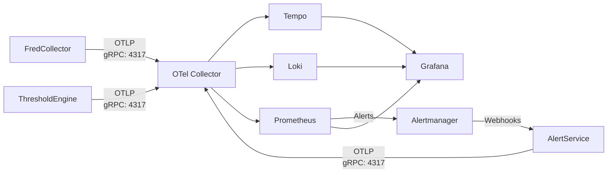

# ATLAS Infrastructure

Infrastructure-as-code definitions for the ATLAS AI inference platform. This directory contains the **WHAT** (service definitions, configs), while `../ansible/` contains the **HOW** (deployment automation).

## Directory Purpose

- **This directory (infrastructure/)**: Docker Compose definitions, monitoring configs, dashboard code
- **../ansible/**: Ansible playbooks that deploy this infrastructure to servers

## Architecture

- **Hardware**: AMD Threadripper 9960X, RTX 5090 (32GB), 128GB RAM
- **Storage**: 
  - NVMe Fast Pool: 1.8TB (striped mirrors) - models, active data
  - SATA Bulk Pool: 5.2TB (RAIDZ1) - archives, logs
- **Container Runtime**: nerdctl + containerd (Docker-compatible, Apache 2.0 licensed)

## Services

### AI Inference
- **ollama-gpu** (port 11434): GPU-accelerated inference for large models
- **ollama-cpu** (port 11435): CPU inference for smaller models
- **dashboard-api** (port 8080): REST API for Claude MCP integration

### Data & Analytics
- **timescaledb** (port 5432): PostgreSQL + TimescaleDB for time-series financial data (FRED Collector)
- **fred-collector** (ports 5002, 5004): FRED API data collection service
- **fred-api** (port 5001): REST API for accessing collected economic data
- **threshold-engine** (port 5003): Pattern evaluation and regime detection engine
- **alert-service** (port 8081): Alert webhook receiver and notification dispatcher

### Observability Stack (OpenTelemetry)
- **otel-collector** (ports 4317, 4318, 8889): OpenTelemetry Collector - receives traces/metrics/logs via OTLP, routes to backends
- **tempo** (port 3200): Grafana Tempo - distributed tracing backend
- **loki** (port 3101): Grafana Loki - log aggregation with trace correlation
- **prometheus** (port 9090): Metrics storage and querying
- **alertmanager** (port 9093): Prometheus Alertmanager - alert routing and grouping
- **grafana** (port 3000): Unified dashboards - traces, metrics, logs with correlation

**Observability Flow**:


**Key Features**:
- **Trace-log correlation**: Click trace_id in Grafana → see all logs for that request
- **Automatic instrumentation**: ASP.NET Core, HttpClient, Entity Framework Core
- **Custom business metrics**: FRED API duration, rate limiter capacity, observation count
- **Unified dashboards**: View traces, metrics, logs together in Grafana

**Documentation**: See `FredCollector/docs/OBSERVABILITY.md` for complete architecture guide

## Deployment

### Primary Method: Ansible (Idempotent, Automated)

Deploy the entire ATLAS infrastructure stack:

```bash
cd ~/ATLAS/ansible
ansible-playbook playbooks/site.yml
```

**What this does:**
- Creates deployment directories in `/opt/ai-inference/`
- Deploys `compose.yaml` to `/opt/ai-inference/`
- Builds C# MCP server container image
- Deploys and enables `atlas.service` for auto-start on boot
- Starts/restarts the infrastructure stack

**When to use:**
- Initial setup
- Updating infrastructure after git pull
- Rebuilding MCP server after code changes
- Ensuring configuration matches repository

### Manual Operations

**Check status:**
```bash
# Service status
sudo systemctl status atlas.service

# Container status
cd /opt/ai-inference
sudo nerdctl compose ps
sudo nerdctl compose logs -f
```

**Manual compose operations (if needed):**
```bash
cd /opt/ai-inference
sudo nerdctl compose up -d
sudo nerdctl compose down
sudo nerdctl compose restart <service>
```

### Pull a model:
```bash
# Small model for testing (3B parameters)
sudo nerdctl exec -it ollama-gpu ollama pull llama3.2:3b

# Larger models for production
sudo nerdctl exec -it ollama-gpu ollama pull llama3.1:70b
sudo nerdctl exec -it ollama-gpu ollama pull qwen2.5:32b
```

### Test inference:
```bash
curl http://localhost:11434/api/generate -d '{
  "model": "llama3.2:3b",
  "prompt": "Explain compound interest briefly.",
  "stream": false
}'
```

### Test Dashboard API:
```bash
curl http://localhost:8080/health
curl http://localhost:8080/ollama/gpu/models
```

## Monitoring

- **Grafana**: http://localhost:3000 (admin/admin)
- **Prometheus**: http://localhost:9090
- **GPU Metrics**: http://localhost:9835/metrics

## Management Commands

### Systemd Service Management:
```bash
# Check service status
sudo systemctl status atlas.service

# Start/stop/restart all services
sudo systemctl start atlas.service
sudo systemctl stop atlas.service
sudo systemctl restart atlas.service

# View service logs
sudo journalctl -u atlas.service -f

# Disable auto-start
sudo systemctl disable atlas.service
```

### Container Management:
```bash
# Stop all services
sudo nerdctl compose down

# Restart a service
sudo nerdctl compose restart ollama-gpu

# View logs for specific service
sudo nerdctl compose logs -f ollama-gpu

# Execute command in container
sudo nerdctl exec -it ollama-gpu bash
```

### Storage Management:
```bash
# Check ZFS pool status
sudo zpool status

# Check compression ratio
sudo zfs get compressratio nvme-fast/models

# Create snapshot
sudo zfs snapshot nvme-fast/models@backup-$(date +%Y%m%d)

# List snapshots
sudo zfs list -t snapshot

# Rollback to snapshot
sudo zfs rollback nvme-fast/models@backup-20251102
```

### GPU Monitoring:
```bash
# Real-time GPU usage
watch -n 1 nvidia-smi

# Check GPU temperature and power
nvidia-smi --query-gpu=temperature.gpu,power.draw --format=csv
```

## Database Access

### TimescaleDB:
```bash
# Connect to database
sudo nerdctl exec -it timescaledb psql -U ai_inference -d financial_news

# Backup database
sudo nerdctl exec timescaledb pg_dump -U ai_inference financial_news > backup.sql

# Restore database
cat backup.sql | sudo nerdctl exec -i timescaledb psql -U ai_inference financial_news
```

## Troubleshooting

### Container won't start:
```bash
sudo nerdctl compose logs <service-name>
sudo nerdctl compose restart <service-name>
```

### GPU not accessible:
```bash
# Check GPU is visible
nvidia-smi

# Test GPU in container
sudo nerdctl run --rm --gpus all nvidia/cuda:12.3.0-base-ubuntu22.04 nvidia-smi
```

### Storage issues:
```bash
# Check pool health
sudo zpool status -v

# Check dataset usage
sudo zfs list

# Scrub pool (integrity check)
sudo zpool scrub nvme-fast
sudo zpool scrub sata-bulk
```

## Configuration Files

- `compose.yaml.j2`: Ansible template (source of truth) - uses variables from `ansible/group_vars/`
- `compose.yaml`: Generated during deployment (do not edit directly)
- `monitoring/prometheus.yml`: Prometheus scrape configs
- `dashboard/app.py`: Dashboard API application
- `dashboard/Dockerfile`: Dashboard container build

### Compose Template Variables

`compose.yaml.j2` uses Ansible variables: `atlas_db_user`, `atlas_db_name`, `atlas_db_password`, `postgres_password`, `api_key`, `deployment_base`. See `ansible/VAULT.md` for password management.

## Security Notes

**IMPORTANT**: Change default passwords before production use:
- TimescaleDB password in compose.yaml
- Grafana admin password (or set via environment variable)

## Deployment Architecture

### Source of Truth

**Repository:** `~/ATLAS/infrastructure/` contains the canonical infrastructure definitions
**Deployment Target:** `/opt/ai-inference/` on the server

### Deployed Structure

```
/opt/ai-inference/
├── compose.yaml          # Deployed from ~/ATLAS/infrastructure/compose.yaml
├── atlas.service         # Systemd unit file for auto-start
├── models/               # Ollama model storage (ZFS: nvme-fast/models)
├── logs/                 # Application logs
├── timeseries/           # TimescaleDB data (ZFS: nvme-fast/timeseries)
└── dashboard/            # Dashboard data
```

### Deployment Workflow

1. **Edit** files in `~/ATLAS/infrastructure/` or `~/ATLAS/OllamaMCP/`
2. **Commit** to git
3. **Deploy** with ansible: `cd ~/ATLAS/ansible && ansible-playbook playbooks/site.yml`
4. Ansible copies files from repo → `/opt/ai-inference/` and restarts services

## Next Steps

1. Set up automated ZFS snapshots
2. Configure Grafana dashboards
3. Set up model management and versioning
4. Configure backup strategy
