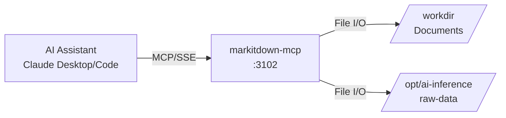

# markitdownMCP

MCP server providing document-to-markdown conversion for ATLAS AI workflows.

## Overview

Wraps Microsoft's [markitdown](https://github.com/microsoft/markitdown) Python library as an MCP server, enabling AI assistants to convert PDFs, Office documents, and other file formats to markdown. Uses the official `mcp/markitdown` container image with SSE transport.

## Architecture



## Features

- **Document Conversion**: PDF, Word (.docx/.doc), Excel (.xlsx/.xls), PowerPoint (.pptx/.ppt)
- **Web Content**: HTML pages via URL fetch
- **OCR Support**: Image text extraction
- **Audio Transcription**: Speech-to-text conversion
- **Plain Text**: CSV, TXT file processing

## Configuration

| Variable | Description | Default |
|----------|-------------|---------|
| `MCP_HOST` | Bind address | `0.0.0.0` |
| `MCP_PORT` | SSE server port | `3102` |

### Volume Mounts

| Container Path | Host Path | Mode | Purpose |
|----------------|-----------|------|---------|
| `/workdir` | `/opt/ai-inference/documents` | ro | Document storage |
| `/opt/ai-inference/raw-data` | `/opt/ai-inference/raw-data` | ro | Sentinel raw data |

## API (MCP Tools)

| Tool | Description | Parameters |
|------|-------------|------------|
| `convert_to_markdown` | Convert document to markdown | `uri`: file:, http:, https:, or data: URI |

### Usage Examples

```
# Convert local PDF
convert_to_markdown(uri="file:///workdir/statements/2024-Q4.pdf")

# Convert web page
convert_to_markdown(uri="https://federalreserve.gov/monetarypolicy/fomcminutes20241218.htm")
```

**Use Cases**: Brokerage PDFs, FOMC minutes, research reports, 10-K/10-Q filings

## Project Structure

```
markitdownMCP/
└── README.md    # No source code - uses official mcp/markitdown:latest image
```

## Development

No local development required - uses official container image.

```bash
# Test markitdown CLI directly
uvx markitdown /path/to/document.pdf

# Run MCP server locally
uvx markitdown-mcp --sse --port 3102
```

## Deployment

```bash
ansible-playbook playbooks/deploy.yml --tags markitdown-mcp
```

### Claude Desktop Integration

Add to Claude Desktop config (`~/.config/Claude/claude_desktop_config.json`):

```json
{
  "mcpServers": {
    "markitdown": {
      "command": "uvx",
      "args": ["mcp-proxy", "http://mercury:3102/sse"]
    }
  }
}
```

## Ports

| Port | Description |
|------|-------------|
| 3102 | SSE endpoint (internal and host-mapped) |

SSE endpoint: `http://mercury:3102/sse`

## See Also

- [markitdown GitHub](https://github.com/microsoft/markitdown) - Official Python library
- [MCP Protocol](https://modelcontextprotocol.io/) - Model Context Protocol specification
- [SecMaster MCP](../SecMaster/mcp/README.md) - Instrument metadata access
- [FredCollector MCP](../FredCollector/mcp/README.md) - Economic data access
