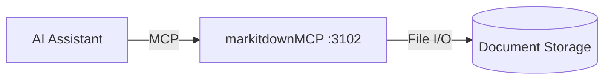

# markitdown MCP Server

MCP server providing Claude Desktop and Claude Code access to document conversion (PDF, Office files) to markdown for ATLAS analysis.

## Overview

Exposes the markitdown Python library as MCP tools, enabling AI assistants to convert PDFs, Word documents, Excel spreadsheets, and PowerPoint presentations to markdown format for analysis and processing within ATLAS workflows.

## Architecture



## MCP Tools

**Note:** markitdownMCP is a Python-based MCP server using the official markitdown library. Tool availability depends on the library's capabilities.

### Expected Tools

| Tool Name | Description | Key Parameters |
|-----------|-------------|----------------|
| `convert_to_markdown` | Convert document to markdown | `file_path`, `output_path` (optional) |
| `list_documents` | List available documents in storage | `path` (optional) |

### Supported Document Types

- PDF documents (.pdf)
- Microsoft Word (.docx, .doc)
- Microsoft Excel (.xlsx, .xls)
- Microsoft PowerPoint (.pptx, .ppt)
- Text files (.txt)

## Use Cases

- **Portfolio reconciliation**: Brokerage PDFs to positions
- **NBFI monitoring**: Bankruptcy filings to stress signals
- **Fed analysis**: FOMC minutes, H.4.1 PDFs to policy shifts
- **Research reports**: Analyst PDFs to structured data
- **Financial statements**: 10-K/10-Q PDFs to extractable text

## Configuration

### Environment Variables

| Variable | Default | Description |
|----------|---------|-------------|
| `MARKITDOWN_WORKDIR` | `/workdir` | Document storage path (container) |
| `MCP_PORT` | `3102` | SSE server port |
| `MCP_HOST` | `0.0.0.0` | Bind address |

### Port Mapping

- Internal: 3102
- External (host): 3102
- SSE endpoint: `http://mercury:3102/sse`

### Storage

- Host path: `/opt/ai-inference/documents`
- ZFS dataset: `sata-bulk/ai-inference/documents`
- Mount mode: Read-only (default)

## Deployment

Add to infrastructure compose file:

```yaml
markitdown-mcp:
  image: mcp/markitdown:latest
  ports:
    - "3102:3102"
  volumes:
    - "/opt/ai-inference/documents:/workdir:ro"
  command: ["--sse", "--host", "0.0.0.0", "--port", "3102"]
```

Deploy via Ansible:
```bash
ansible-playbook playbooks/deploy.yml --tags markitdown-mcp
```

## Claude Desktop Integration

Add to `~/.config/Claude/claude_desktop_config.json` (Linux) or `~/Library/Application Support/Claude/claude_desktop_config.json` (macOS):

```json
{
  "mcpServers": {
    "markitdown": {
      "command": "uvx",
      "args": ["mcp-proxy", "http://mercury:3102/sse"]
    }
  }
}
```

Alternatively, for local Claude Desktop usage with local markitdown installation:

```json
{
  "mcpServers": {
    "markitdown": {
      "command": "uvx",
      "args": ["markitdown-mcp"]
    }
  }
}
```

Claude Desktop uses stdio transport, so `mcp-proxy` bridges stdio to SSE for the ATLAS server deployment.

## Usage Examples

**Convert brokerage statement:**
```
User: "Convert the Q4 brokerage statement to markdown"
Claude calls: convert_to_markdown(file_path="/workdir/statements/2024-Q4.pdf")
Response: "Converted 2024-Q4.pdf to markdown. Found 47 positions..."
```

**Extract FOMC minutes:**
```
User: "Parse the latest FOMC minutes"
Claude calls: convert_to_markdown(file_path="/workdir/fed/fomc-2024-12.pdf")
Response: "Extracted FOMC minutes: Committee voted 11-1 to hold rates..."
```

**List available documents:**
```
User: "What PDFs are in the documents folder?"
Claude calls: list_documents(path="/workdir")
Response: "Found 23 documents: brokerage statements (8), FOMC minutes (5)..."
```

## See Also

- [FredCollectorMcp](../FredCollectorMcp/README.md) - Economic data access
- [SecMasterMcp](../SecMasterMcp/README.md) - Instrument metadata
- [markitdown GitHub](https://github.com/microsoft/markitdown) - Official Python library
