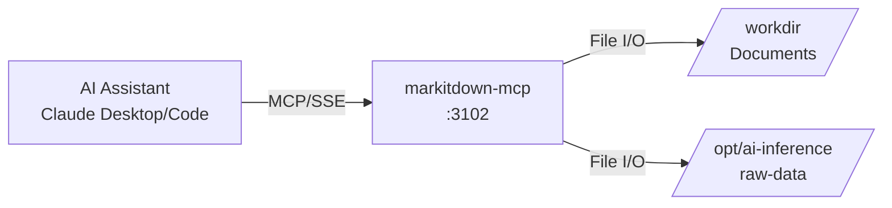

# markitdownMCP

MCP server providing Claude Desktop and Claude Code access to document-to-markdown conversion for ATLAS analysis workflows.

## Overview

Wraps Microsoft's [markitdown](https://github.com/microsoft/markitdown) Python library as an MCP server, enabling AI assistants to convert PDFs, Office documents, and other file formats to markdown. Deployed via the official `mcp/markitdown` container image with SSE transport.

## Architecture



## MCP Tools

| Tool Name | Description | Key Parameters |
|-----------|-------------|----------------|
| `convert_to_markdown` | Convert document to markdown format | `uri`: file:, http:, https:, or data: URI |

### Supported Formats

- PDF documents (.pdf)
- Microsoft Word (.docx, .doc)
- Microsoft Excel (.xlsx, .xls)
- Microsoft PowerPoint (.pptx, .ppt)
- HTML pages (via URL)
- Images with OCR
- Audio files (via speech-to-text)
- Text files (.txt, .csv)

## Configuration

### Environment Variables

| Variable | Default | Description |
|----------|---------|-------------|
| `MCP_HOST` | `0.0.0.0` | Bind address |
| `MCP_PORT` | `3102` | SSE server port |

### Port Mapping

- Internal: 3102
- External (host): 3102
- SSE endpoint: `http://mercury:3102/sse`

### Volume Mounts

| Container Path | Host Path | Mode | Purpose |
|----------------|-----------|------|---------|
| `/workdir` | `/opt/ai-inference/documents` | ro | Document storage |
| `/opt/ai-inference/raw-data` | `/opt/ai-inference/raw-data` | ro | Sentinel raw data |

## Project Structure

```
markitdownMCP/
└── README.md           # This file (no source code - uses official image)
```

This service uses the official `mcp/markitdown:latest` image from Microsoft without modification.

## Development

No local development required - uses official container image.

### Testing Locally

```bash
# Run markitdown directly
uvx markitdown /path/to/document.pdf

# Run MCP server locally
uvx markitdown-mcp --sse --port 3102
```

## Deployment

```bash
ansible-playbook playbooks/deploy.yml --tags markitdown-mcp
```

## Claude Desktop Integration

Add to `~/.config/Claude/claude_desktop_config.json` (Linux) or `~/Library/Application Support/Claude/claude_desktop_config.json` (macOS):

```json
{
  "mcpServers": {
    "markitdown": {
      "command": "uvx",
      "args": ["mcp-proxy", "http://mercury:3102/sse"]
    }
  }
}
```

Claude Desktop uses stdio transport, so `mcp-proxy` bridges stdio to SSE.

## Usage Examples

**Convert brokerage statement:**
```
User: "Convert the Q4 brokerage statement to markdown"
Claude calls: convert_to_markdown(uri="file:///workdir/statements/2024-Q4.pdf")
Response: Markdown text of converted PDF
```

**Convert FOMC minutes from URL:**
```
User: "Parse the latest FOMC minutes"
Claude calls: convert_to_markdown(uri="https://federalreserve.gov/monetarypolicy/fomcminutes20241218.htm")
Response: Markdown text of FOMC minutes
```

**Use Cases:**
- Portfolio reconciliation: Brokerage PDFs to positions
- Fed analysis: FOMC minutes, H.4.1 PDFs to policy data
- Research reports: Analyst PDFs to structured text
- Financial statements: 10-K/10-Q PDFs to extractable content

## See Also

- [markitdown GitHub](https://github.com/microsoft/markitdown) - Official Python library
- [MCP Protocol](https://modelcontextprotocol.io/) - Model Context Protocol specification
- [SecMaster MCP](../SecMaster/mcp/README.md) - Instrument metadata access
- [FredCollector MCP](../FredCollector/mcp/README.md) - Economic data access
