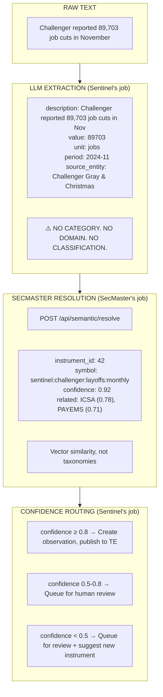
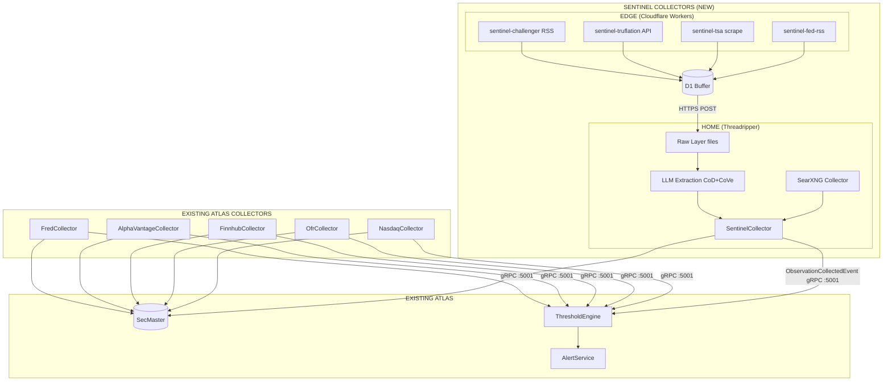
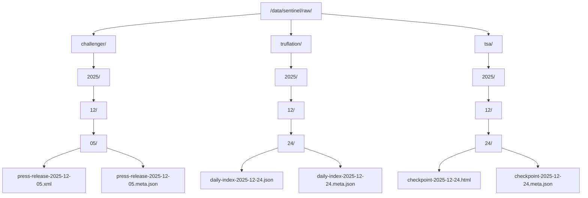
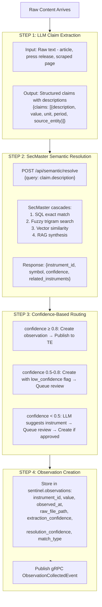
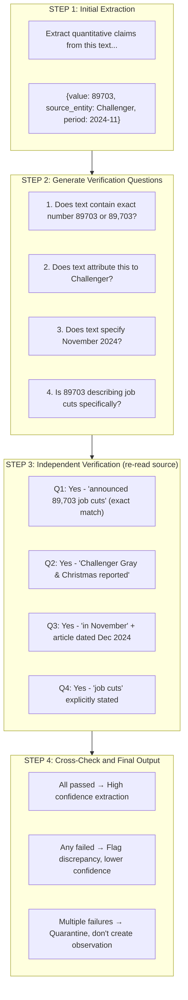
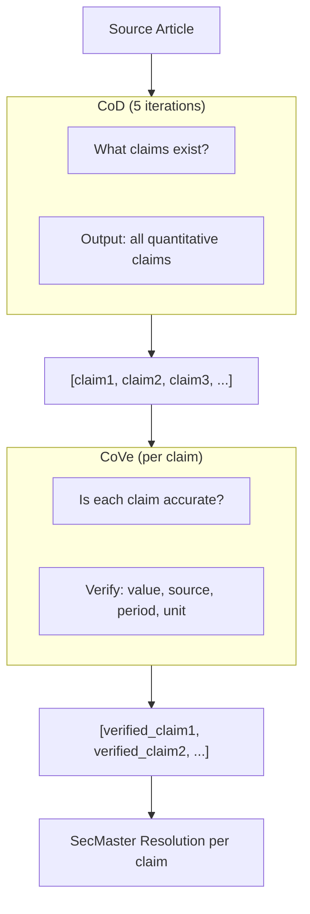

# Sentinel Edge Platform - Product Specification

**Version:** 2.7  
**Date:** December 26, 2025  
**Product Owner:** Claude  
**Status:** Ready for Engineering  

---

## ⚠️ FOR CODING AGENTS: READ BEFORE IMPLEMENTING

### What You MUST NOT Build

```
❌ Category enums (Employment, Inflation, Growth, Recession...)
❌ Domain classification logic
❌ Taxonomy mappings
❌ "Is this relevant?" filters
❌ Manual instrument-to-category assignments
❌ Hardcoded source-to-series mappings
❌ Speed optimizations that sacrifice accuracy
❌ Single-pass extraction (use CoD+CoVe)
```

### What You MUST Use

```
✓ SecMaster /api/semantic/resolve for ALL instrument matching
✓ SecMaster /api/semantic/ask for natural language queries  
✓ SecMaster /api/instruments + /api/semantic/embed/{id} for new instruments
✓ Vector similarity (pgvector) for instrument resolution
✓ Confidence scores from SecMaster to route to review queue
✓ Chain-of-Density (CoD) for complete extraction
✓ Chain-of-Verification (CoVe) for accurate extraction
✓ Store all observations, derive counts via GROUP BY
```

### The Core Pattern



### Why No Categories?

SecMaster is an **LLM-powered semantic knowledge layer**, not a data dictionary.

Query: "October unemployment"

| If You Built Categories | What SecMaster Actually Does |
|------------------------|------------------------------|
| Returns: UNRATE | Returns by vector similarity: |
| (exact match on "unemployment") | - UNRATE (0.89) |
| Nothing else | - ICSA (0.84) |
| | - sentinel:challenger:layoffs (0.82) |
| | - ADP payroll (0.79) |
| | - News: "Tech layoffs surge" (0.71) |
| | - JTSJOL job openings (0.68) |

Categories are rigid. Embeddings understand meaning.

---

## Problem Statement

ATLAS currently collects data through dedicated API collectors (FRED, AlphaVantage, Nasdaq, Finnhub, OFR). These sources provide structured, well-documented APIs with predictable schemas.

However, valuable macro signals exist in sources that don't fit this pattern:
- **RSS feeds** (Challenger press releases, Fed announcements)
- **Web scraping** (TSA throughput, job postings)
- **Alternative APIs** (Truflation, FreightWaves)
- **Aggregated search** (SearXNG news monitoring)

These sources are:
- Heterogeneous (different formats, frequencies, access methods)
- Less reliable (sites change, feeds break, scraping is fragile)
- Unstructured (require extraction to produce observations)

Example divergence that current collectors can't detect:
- Challenger reports 1.17M announced layoffs (RSS press release)
- BLS initial claims at 3-year lows (FRED)
- Someone is wrong. SecMaster should surface both when you ask about "employment."

---

## Goal

Extend ATLAS with collectors for heterogeneous alternative data:
- Publish `ObservationCollectedEvent` via gRPC (like FredCollector, OfrCollector)
- Use SecMaster for semantic resolution (NOT manual classification)
- Feed ThresholdEngine for pattern evaluation
- Integrate with existing observability stack

**Key Constraint: Accuracy Over Speed**

ATLAS drives weekly/monthly portfolio rebalancing decisions, not real-time trading. Extraction that takes 30 seconds instead of 3 seconds is fine. Extraction that gets 89,703 wrong as 89,073 is not fine. The entire pipeline optimizes for accuracy.

---

## Phased Delivery

### Phase 1: Architecture MVP (4-6 weeks)

**Goal:** Prove the data lake handles heterogeneous sources with accurate extraction.

**Scope:**
- 5+ sources across different access methods (API, RSS, scrape, SearXNG)
- Three-layer data lake operational (raw → enriched → curated)
- Full CoD+CoVe extraction pipeline (accuracy over speed)
- SecMaster semantic resolution for instrument mapping
- Store all observations, conflict detection via GROUP BY
- Integration with existing ThresholdEngine

**Not in Phase 1:**
- Contrarian detection (needs data accumulation)
- Consensus tracking (needs data accumulation)
- Source authority scoring
- Review queue UI (CLI review acceptable)

### Phase 2: Enrichment & Quality (4 weeks)

**Goal:** Production-grade extraction with quality controls.

**Scope:**
- Extraction confidence scoring
- Human review queue for low-confidence items
- Review queue UI
- Additional sources (target: 10+ total)
- Data quality dashboards

### Phase 3: Intelligence Layer (6+ weeks)

**Goal:** Surface insights from accumulated data.

**Scope:**
- Consensus tracking per domain
- Contrarian detection and surfacing
- Source history and resolution tracking
- Requires 3-6 months of data from Phase 1/2

---

## Architecture

### Integration with ATLAS

Sentinel follows the same patterns as existing ATLAS collectors:



### Key Integration Points

| Integration | Contract | Notes |
|-------------|----------|-------|
| ThresholdEngine | `ObservationCollectedEvent` via gRPC | Same as FredCollector, OfrCollector |
| SecMaster | gRPC registration | Register instruments, source mappings |
| TimescaleDB | Shared instance, `sentinel` schema | Observations table mirrors existing pattern |
| Observability | OpenTelemetry → Loki/Prometheus/Tempo | Same stack, new service dashboards |
| AlertService | Via ThresholdEngine patterns | No direct integration needed |

### What's Different About Sentinel

| Existing Collectors | Sentinel |
|---------------------|----------|
| Single API source | Multiple heterogeneous sources |
| Structured responses | Raw data requiring extraction |
| Direct to TimescaleDB | Raw layer → LLM extraction → TimescaleDB |
| Home-only | Edge collection + home processing |
| No raw preservation | Full raw data lake |

---

## Data Sources - Phase 1 MVP

Five sources across different access methods to prove architecture handles variety.

### 1. Challenger Gray & Christmas (RSS)

| Attribute | Value |
|-----------|-------|
| Access Method | RSS feed |
| Runs On | Edge or Home (TBD by engineering) |
| Frequency | Monthly (first Thursday) |
| Data Points | Layoffs announced, YoY change, hiring plans |
| Value | Leading indicator for claims, BLS divergence |

### 2. Truflation (API)

| Attribute | Value |
|-----------|-------|
| Access Method | REST API |
| Runs On | Edge |
| Frequency | Daily |
| Data Points | Real-time inflation index, components |
| Value | CPI verification, leading indicator |
| Auth | API key required |

### 3. TSA Checkpoint (Scrape)

| Attribute | Value |
|-----------|-------|
| Access Method | Web scrape |
| Runs On | Edge |
| Frequency | Daily |
| Data Points | Passenger throughput, YoY comparison |
| Value | Travel demand, consumer health proxy |

### 4. Federal Reserve (RSS)

| Attribute | Value |
|-----------|-------|
| Access Method | RSS feed |
| Runs On | Home |
| Frequency | As published |
| Data Points | Press releases, speech announcements |
| Value | Policy signals, forward guidance |

### 5. Economic News (SearXNG)

| Attribute | Value |
|-----------|-------|
| Access Method | SearXNG API |
| Runs On | Home |
| Frequency | 2x daily |
| Data Points | News matching macro keywords |
| Value | Context, narrative tracking, coverage breadth |
| Queries | "employment report", "inflation data", "fed rate decision" |

---

## Access Method Taxonomy

For future source additions:

### API (Edge preferred)

Structured, authenticated, rate-limited.

| Candidates | Notes |
|------------|-------|
| Trading Economics | Subscription required |
| Indeed Hiring Lab | Job postings index |
| Redfin | Housing data |

### RSS/Atom (Edge or Home)

Structured, usually public.

| Candidates | Notes |
|------------|-------|
| Treasury announcements | Auction results |
| BLS release schedule | Timing awareness |
| Major bank research | Goldman, JPM if public |

### Scrape (Edge preferred)

Unstructured, fragile.

| Candidates | Notes |
|------------|-------|
| OpenTable | Reservations - complex |
| Zillow | Housing - complex |
| Freight indices | Various sources |

### SearXNG (Home only)

Aggregated search, internal network.

| Use Cases | Notes |
|-----------|-------|
| News monitoring | Scheduled keyword queries |
| Verification | Cross-reference single sources |
| Discovery | Find sources we don't know about |

## ATLAS Conventions

Sentinel follows existing ATLAS patterns per `CLAUDE.md`:

| Convention | Requirement |
|------------|-------------|
| Container files | `compose.yaml`, `Containerfile` (not docker-compose.yml, Dockerfile) |
| Development | Dev containers, zero local SDK install |
| Deployment | Ansible only (`ansible-playbook playbooks/deploy.yml --tags sentinel`) |
| Database | EF Core migrations, no raw SQL scripts for schema |
| Observability | OpenTelemetry → Loki/Prometheus/Tempo, Serilog structured logging |
| gRPC | Internal port 5001 for event streaming (matches other collectors) |
| Testing | xUnit, integration tests against real TimescaleDB |

**Service Naming:**
- `sentinel-collector` - Home-side collector service (receives from edge, extracts, publishes gRPC)
- `sentinel-*` - Individual edge workers (sentinel-challenger, sentinel-truflation, etc.)

---

### Raw Layer

**Purpose:** Immutable source of truth for reprocessing.

**Location:** `/data/sentinel/raw/{source}/{YYYY}/{MM}/{DD}/{filename}`

**File Structure:**



**Sidecar Metadata (JSON):**
```json
{
  "collector": "sentinel-challenger",
  "collected_at": "2025-12-05T14:32:00Z",
  "source_url": "https://www.challengergray.com/feed/",
  "http_status": 200,
  "content_hash": "sha256:abc123...",
  "collector_version": "1.2.0",
  "headers": {
    "etag": "...",
    "last-modified": "..."
  }
}
```

**Retention:** Indefinite. No automatic deletion.

**Storage:** File server (~10TB available)

### Enriched Layer

**Purpose:** Extracted observations linked to raw source.

**Location:** TimescaleDB `sentinel.observations` table

**Schema:**
```sql
CREATE TABLE sentinel.observations (
    id BIGSERIAL,
    
    -- Source linkage
    collector TEXT NOT NULL,
    source TEXT NOT NULL,
    series_id TEXT NOT NULL,
    raw_file_path TEXT,              -- Link to raw layer
    
    -- Temporal model (three distinct concepts)
    period_start DATE NOT NULL,      -- Start of measurement period
    period_end DATE NOT NULL,        -- End of measurement period (same as start for point-in-time)
    release_date DATE NOT NULL,      -- When source published this value
    collected_at TIMESTAMPTZ NOT NULL DEFAULT NOW(),  -- When Sentinel grabbed it
    
    -- Observation data
    value DOUBLE PRECISION NOT NULL,
    unit TEXT,                        -- "jobs", "percent", "index", etc.
    
    -- Revision tracking
    vintage TEXT,                     -- "advance", "preliminary", "final", "revised", NULL for non-revising sources
    revision_number INT DEFAULT 1,    -- 1 = first release, 2 = first revision, etc.
    supersedes_id BIGINT,             -- Points to previous revision of same (series, period)
    
    -- Extraction metadata
    extraction_model TEXT,            -- e.g., "llama3.1-70b-q4"
    extraction_confidence REAL,       -- 0.0 to 1.0
    extracted_fields JSONB,           -- Full extraction output
    
    -- SecMaster resolution
    instrument_id INT,                -- FK to SecMaster
    resolution_confidence REAL,       -- 0.0 to 1.0
    resolution_method TEXT,           -- "sql", "fuzzy", "vector", "rag", "manual"
    
    PRIMARY KEY (id, release_date)
);

-- Partition by release_date, not period (we query by "when did we learn this")
SELECT create_hypertable('sentinel.observations', 'release_date');

-- Index for "latest value for this series/period"
CREATE INDEX idx_obs_series_period ON sentinel.observations (series_id, period_start, period_end, revision_number DESC);

-- Index for "all revisions of this observation"
CREATE INDEX idx_obs_revisions ON sentinel.observations (series_id, period_start, supersedes_id);
```

**Temporal Model Explained:**

| Field | Question It Answers | Example: Nov 2024 Jobs Report |
|-------|---------------------|-------------------------------|
| `period_start` | What period does this measure? | 2024-11-01 |
| `period_end` | End of measurement period | 2024-11-30 |
| `release_date` | When was this value published? | 2024-12-06 (first Friday) |
| `collected_at` | When did Sentinel grab it? | 2024-12-06T08:35:00Z |
| `vintage` | What revision stage? | "advance" |

**Revision Example: BLS Nonfarm Payrolls**

```
period: 2024-11
┌─────────────────────────────────────────────────────────────────────┐
│ release_date │ vintage     │ value  │ revision │ supersedes_id     │
├──────────────┼─────────────┼────────┼──────────┼───────────────────┤
│ 2024-12-06   │ advance     │ 227000 │ 1        │ NULL              │
│ 2025-01-10   │ preliminary │ 212000 │ 2        │ → row 1           │
│ 2025-02-07   │ final       │ 218000 │ 3        │ → row 2           │
└─────────────────────────────────────────────────────────────────────┘
```

**Querying:**

```sql
-- Latest value for November 2024 jobs (most recent revision)
SELECT * FROM sentinel.observations 
WHERE series_id = 'PAYEMS' 
  AND period_start = '2024-11-01'
ORDER BY revision_number DESC 
LIMIT 1;

-- All revisions for November 2024 jobs (audit trail)
SELECT * FROM sentinel.observations 
WHERE series_id = 'PAYEMS' 
  AND period_start = '2024-11-01'
ORDER BY release_date;

-- Point-in-time: What did we know on Dec 15, 2024?
SELECT * FROM sentinel.observations 
WHERE series_id = 'PAYEMS' 
  AND period_start = '2024-11-01'
  AND release_date <= '2024-12-15'
ORDER BY revision_number DESC 
LIMIT 1;
```

**Retention:** Indefinite.

### Curated Layer

**Purpose:** Query-optimized views for patterns and dashboards.

**Implementation:** TimescaleDB continuous aggregates + materialized views.

**Examples:**
- Daily latest values per series (latest revision)
- Observation counts by (instrument, period, value) for conflict detection
- Cross-source comparisons (ADP vs BLS)
- Contrarian views: claims with low observation_count vs high for same semantic cluster

---

## LLM Extraction & SecMaster Resolution

### The Only Thing Sentinel's LLM Does

Extract structured claims from unstructured text. That's it.

**Input:** Raw text (article, press release, scraped page)

**Output:**
```json
{
  "claims": [
    {
      "description": "Natural language description for SecMaster to embed",
      "value": 89703,
      "unit": "jobs",
      "period": "2024-11",
      "period_type": "month",
      "source_entity": "Challenger Gray & Christmas",
      "vintage": null,
      "is_revision": false
    }
  ]
}
```

**Temporal Fields:**

| Field | Extraction Notes |
|-------|------------------|
| `period` | Extract as stated: "November 2024", "Q3 2024", "2024-11-15" |
| `period_type` | Infer: "day", "week", "month", "quarter", "year" |
| `vintage` | Extract if stated: "advance estimate", "preliminary", "revised", "final" |
| `is_revision` | True if text says "revised from X" or "updated from previous" |
| `release_date` | Usually from source metadata, not text extraction |

**Period Parsing (post-extraction):**

| Extracted | period_start | period_end |
|-----------|--------------|------------|
| "2024-11" or "November 2024" | 2024-11-01 | 2024-11-30 |
| "Q3 2024" | 2024-07-01 | 2024-09-30 |
| "2024-11-15" | 2024-11-15 | 2024-11-15 |
| "week ending Dec 21" | 2024-12-15 | 2024-12-21 |

**The `description` field is critical.** SecMaster will embed this text and use vector similarity to find related instruments. Write it like you're explaining the data point to someone.

### What the LLM Does NOT Do

```
❌ Classify into domains (Employment, Inflation, Growth...)
❌ Decide if content is "relevant to ATLAS"
❌ Map to specific instruments
❌ Assign categories or tags
❌ Filter out "unimportant" data
```

All of that is SecMaster's job via semantic similarity.

### Pipeline Flow



### Why This Design

| Approach | Problem |
|----------|---------|
| Rule-based classification | Brittle, requires manual domain mapping, misses nuance |
| Separate embedding model | Duplicates SecMaster capability, vectors don't align |
| LLM-only classification | No persistent knowledge, can't learn from corpus |

**SecMaster-native approach:**
- Single embedding space across all ATLAS instruments
- Sentinel claims resolve against existing knowledge
- New instruments expand the semantic space for future matching
- Human review improves the corpus over time

### Extraction Verification (Chain-of-Verification)

**Reference:** [Chain-of-Verification Reduces Hallucination in Large Language Models](https://arxiv.org/abs/2309.11495)

Non-reasoning LLMs (Llama 3.1 70B Q4) hallucinate during extraction:
- Transpose digits (89,703 → 89,073)
- Misattribute sources (Challenger → BLS)
- Wrong time periods (November → October)
- Invented values not in source text

**CoVe Pattern for Extraction:**



### Extraction Completeness (Chain-of-Density)

**Reference:** [From Sparse to Dense: GPT-4 Summarization with Chain of Density Prompting](https://arxiv.org/abs/2309.04269)

Single-pass extraction misses data points. A Challenger press release contains:
- Headline layoff number
- YoY and MoM comparisons  
- Sector breakdown (tech, retail, finance...)
- Regional breakdown
- Hiring plans data
- Executive quotes with forward guidance

**CoD Prompt Template (adapted for extraction):**

```
ARTICLE: {{ content }}

You will generate increasingly complete, entity-dense extractions of quantitative claims from the above Article. Repeat the following 2 steps 5 times.

Step 1. Identify 1-3 informative Entities (";" delimited) from the Article which are missing from the previously generated extraction.
Step 2. Write a new, denser extraction of identical length which covers every entity and detail from the previous extraction plus the Missing Entities.

A Missing Entity is:
- Relevant: a quantitative claim (number, percentage, comparison)
- Specific: descriptive yet concise (5 words or fewer)
- Novel: not in the previous extraction
- Faithful: present in the Article
- Anywhere: located anywhere in the Article

Guidelines:
- The first extraction should be long (4-5 claims, ~80 words) yet highly non-specific, containing little information beyond the Entities marked as Missing.
- Make every word count: re-write the previous extraction to improve flow and make space for additional Entities.
- Make space with fusion, compression, and removal of uninformative phrases.
- The extractions should become highly dense and concise yet self-contained.
- Missing Entities can appear anywhere in the new extraction.
- Never drop Entities from the previous extraction. If space cannot be made, add fewer new Entities.

Remember, use the exact same number of words for each extraction.

Output each iteration as JSON with:
- iteration: 1-5
- missing_entities: ["entity1", "entity2"]
- claims: [{ description, value, unit, period, source_entity }]
```

**CoD Iteration Example (Challenger press release):**

| Iteration | Missing Entities | Claims Extracted |
|-----------|-----------------|------------------|
| 1 | "89,703 job cuts" | Total layoffs only |
| 2 | "+3.8% MoM"; "+51% YoY" | + month/year comparisons |
| 3 | "Tech: 32,000"; "Retail: 18,000" | + sector breakdown |
| 4 | "Hiring plans lowest since 2010" | + forward indicator |
| 5 | "California: 12,000"; "Texas: 8,500" | + regional data |

**Final output:** 8-10 claims from a single press release vs. 1-2 from single-pass.

### Combined Pipeline: CoD → CoVe

**ATLAS operates on weekly/monthly rebalancing cycles, not real-time trading. Extraction latency is irrelevant. Accuracy is everything.**

For all substantive sources, run both:



**Source Selection (the actual filter):**

The question isn't "how fast can we process?" It's "should we process this at all?"

| Source | Process? | Rationale |
|--------|----------|-----------|
| Challenger press release | ✓ Full CoD+CoVe | Primary data, monthly, high value |
| Fed minutes | ✓ Full CoD+CoVe | Policy signals, 8x/year |
| Truflation API | ✓ CoVe only | Structured JSON, just verify |
| Reuters article on Challenger | ✓ Full CoD+CoVe | May contain analyst context |
| Generic market commentary | ❌ Skip | No primary data |
| Celebrity news | ❌ Skip | Not collected |

**The filtering happens at collection, not extraction.** If a source made it into the raw layer, it's worth extracting properly.

**Quality Targets:**

| Metric | Target | Notes |
|--------|--------|-------|
| Claim completeness | > 90% | CoD extracts all quantitative claims |
| Value accuracy | > 99% | CoVe catches transposition, misattribution |
| Source attribution | 100% | Never attribute Challenger data to BLS |
| Period accuracy | > 99% | November vs October matters |

### Claim Extraction Prompt

```
You are a data extraction system. Extract quantitative claims from the text below.

For each claim with a numeric value, output:

- description: A clear, complete sentence describing this data point. 
  Include: what is being measured, who reported it, the time period, 
  and any relevant context. This text will be used for semantic search,
  so write it as if explaining the data point to someone unfamiliar.
  
  GOOD: "Challenger Gray & Christmas reported 89,703 announced job cuts 
         in November 2024, representing US employer layoff intentions"
  
  BAD: "89,703 layoffs" (too terse, missing context)

- value: The numeric value
- unit: Unit of measurement (jobs, percent, dollars, index points, etc.)
- period: Time period in ISO format (YYYY-MM, YYYY-QN, YYYY) or "latest"
- source_entity: Organization that produced/reported this data
- geography: Geographic scope (US, Global, EU, specific country/region)
- confidence: Your confidence in the extraction accuracy (0.0-1.0)

Only extract claims with specific numeric values. 
Skip: opinions, forecasts without numbers, vague statements, 
      price movements of individual securities.

Output valid JSON only. No markdown, no explanation.
```

### Description Quality Matters

The `description` field becomes an embedding. Good descriptions enable:

| Description Quality | SecMaster Can Find |
|--------------------|-------------------|
| "Challenger Gray reported 89,703 announced layoffs in November 2024, tracking US employer workforce reduction intentions" | Related: ICSA, PAYEMS, JOLTS, ADP, other Challenger series, news about layoffs |
| "89703 job cuts" | Almost nothing - too sparse for meaningful embedding |

### Deduplication via Semantic Similarity

When multiple sources report the same fact:

```
Source 1 (Reuters): "Challenger reported 89,703 job cuts in November"
Source 2 (Bloomberg): "US layoff announcements reached nearly 90,000 last month per Challenger"
Source 3 (WSJ): "Job cuts surged to 89,703 in November according to Challenger Gray"
```

All three resolve to same SecMaster instrument via vector similarity:
- Same source_entity embedding component (Challenger)
- Same metric embedding component (layoffs/job cuts)
- Same time period

**Result:** Three observations stored. Query `GROUP BY value` to see agreement.

### Instrument Discovery

When SecMaster returns low confidence, LLM suggests new instrument:

```json
{
  "suggested_instrument": {
    "symbol": "sentinel:challenger:layoffs:monthly",
    "name": "Challenger Gray & Christmas Monthly Layoff Announcements",
    "asset_class": "Economic",
    "instrument_type": "Indicator",
    "frequency": "Monthly",
    "sector": "Labor",
    "description": "Monthly count of announced job cuts tracked by Challenger Gray & Christmas outplacement firm"
  },
  "rationale": "No existing instrument tracks Challenger layoff data. Related to ICSA (initial claims) but measures announcements vs actual filings.",
  "related_instruments": ["ICSA", "CCSA", "JTSJOL", "PAYEMS"]
}
```

Human reviews, approves, instrument is created in SecMaster with embedding generated.

### Execution Environment

**Location:** Home (Threadripper - 24 cores/48 threads Zen 5, 128GB RAM, RTX 5090 32GB VRAM)

**LLM Runtime:** Ollama (already running at :11434)

| Task | Model | Notes |
|------|-------|-------|
| Claim extraction | Llama 3.1 70B Q4 | Complex reasoning, structured output |
| Embeddings | nomic-embed-text | Already configured in SecMaster |
| RAG synthesis | llama3.2:3b | Already configured in SecMaster |

**Key Point:** Sentinel uses SecMaster's existing Ollama integration for embeddings and RAG. Only claim extraction is new LLM usage.

---

## Signal vs Noise

### Core Principles

| Principle | Definition |
|-----------|------------|
| **Novelty** | First mention matters, repetition doesn't |
| **Source authority** | Primary source > aggregator > commentary |
| **Data over narrative** | Numbers are signal, opinions are noise |
| **Divergence value** | Contrarian data points worth more than consensus |

### Deduplication

**Store all observations. Derive counts via query.**

Same underlying fact from multiple sources = multiple rows, not one row with a counter.

**Implementation:**

```
Source 1 (Reuters): "Challenger reported 89,703 job cuts in November"
Source 2 (Bloomberg): "US layoff announcements hit nearly 90,000 per Challenger"  
Source 3 (WSJ): "Job cuts surged to 89,703 according to Challenger Gray"
```

All three get stored as separate observations. Query to see agreement/disagreement:

```sql
-- Observation count by value for conflict detection
SELECT 
    value, 
    COUNT(*) as observation_count, 
    array_agg(DISTINCT source) as sources
FROM sentinel.observations
WHERE instrument_id = 42 
  AND period_start = '2024-11-01'
GROUP BY value;
```

**Result:**
| value | observation_count | sources |
|-------|-------------------|---------|
| 89703 | 3 | {Reuters, Bloomberg, WSJ} |

**Why Store All (Not Skip Duplicates):**

| Use Case | What Count Tells You |
|----------|---------------------|
| **Fact accuracy** | 9 say 89,703, 1 says 89,700 → minority likely typo |
| **Contrarian detection** | 15 say "resilient", 2 say "weakening" → minority worth attention |

Both need the count, but for opposite reasons. Store observations, derive counts as needed.

**Discrepancy Detection:**

```sql
-- Flag (instrument, period) with conflicting values
SELECT instrument_id, period_start, COUNT(DISTINCT value) as distinct_values
FROM sentinel.observations
GROUP BY instrument_id, period_start
HAVING COUNT(DISTINCT value) > 1;
```

### Source Hierarchy

When multiple sources report same information:

1. **Primary source** - Entity that created the data
2. **Authoritative aggregator** - FRED, official repositories
3. **Quality journalism** - WSJ, FT, Reuters
4. **General news** - AP, major outlets
5. **Aggregators** - News APIs
6. **Commentary** - Blogs, social

---

## Contrarian Detection (Phase 3)

### Purpose

Surface dissenting views with substance for human attention.

### Prerequisites

- 3-6 months of data accumulation
- Sufficient observations for semantic clustering
- Resolution tracking operational

### Approach

**Don't score contrarians. Surface them.**

1. **Identify clusters** via SecMaster vector similarity (not predefined domains)
2. For each cluster, track dominant narrative (by source count/authority)
3. Flag claims that contradict dominant narrative with specific data
4. Require substance: data + mechanism + falsifiability
5. Present for human review, don't auto-weight
6. Track resolution over time

Example: SecMaster clusters "employment" observations automatically via embeddings.
- Dominant: BLS, ADP, JOLTS all showing strength
- Contrarian: Challenger layoffs surging, tech workforce reduction accelerating
- System surfaces the divergence, human investigates

### Quality Indicators

| Indicator | Noise | Signal |
|-----------|-------|--------|
| Specificity | "Economy will crash" | "These tranches have 40% exposure" |
| Mechanism | "It's all going down" | "When rates reset, defaults exceed reserves" |
| Data citation | Vibes | Specific primary sources |
| Falsifiability | Vague timing | Specific predictions with timeframes |

**Not in Phase 1.** Documented here for architectural awareness.

---

## Operational Requirements

### Health Monitoring

Each collector must expose:
- `/health` endpoint returning status
- Last successful run timestamp
- Error count (last 24h)
- Next scheduled run

### Alerting

| Condition | Alert Level |
|-----------|-------------|
| Collector missed scheduled window | Warning |
| Collector failed 3 consecutive runs | Critical |
| Extraction queue depth > 100 | Warning |
| Low-confidence extraction rate > 20% | Warning |
| Raw storage > 80% capacity | Warning |

### Daily Summary

Automated report (via alert service):
- Sources collected today
- Observations extracted
- Extraction success rate
- Anomalies flagged
- Storage utilization

### Data Quality Checks

Daily automated validation:
- All expected sources reported
- No duplicate canonical observations
- Values within historical bounds
- Raw → Enriched linkage intact

---

## Success Criteria

### Phase 1 MVP

| Metric | Target |
|--------|--------|
| Sources operational | 5+ heterogeneous sources |
| Raw preservation | 100% (zero data loss) |
| Value accuracy | > 99% (CoVe catches errors) |
| Claim completeness | > 90% (CoD extracts all claims) |
| Source attribution | 100% correct |
| Period extraction | 100% parseable into period_start/period_end |
| Temporal integrity | period ≠ release_date ≠ collected_at always distinct |
| SecMaster resolution rate | > 70% resolve to existing or create new instrument |
| ThresholdEngine integration | Patterns can query Sentinel-derived instruments |
| Days without collection failure | 7+ consecutive |

### Phase 2

| Metric | Target |
|--------|--------|
| Sources operational | 10+ |
| Value accuracy | > 99.5% |
| Claim completeness | > 95% |
| Revision tracking | Sources with revisions (BLS, GDP) track supersedes_id chain |
| Point-in-time queries | "What did we know on date X?" returns correct historical view |
| High-confidence resolution | > 80% resolve at confidence ≥ 0.8 |
| Review queue throughput | < 50 items pending at any time |
| Deduplication accuracy | Same fact from 3 sources → 3 observations, GROUP BY value shows agreement |
| Zero misattributions | Challenger data never attributed to BLS, etc. |

### Phase 3

| Metric | Target |
|--------|--------|
| Contrarian alerts surfaced | Qualitative review |
| Resolution tracking coverage | > 80% of falsifiable claims |
| Semantic corpus growth | Sentinel instruments improve future matching |

---

## Decisions Made (Reducing Open Questions)

| Question | Decision | Rationale |
|----------|----------|-----------|
| Integration pattern | gRPC `ObservationCollectedEvent` | Same as all ATLAS collectors |
| Buffer strategy | D1 for edge buffer | Simple, sufficient for MVP volume |
| Database | Same TimescaleDB instance, `sentinel` schema | ATLAS convention, shared queries |
| Raw layer path | `/data/sentinel/raw/{source}/{date}/` | Simple, greppable |
| Sidecar format | JSON | Human-readable, tooling available |
| Classification approach | SecMaster semantic resolution | Use existing pgvector + hybrid search, not separate classifier |
| Embeddings | nomic-embed-text via SecMaster | Already configured, 768-dim vectors |
| LLM extraction | Llama 3.1 70B Q4 via Ollama | Claim extraction only, SecMaster handles classification |
| Extraction verification | Chain-of-Verification (CoVe) | Accuracy is everything; verify all claims |
| Extraction completeness | Chain-of-Density (CoD) | Extract ALL claims from every substantive source |
| Extraction strategy | Full CoD+CoVe pipeline | Latency irrelevant for weekly/monthly rebalancing |
| Edge vs Home for RSS | Engineering decision | No strong product preference |
| Deployment | Ansible, same as other ATLAS services | Project convention |
| Observability | OpenTelemetry to existing stack | Project convention |
| Instrument creation | Human-approved via review queue | Low-confidence matches queue for approval, then SecMaster creates |
| Deduplication | Store all, derive counts | Query GROUP BY value for agreement/conflict detection |
| Observation count | Derived, not stored | Count at (instrument, period, value) level via query |
| Temporal model | period + release_date + collected_at | Three distinct timestamps: what period measured, when published, when collected |
| Revision tracking | supersedes_id chain + vintage | Same (series, period) can have multiple values; track lineage |
| Hypertable partition | release_date | Query by "when we learned" not "what period measured" |

---

## Open Questions for Engineering

1. **gRPC contract** - Does `ObservationCollectedEvent` need extension for Sentinel metadata (raw_file_path, extraction_confidence, resolution_confidence, match_type)?
2. **Challenger source** - Is RSS feed sufficient or need API/scrape?
3. **Truflation** - API key acquisition, rate limits?
4. **TSA scrape** - Page structure, fragility assessment?
5. **Raw → Enriched trigger** - Filesystem watch? Queue? Polling?
6. **Review queue UI** - How do humans review low-confidence matches? Admin endpoint? Separate tool?
7. **SecMaster confidence threshold** - Use existing 0.8/0.5 or tune for Sentinel use case?
8. **Instrument creation workflow** - Auto-create with embedding after human approval? Or manual SecMaster API call?
9. **SearXNG query design** - Which keywords? Frequency? How to scope queries to ATLAS-relevant content?
10. **Source count tracking** - How to increment when same fact arrives from multiple sources?
11. **ThresholdEngine patterns** - How to express patterns that combine Sentinel + FRED data? (e.g., Challenger vs ICSA divergence)
12. **CoD/CoVe implementation** - Single prompt combining both? Or sequential calls? How to structure verification questions for financial data specifically?

---

## Dependencies

| Dependency | Owner | Status | Notes |
|------------|-------|--------|-------|
| TimescaleDB | ATLAS | ✅ Running | Port 5432, shared instance |
| ThresholdEngine | ATLAS | ✅ Running | gRPC :5001, needs new patterns for Sentinel data |
| SecMaster | ATLAS | ✅ Running | gRPC registration, instrument search |
| AlertService | ATLAS | ✅ Running | HTTP POST to :8081/alerts |
| Observability | ATLAS | ✅ Running | OTEL → Loki/Prometheus/Tempo/Grafana |
| Cloudflare account | James | ✅ Exists | Workers, D1 |
| Ollama | ATLAS | ✅ Running | GPU :11434, CPU :11435 |
| SearXNG | Infrastructure | ✅ Running | Internal network |
| Raw storage | Infrastructure | ✅ Exists | ~10TB file server, ~5TB sata-bulk |

**Compute Available:**
- CPU: AMD Zen 5, 24 cores / 48 threads
- RAM: 128GB
- GPU: RTX 5090, 32GB VRAM
- Storage: ~15TB total across file server and local

**Existing gRPC Contract:**
Sentinel collectors must implement `ObservationCollectedEvent` to integrate with ThresholdEngine:
```protobuf
message ObservationCollectedEvent {
    string series_id = 1;
    google.protobuf.Timestamp observed_at = 2;
    double value = 3;
    // ... additional fields per Events/ shared contract
}
```

---

## Appendix: Future Source Candidates

For Phase 2+ consideration:

| Source | Method | Domain | Priority |
|--------|--------|--------|----------|
| Indeed Hiring Lab | API | Employment | High |
| OpenTable | Scrape | Consumer | Medium |
| Redfin | API | Housing | Medium |
| FreightWaves | API | Freight | High (paid) |
| Treasury auctions | RSS | Funding | Medium |
| Bank of Japan | RSS | Policy | Medium |

Note: ADP employment data is already available via FredCollector (series ADPMNUSNERSA, etc.)

---

## Appendix: ThresholdEngine Pattern Format

Sentinel-derived series should integrate with existing ThresholdEngine patterns. Example pattern for Challenger/Claims divergence:

```json
{
  "name": "Challenger Claims Divergence",
  "category": "Recession",
  "weight": 0.80,
  "temporalType": "Leading",
  "publicationFrequencyDays": 30,
  "expression": "GetYoY(\"sentinel:challenger:layoffs\") > 0.25 && GetLatest(\"ICSA\") < 250000",
  "signalStrength": 2,
  "description": "Announced layoffs surging while claims remain low - forward recession indicator"
}
```

This follows the existing pattern format in ThresholdEngine with Roslyn expression compilation.

---

## Appendix: Contrarian Alert Format (Phase 3)

For architectural awareness:

> **CONTRARIAN ALERT - Employment**
> 
> **Consensus (15 sources):**
> "Labor market remains resilient, claims at historic lows"
> 
> **Divergent (2 sources):**
> - Source: Challenger Gray (primary data)
> - Claim: Layoffs up 54% YoY, hiring plans lowest since 2010
> - Mechanism: "Severance periods and WARN Act lag"
> - Falsifiable: Claims should rise within 60-90 days
> 
> **Resolution tracking:** PENDING

---

## References

| Topic | Link | Notes |
|-------|------|-------|
| Chain-of-Verification (CoVe) | [arXiv:2309.11495](https://arxiv.org/abs/2309.11495) | Reduces hallucination via verification questions |
| Chain-of-Density (CoD) | [arXiv:2309.04269](https://arxiv.org/abs/2309.04269) | Iterative densification for complete extraction |
| SecMaster | [SecMaster README](../SecMaster/README.md) | Semantic knowledge layer, pgvector, hybrid search |
| ThresholdEngine | [ThresholdEngine README](../ThresholdEngine/README.md) | Pattern evaluation, Roslyn expressions |
| ATLAS Architecture | [ARCHITECTURE.md](../docs/ARCHITECTURE.md) | Microservices design, gRPC patterns |
| ATLAS Conventions | [CLAUDE.md](../CLAUDE.md) | Code generation rules, deployment patterns |

---

## Revision History

| Version | Date | Changes |
|---------|------|---------|
| 1.0 | 2025-12-24 | Initial spec |
| 2.0 | 2025-12-24 | Red team feedback: phasing, MVP scope, ATLAS integration |
| 2.1 | 2025-12-26 | SecMaster-native semantic resolution, removed category-based classification |
| 2.2 | 2025-12-26 | Added Chain-of-Verification (CoVe) for extraction accuracy |
| 2.3 | 2025-12-26 | Added Chain-of-Density (CoD) for extraction completeness |
| 2.4 | 2025-12-26 | Removed latency concerns - accuracy is everything for weekly/monthly rebalancing |
| 2.5 | 2025-12-26 | Fixed naive temporal model: period ≠ release_date ≠ collected_at; revision tracking |
| 2.6 | 2025-12-26 | Removed source_count (echo count doesn't improve accuracy); simplified deduplication |
| 2.7 | 2025-12-26 | Restored observation counting: store all, derive counts via GROUP BY for conflict/contrarian detection |
